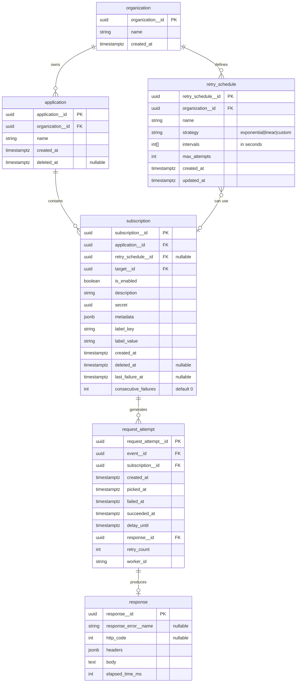
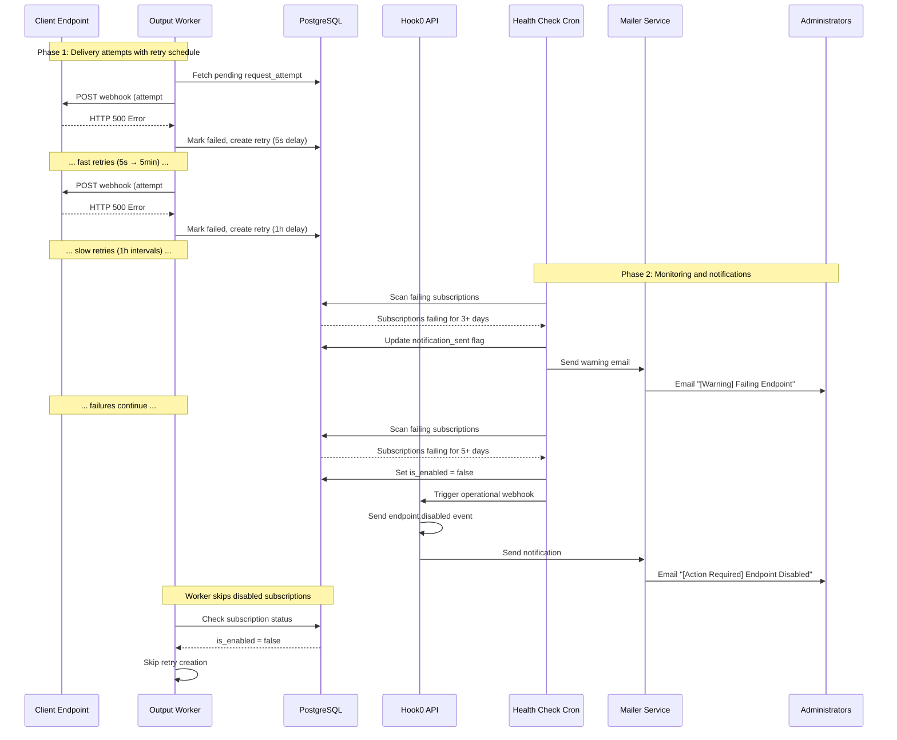
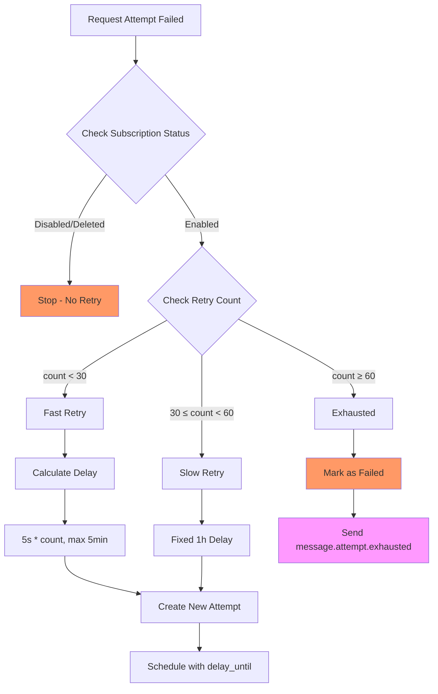
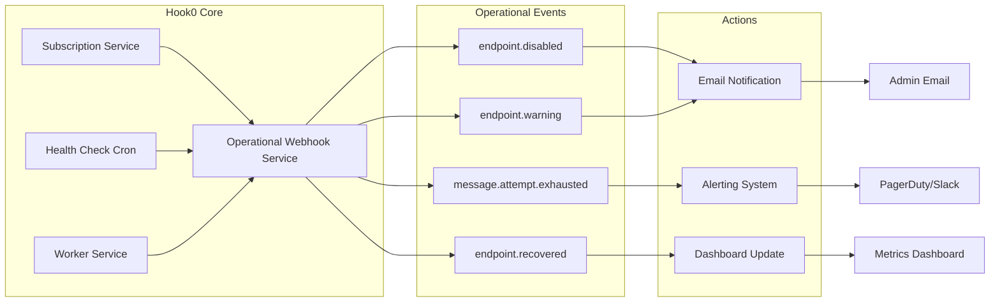

# Specifications & AAD: Automatic Deactivation and Retry Policies

**Date:** 2025-08-16
**Author:** Hook0 System
**Status:** Implementation
**Version:** 1.0

## 1. Purpose

This document describes the webhook delivery retry policy, the process for automatically disabling a subscription (endpoint) in case of repeated failures, the configuration of customizable retry schedules, and the advance email notifications for hook0 application managers.

The goal is to maintain a healthy and reliable platform by implementing a failure management system similar to Stripe and Facebook, featuring:
- A configurable retry schedule with exponential backoff
- Automatic deactivation after 5 days of continuous failures
- Proactive email notifications before deactivation
- An operational webhooks system for deactivation events

---

## 2. Functional Specifications

### 2.1. Retry Schedule

When a webhook sent to a client endpoint fails, the system will attempt to deliver it again following the schedule defined by its retry policy. If no custom policy is defined, the default policy is used.

**Default Policy: Exponential Backoff (Svix/Stripe Model)**
1.  **Immediately** (first attempt)
2.  **5 seconds** after the first failure
3.  **5 minutes** after the second failure
4.  **30 minutes** after the third failure
5.  **2 hours** after the fourth failure
6.  **5 hours** after the fifth failure
7.  **10 hours** after the sixth failure
8.  **10 hours** after the seventh failure (and subsequent ones until exhaustion)

**Current implementation in the code**:
- Fast retries: 30 attempts with a progressive delay from 5s to 5min
- Slow retries: 30 additional attempts with a fixed delay of 1h
- Total: up to 60 attempts before final failure

If an attempt succeeds, the cycle stops. If all attempts fail, the message is marked as `Failed`, and an operational webhook `message.attempt.exhausted` is sent.

### 2.2. Definition of Success and Failure

-   **Success**: The client's endpoint returns a `2xx` status code (e.g., 200, 204) within 15 seconds.
-   **Failure**: Any other situation (`3xx`, `4xx`, `5xx` codes, timeout, connectivity error).

### 2.3. Automatic Endpoint Deactivation Process

An endpoint will be automatically disabled if the following conditions are met:

1.  **Continuous Failures**: All delivery attempts fail consecutively over a period of **5 days**.
2.  **Trigger Condition**: The 5-day counter only starts after several delivery failures have been observed over a 24-hour period, with at least 12 hours between the first and last failure.
3.  **Deactivation Action**: The subscription is marked with `is_enabled = false` in the database.
4.  **Operational Webhook**: An `endpoint.disabled` event is sent to the operational webhooks system to trigger notifications.

**Important Note**: This feature can be disabled via environment settings (similar to Svix).

### 2.4. Email Notifications for hook0 Administrators

Emails will be sent to the application managers configured in hook0. The emails are sent via the existing mailer system.

#### 2.4.1. Warning Notification (Pre-deactivation)

-   **Trigger**: An endpoint has been failing continuously for **3 days**.
-   **Recipients**: Administrators of the organization owning the application.
-   **Subject**: `[Hook0 - Warning] Failing Endpoint: {subscription_name}`
-   **Content**:
    ```
    Hello,

    We are writing to inform you that the following endpoint has been experiencing difficulties for the past 3 days:

    Application: {application_name}
    Subscription: {subscription_name} (ID: {subscription_id})
    Endpoint: {target_url}
    Description: {subscription_description}
    
    Statistics:
    - First failure: {first_failure_date}
    - Total number of failures: {failure_count}
    - Last attempt: {last_attempt_date}
    - Next attempt: {next_retry_date}

    Action required:
    If no action is taken, this endpoint will be automatically disabled in 2 days.

    To prevent deactivation:
    1. Verify that your endpoint is accessible and responding correctly.
    2. Ensure it returns a 2xx HTTP code within 15 seconds.
    3. Check the detailed logs in your Hook0 dashboard.

    Regards,
    The Hook0 Team
    ```

#### 2.4.2. Deactivation Notification

-   **Trigger**: An endpoint has just been automatically disabled after 5 days of failures.
-   **Recipients**: Administrators of the organization owning the application.
-   **Subject**: `[Hook0 - Action Required] Endpoint Disabled: {subscription_name}`
-   **Content**:
    ```
    Hello,

    The following endpoint has been automatically disabled due to repeated failures:

    Application: {application_name}
    Subscription: {subscription_name} (ID: {subscription_id})
    Endpoint: {target_url}
    Description: {subscription_description}
    
    Deactivation Details:
    - Deactivation date: {disabled_date}
    - Total duration of failures: 5 days
    - Total number of attempts: {total_attempts}
    - Last error: {last_error_type}

    Possible actions:
    1. Fix the issues with your endpoint.
    2. Re-enable the subscription via the API or the dashboard.
    3. Use the "Replay" feature to resend missed events.

    Re-activation API:
    PUT /v1/subscriptions/{subscription_id}
    {
      "is_enabled": true
    }

    Regards,
    The Hook0 Team
    ```

#### 2.4.3. Recovery Notification (Optional)

-   **Trigger**: A previously failing endpoint returns to a normal state.
-   **Subject**: `[Hook0 - Info] Endpoint Recovered: {subscription_name}`
-   **Content**: Confirmation that the endpoint is working correctly again.

### 2.5. Configuring Retry Policies

The system offers several retry policies (retry schedules) that users can configure for their endpoints.

-   **Available Policies**:
    1.  **Exponential Backoff (Default)**: Increases the interval between each attempt, following the Svix/Stripe model.
    2.  **Linear Intervals**: Retries at fixed intervals (e.g., every 5 minutes).
    3.  **Custom**: Allows the user to define their own sequence of intervals in seconds.

-   **Configuration Structure**:
    ```json
    {
      "id": "uuid",
      "organization_id": "uuid",
      "name": "Production Retry Policy",
      "strategy": "exponential|linear|custom",
      "intervals": [5, 300, 1800, 7200, 18000, 36000, 36000], // in seconds
      "max_attempts": 8
    }
    ```

-   **Management**:
    -   Policies are manageable via the REST API.
    -   Each organization can create and name its own policies.
    -   A policy can be assigned to one or more `subscription`.
    -   If no policy is assigned, the default policy applies.
    -   Policies can be modified without affecting retries already in progress.

### 2.6. Manual Retry and Recovery

Following the Svix model, users can:

1. **Manual Retry**: Manually resend a specific message via the API.
2. **Automatic Recovery**: "Recover" function to automatically resend all failed messages from a given date.
3. **Bulk Replay**: Resend all events from a given period.

Available APIs:
- `POST /v1/messages/{message_id}/retry` - Retry a single message
- `POST /v1/applications/{app_id}/replay` - Replay messages in bulk
- `POST /v1/applications/{app_id}/recover` - Recover failed messages

---

## 3. Diagrams

### 3.1. Database Schema



### 3.2. Sequence Diagram: Retry and Deactivation Process



### 3.3. Flowchart: Retry Logic



### 3.4. Operational Webhooks Architecture



---

## 4. Files to Modify and Implementation Plan

### 4.1. Database (SQL Migrations)

#### Migration 1: Add retry schedule system
-   **File**: `api/migrations/[timestamp]_add_retry_schedule.up.sql`
-   **Actions**:
    1.  Create the `webhook.retry_schedule` table:
        ```sql
        CREATE TABLE webhook.retry_schedule (
            retry_schedule__id UUID NOT NULL DEFAULT gen_random_uuid(),
            organization__id UUID NOT NULL REFERENCES iam.organization(organization__id),
            name TEXT NOT NULL CHECK (length(name) >= 1),
            strategy TEXT NOT NULL CHECK (strategy IN ('exponential', 'linear', 'custom')),
            intervals INTEGER[] NOT NULL CHECK (array_length(intervals, 1) > 0),
            max_attempts INTEGER NOT NULL DEFAULT 8 CHECK (max_attempts > 0 AND max_attempts <= 100),
            created_at TIMESTAMPTZ NOT NULL DEFAULT statement_timestamp(),
            updated_at TIMESTAMPTZ NOT NULL DEFAULT statement_timestamp(),
            CONSTRAINT retry_schedule_pkey PRIMARY KEY (retry_schedule__id),
            CONSTRAINT retry_schedule_org_name_unique UNIQUE (organization__id, name)
        );
        ```
    
    2.  Modify the `webhook.subscription` table:
        ```sql
        ALTER TABLE webhook.subscription 
        ADD COLUMN retry_schedule__id UUID REFERENCES webhook.retry_schedule(retry_schedule__id);
        
        ALTER TABLE webhook.subscription
        ADD COLUMN last_failure_at TIMESTAMPTZ,
        ADD COLUMN consecutive_failures INTEGER NOT NULL DEFAULT 0;
        ```
    
    3.  Create the necessary indexes:
        ```sql
        CREATE INDEX subscription_retry_schedule_idx ON webhook.subscription(retry_schedule__id);
        CREATE INDEX subscription_failure_tracking_idx ON webhook.subscription(last_failure_at, consecutive_failures) 
        WHERE is_enabled = true AND deleted_at IS NULL;
        ```

#### Migration 2: Add failure tracking
-   **File**: `api/migrations/[timestamp]_add_failure_tracking.up.sql`
-   **Actions**:
    1.  Create the notification tracking table:
        ```sql
        CREATE TABLE webhook.endpoint_health_notification (
            notification__id UUID NOT NULL DEFAULT gen_random_uuid(),
            subscription__id UUID NOT NULL REFERENCES webhook.subscription(subscription__id),
            notification_type TEXT NOT NULL CHECK (notification_type IN ('warning_3_days', 'disabled_5_days', 'recovered')),
            sent_at TIMESTAMPTZ NOT NULL DEFAULT statement_timestamp(),
            CONSTRAINT endpoint_health_notification_pkey PRIMARY KEY (notification__id)
        );
        
        CREATE INDEX notification_subscription_idx ON webhook.endpoint_health_notification(subscription__id, notification_type);
        ```

### 4.2. Backend API (`api/src/`)

#### 4.2.1. New API Handlers for Retry Schedules

**File**: `api/src/handlers/retry_schedules.rs`
```rust
// Structure for retry schedules
#[derive(Debug, Serialize, Deserialize, Apiv2Schema)]
pub struct RetrySchedule {
    pub retry_schedule_id: Uuid,
    pub organization_id: Uuid,
    pub name: String,
    pub strategy: RetryStrategy,
    pub intervals: Vec<i32>, // in seconds
    pub max_attempts: i32,
    pub created_at: DateTime<Utc>,
    pub updated_at: DateTime<Utc>,
}

#[derive(Debug, Serialize, Deserialize, Apiv2Schema)]
#[serde(rename_all = "lowercase")]
pub enum RetryStrategy {
    Exponential,
    Linear,
    Custom,
}
```

**Routes to add**:
- `POST /v1/organizations/{org_id}/retry-schedules` - Create a policy
- `GET /v1/organizations/{org_id}/retry-schedules` - List policies
- `GET /v1/retry-schedules/{schedule_id}` - Get a policy
- `PUT /v1/retry-schedules/{schedule_id}` - Update a policy
- `DELETE /v1/retry-schedules/{schedule_id}` - Delete a policy

#### 4.2.2. Health Check and Deactivation Module

**File**: `api/src/endpoint_health_monitor.rs`
```rust
pub struct EndpointHealthMonitor {
    db: PgPool,
    mailer: Arc<Mailer>,
    hook0_client: Option<Arc<Hook0Client>>,
}

impl EndpointHealthMonitor {
    pub async fn check_failing_endpoints(&self) -> Result<(), Error> {
        // 1. Find subscriptions failing for > 3 days
        let warning_subscriptions = self.find_subscriptions_failing_for_days(3).await?;
        
        // 2. Send warning emails
        for sub in warning_subscriptions {
            if !self.notification_already_sent(&sub.id, "warning_3_days").await? {
                self.send_warning_email(&sub).await?;
                self.record_notification(&sub.id, "warning_3_days").await?;
            }
        }
        
        // 3. Find subscriptions failing for > 5 days
        let disable_subscriptions = self.find_subscriptions_failing_for_days(5).await?;
        
        // 4. Disable and notify
        for sub in disable_subscriptions {
            self.disable_subscription(&sub.id).await?;
            self.send_operational_webhook("endpoint.disabled", &sub).await?;
            self.send_disabled_email(&sub).await?;
            self.record_notification(&sub.id, "disabled_5_days").await?;
        }
        
        Ok(())
    }
}
```

#### 4.2.3. Modify Worker to Support Retry Schedules

**File**: `output-worker/src/main.rs`
```rust
// Modify compute_next_retry to use the retry schedule
async fn compute_next_retry_with_schedule(
    conn: &mut PgConnection,
    subscription_id: &Uuid,
    retry_count: i16,
) -> Result<Option<Duration>, sqlx::Error> {
    // 1. Fetch the subscription's retry schedule
    let schedule = query!(
        r#"
        SELECT rs.strategy, rs.intervals, rs.max_attempts
        FROM webhook.subscription s
        LEFT JOIN webhook.retry_schedule rs ON s.retry_schedule__id = rs.retry_schedule__id
        WHERE s.subscription__id = $1 AND s.deleted_at IS NULL AND s.is_enabled
        "#,
        subscription_id
    )
    .fetch_optional(conn)
    .await?;
    
    match schedule {
        Some(s) if s.strategy.is_some() => {
            // Use the custom policy
            compute_delay_from_schedule(
                &s.strategy.unwrap(),
                &s.intervals.unwrap_or_default(),
                s.max_attempts.unwrap_or(8),
                retry_count
            )
        }
        _ => {
            // Use the default policy
            compute_default_retry_duration(retry_count)
        }
    }
}
```

#### 4.2.4. Operational Webhooks Integration

**File**: `api/src/operational_webhooks.rs`
```rust
#[derive(Debug, Serialize)]
#[serde(tag = "type")]
pub enum OperationalWebhookEvent {
    #[serde(rename = "endpoint.disabled")]
    EndpointDisabled {
        organization_id: Uuid,
        application_id: Uuid,
        subscription_id: Uuid,
        endpoint_url: String,
        disabled_at: DateTime<Utc>,
        failure_count: i64,
    },
    
    #[serde(rename = "endpoint.warning")]
    EndpointWarning {
        organization_id: Uuid,
        application_id: Uuid,
        subscription_id: Uuid,
        endpoint_url: String,
        failing_since: DateTime<Utc>,
        failure_count: i64,
    },
    
    #[serde(rename = "message.attempt.exhausted")]
    MessageAttemptExhausted {
        organization_id: Uuid,
        application_id: Uuid,
        subscription_id: Uuid,
        message_id: Uuid,
        attempts: i32,
    },
}
```

#### 4.2.5. Email Templates

**File**: `api/src/email_templates/endpoint_warning.html`
```html
<!DOCTYPE html>
<html>
<head>
    <style>
        /* CSS styles for the email */
    </style>
</head>
<body>
    <div class="container">
        <h2>⚠️ Warning: Failing Endpoint</h2>
        <p>The endpoint <strong>{{ subscription_name }}</strong> is experiencing difficulties.</p>
        <!-- Detailed content as specified in section 2.4.1 -->
    </div>
</body>
</html>
```

### 4.3. Configuration and Environment Variables

#### Environment variables to add

**For the API**:
```env
# Automatic deactivation of endpoints
DISABLE_FAILING_ENDPOINTS=true  # Enables/disables the feature
ENDPOINT_WARNING_DAYS=3         # Days before warning
ENDPOINT_DISABLE_DAYS=5         # Days before deactivation
HEALTH_CHECK_CRON="0 8 * * *"  # Cron for the health check (8am every day)

# Email settings for notifications
SMTP_FROM_NAME="Hook0 System"
ADMIN_EMAIL_LIST="admin1@company.com,admin2@company.com"
```

**For the Worker**:
```env
# Default retry configuration
DEFAULT_MAX_FAST_RETRIES=30
DEFAULT_MAX_SLOW_RETRIES=30
DEFAULT_FAST_RETRY_MIN_DELAY=5      # seconds
DEFAULT_FAST_RETRY_MAX_DELAY=300    # 5 minutes
DEFAULT_SLOW_RETRY_DELAY=3600       # 1 hour
```

### 4.4. Testing and Validation

#### Unit Tests
1. **Retry Schedule Logic**: Test delay calculations for different policies.
2. **Health Monitor**: Test detection of failing endpoints.
3. **Email Generation**: Verify email content and format.

#### Integration Tests
1. **Complete Workflow**: Simulate an endpoint failing for 5 days.
2. **Retry Schedule API**: Test all CRUD operations.
3. **Worker Integration**: Verify the use of custom retry schedules.

#### Performance Tests
1. **Health Check Scalability**: Performance with 10k+ subscriptions.
2. **Worker Retry Logic**: Impact of retry schedules on performance.

## 5. Security Considerations

1. **Authentication**: All retry schedule APIs require authentication.
2. **Authorization**: Verify that the user has access to the organization.
3. **Rate Limiting**: Limit manual retries to prevent abuse.
4. **Validation**: Validate retry intervals (min: 1s, max: 1 week).

## 6. Monitoring and Metrics

### Metrics to Track
- **endpoint_failures_total**: Total number of failures per endpoint.
- **endpoint_disabled_count**: Number of disabled endpoints.
- **retry_attempts_total**: Number of attempts per policy.
- **notification_sent_count**: Emails sent by type.

### Dashboards
1. **Health Overview**: Overview of endpoint health.
2. **Retry Performance**: Effectiveness of different policies.
3. **Notification Tracking**: Tracking of sent notifications.

## 7. API Documentation

### Example of Creating a Retry Schedule
```bash
curl -X POST https://api.hook0.com/v1/organizations/{org_id}/retry-schedules \
  -H "Authorization: Bearer $TOKEN" \
  -H "Content-Type: application/json" \
  -d '{
    "name": "Aggressive Retry",
    "strategy": "custom",
    "intervals": [1, 2, 5, 10, 30, 60, 300, 600],
    "max_attempts": 8
  }'
```

### Example of Assigning to a Subscription
```bash
curl -X PUT https://api.hook0.com/v1/subscriptions/{sub_id} \
  -H "Authorization: Bearer $TOKEN" \
  -H "Content-Type: application/json" \
  -d '{
    "retry_schedule_id": "{schedule_id}",
    "is_enabled": true
  }'
```

## 8. Migration Plan

1. **Phase 1**: Deploy the new tables without enabling the feature.
2. **Phase 2**: Enable monitoring without automatic deactivation.
3. **Phase 3**: Enable warning notifications only.
4. **Phase 4**: Enable full automatic deactivation.

---

**End of document**