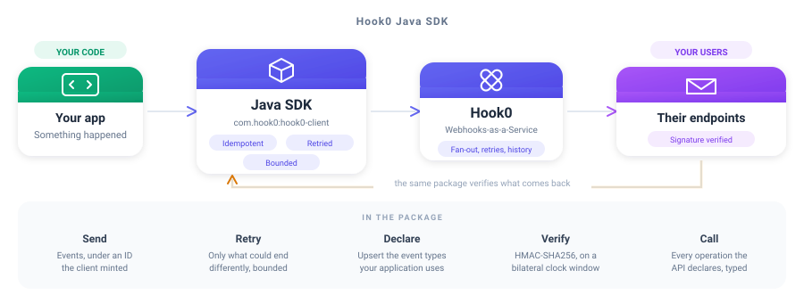

<div align="center">

# Hook0 Java SDK

**Send and verify webhooks on the standard library, blocking or futured**

<br/>



<br/>
<br/>

[](https://openjdk.org/projects/jdk/21/)
[](./LICENSE)

</div>

---

## What is this?

The Java SDK for [Hook0](https://www.hook0.com/), the open source Webhooks-as-a-Service platform
for SaaS applications. It sends events, declares the event types your application uses, verifies the
signature of a webhook you receive, and calls every operation the API declares through generated,
documented types.

Every call comes twice: one that blocks, and one that answers a `CompletableFuture`. **It brings
nothing with it.** No HTTP client, no JSON library, no logging façade, so adding it can never drag a
transitive dependency onto your classpath and never asks you to reconcile a version of Jackson or
Gson with ours. `PackagingTest` is what keeps that sentence true rather than aspirational.

## Features

- **Send events** - under an ID the client mints, so a retry cannot duplicate one
- **Declare event types** - upsert the ones your application emits, in one call
- **Verify signatures** - HMAC-SHA256 over a bilateral clock window
- **The whole API, typed** - `record`s for schemas, `enum`s for closed lists, one exception per problem
- **Bounded everywhere** - attempts, backoff, timeouts, payload and answer, all yours to set
- **Zero dependencies** - the standard library and nothing else, held there by a test

---

## Quick Start

### 1. Install

> **Not on Maven Central yet.** The `com.hook0` namespace has not been claimed on the Central
> Portal, which is not something a pipeline can do;
> [`ci/release-no-publish-job.toml`](https://gitlab.com/hook0/hook0/-/blob/master/ci/release-no-publish-job.toml)
> records what is missing. The pom already carries everything else a Central release needs, under a
> `release` profile. Until the namespace is claimed, build the jar from a checkout and install it
> into your local repository.

```bash
git clone https://gitlab.com/hook0/hook0.git
mvn -f hook0/clients/java/pom.xml install
```

That puts `com.hook0:hook0-client:2.0.2` in `~/.m2`, where your own build resolves it:

```xml
<dependency>
  <groupId>com.hook0</groupId>
  <artifactId>hook0-client</artifactId>
  <version>2.0.2</version>
</dependency>
```

Java 21 or later.

### 2. Send an event

```java
try (Hook0Client client = new Hook0Client("https://app.hook0.com/api/v1", applicationId, token)) {
  UUID sent = client.sendEvent(
      Event.of(
          "billing.invoice.paid",
          "{\"invoice\":\"in_123\"}",
          "application/json",
          Map.of("environment", "production")));
}
```

### 3. Verify a webhook you receive

```java
Webhooks.verify(
    request.getHeader("X-Hook0-Signature"),
    rawBody,
    headersAsTheyArrived,
    subscriptionSecret,
    Duration.ofMinutes(5));
```

The clock window is bilateral, so a delivery dated too far ahead is refused exactly like one dated
too far behind, because a window that only looked backwards is one a sender widens by dating its own
delivery in the future. A header the signature covers but the request did not carry is refused
before any code is computed.

---

## Configuration

Every bound one send is held to is yours to set, and every one has a default.

| Bound | Default | What it holds back |
|-|-|-|
| `maxAttempts` | 4 | requests one send issues, capped at 16 whatever a policy says |
| `initialBackoff` | 100 ms | the ceiling of the wait before the first retry |
| `maxBackoff` | 2 s | the ceiling no single wait between attempts crosses |
| `maxTotalDelay` | 5 s | the budget every wait of one send shares |
| `requestTimeout` | 10 s | how long one attempt is given |
| `maxPayloadBytes` | 1 MiB | the payload, refused before a socket is opened |
| `maxResponseBytes` | 8 MiB | the body read off a socket |
| `maxHeadBytes` | 16 KiB | the head of an answer, every line taken together |
| `maxResponseHeaders` | 64 | header lines one answer may carry |
| `maxHeaderBytes` | 64 KiB | one header line |

Every default comes from [`clients/conformance/bounds.json`](https://gitlab.com/hook0/hook0/-/blob/master/clients/conformance/bounds.json),
the corpus every Hook0 SDK reads. A number changed there fails every SDK still carrying the old one,
so no two of them can bound different things.

The last three bound what the other end may cost you. A server that is broken or hostile can
otherwise stream a head, a header or a body of any length into your process.

```java
Options options = Options.defaults()
    .withRetryPolicy(new RetryPolicy(
        4,
        Duration.ofMillis(100),
        Duration.ofMillis(2000),
        Duration.ofMillis(5000)))
    .withRequestTimeout(Duration.ofSeconds(10))
    .withMaxPayloadBytes(1024 * 1024)
    .withMaxResponseBytes(8L * 1024 * 1024);

Hook0Client client = new Hook0Client("https://app.hook0.com/api/v1", applicationId, token, options);
```

---

## Usage

### Sending is idempotent, and retried

`sendEvent` sends every event under an ID it knows, either the one set on the event or a UUIDv7 it
mints when the event carries none. **Passing no ID does not mean the ID comes from Hook0.** The value comes
from the client, travels with the request, and is what `sendEvent` answers.

That is what makes a retry safe. Hook0 keys events on their ID, so a request repeated after a network
failure or a server error ingests the event once rather than twice. Without a client-chosen ID, the
repeated request would create a second event and deliver it to every subscriber.

Retrying is limited to what could end differently. A request that got no answer, a server error and
an instance saying it is being reached faster than it accepts are all retried. A `429` naming a
spent quota is not, because a quota clears when a plan changes or a day turns, and no send can wait
for that. A
`Retry-After` the answer carries is honoured, clamped to what is left of the delay budget. A retried
request Hook0 answers with `EventAlreadyIngested` reports success, since an earlier attempt of that
same send reached the API. The same answer to a *first* attempt is a genuine conflict, and is
reported as an error.

### Declaring the event types you use

```java
List<String> created = client.upsertEventTypes(
    List.of("billing.invoice.paid", "billing.invoice.voided"));
```

Only the ones your application does not declare yet are created, and those are what comes back.

### Calling the rest of the API

Every operation the API declares is a method of a generated group, one group per entity.

```java
ApplicationsApi applications = new ApplicationsApi(client.transport());
ApplicationInfo application = applications.get(applicationId);

ApplicationsAsyncApi waiting = new ApplicationsAsyncApi(client.transport());
CompletableFuture<ApplicationInfo> later = waiting.get(applicationId);
```

### The compiler tells you when the API grows a problem

Each problem the API can report is an exception of its own under a `sealed` `ProblemException`, so a
`catch` may name one problem, or the base, or match over the closed set and be told by the compiler
the day the API grows another.

---

## Development

`clients/java/src/main/java/com/hook0/client/generated/` is written by [`hook0-sdkgen`](https://gitlab.com/hook0/hook0/-/tree/master/clients/sdkgen)
from the OpenAPI snapshot the API commits, and is rewritten whole on every regeneration. A hand edit
there is reverted the next time anyone regenerates, and the drift guard says so before that. Change
the generator, then run:

```
UPDATE_SDK=java cargo test -p hook0-sdkgen sdk_targets
```

Everything beside it, the transport, the retry loop, the signature verification and the JSON reader,
is hand-written and never regenerated, and so is `test/java`, which sits outside `src` on purpose,
since a test file under a generated tree would be deleted without a word at the next regeneration.

What a send retries, the bounds it is held to and how a signature is verified are dictated by the
shared corpus at [`clients/conformance`](https://gitlab.com/hook0/hook0/-/tree/master/clients/conformance),
which every SDK's suite reads, so a verdict changed there fails this client until it agrees again.

Every case runs against a real Hook0 over a loopback socket. Nothing here stands in for a part of
the client.

```
mvn checkstyle:check verify
```

---

## License

The Hook0 Java SDK is free and open source, released under the [MIT License](./LICENSE). Use it,
change it, ship it, in open source and in commercial work alike, as long as the copyright notice
travels with it.

Hook0 itself is open source too. Read [what Hook0 is](https://documentation.hook0.com/docs/what-is-hook0),
visit [hook0.com](https://www.hook0.com/), join the [community](https://www.hook0.com/community), or
write to [support@hook0.com](mailto:support@hook0.com).

Maintained by [David Sferruzza](mailto:david@hook0.com) and [François-Guillaume Ribreau](mailto:fg@hook0.com).
