<div align="center">

# Hook0 MCP Server

**Connect Claude to your webhook infrastructure**

<br/>



<br/>
<br/>

[](https://crates.io/crates/hook0-mcp)
[](../../LICENSE)
[](https://www.rust-lang.org/)
[](https://modelcontextprotocol.io/)

</div>

---

## What is this?

A [Model Context Protocol (MCP)](https://modelcontextprotocol.io/) server that lets AI assistants like Claude interact with your [Hook0](https://www.hook0.com/) webhook infrastructure. Query events, create subscriptions, debug deliveries - all through natural conversation.

## Features

- **List & inspect** - Browse organizations, applications, event types, and delivery history
- **Send events** - Ingest webhook events directly via Claude
- **Manage subscriptions** - Create, enable, disable webhook endpoints
- **Retry deliveries** - Retry failed webhook attempts
- **Guided workflows** - Step-by-step prompts for common tasks
- **Read-only mode** - Safe observability access without write permissions

## Quick Start

### 1. Install via Cargo

```bash
cargo install hook0-mcp
```

### 2. Get your API token

Create a **Service Token** from the Hook0 dashboard:

1. Log in to [Hook0](https://app.hook0.com/)
2. Select your **Organization** from the dropdown
3. Click **Service Tokens** in the left sidebar
4. Click **Create Service Token**
5. Give it a name (e.g., "Claude MCP")
6. Copy the generated token - this is your `HOOK0_API_TOKEN`

> **Note**: Service tokens are organization-scoped. The MCP server will only have access to applications within the organization associated with the token.

### 3. Add to Claude Desktop

**macOS**: `~/Library/Application Support/Claude/claude_desktop_config.json`
**Windows**: `%APPDATA%\Claude\claude_desktop_config.json`

```json
{
  "mcpServers": {
    "hook0": {
      "command": "hook0-mcp",
      "env": {
        "HOOK0_API_TOKEN": "your-api-token-here"
      }
    }
  }
}
```

---

## Configuration

| Variable | Default | Description |
|----------|---------|-------------|
| `HOOK0_API_TOKEN` | *required* | Your Hook0 API token |
| `HOOK0_API_URL` | `https://app.hook0.com` | Hook0 API base URL |
| `HOOK0_READ_ONLY` | `false` | Enable read-only mode |
| `MCP_TRANSPORT` | `stdio` | Transport: `stdio` or `sse` |
| `MCP_SSE_PORT` | `3000` | Port for SSE transport |

### Read-Only Mode

Set `HOOK0_READ_ONLY=true` for safe observability access. Only list/get operations are exposed - no modifications allowed.

---

## Available Tools

### Read Operations
| Tool | Description |
|------|-------------|
| `list_organizations` | List accessible organizations |
| `list_applications` | List applications |
| `get_application` | Get application details |
| `list_event_types` | List event types for an app |
| `list_subscriptions` | List webhook subscriptions |
| `list_events` | List events for an app |
| `get_event` | Get event details |
| `list_request_attempts` | List delivery attempts |

### Write Operations
| Tool | Description |
|------|-------------|
| `create_application` | Create a new application |
| `delete_application` | Delete an application |
| `create_event_type` | Register a new event type |
| `create_subscription` | Create a webhook subscription |
| `delete_subscription` | Delete a subscription |
| `ingest_event` | Send a new event |
| `retry_delivery` | Retry a failed delivery |

---

## Prompts

| Prompt | Description |
|--------|-------------|
| `create_webhook_subscription` | Step-by-step guide to create a subscription |
| `debug_event_delivery` | Troubleshoot delivery issues |
| `setup_application` | Initial application setup guide |

---

## Resources

| URI | Description |
|-----|-------------|
| `hook0://organizations` | List all organizations |
| `hook0://applications` | List all applications |
| `hook0://applications/{id}` | Application details |
| `hook0://applications/{id}/events` | Events for an app |
| `hook0://applications/{id}/subscriptions` | App subscriptions |
| `hook0://applications/{id}/event_types` | App event types |
| `hook0://events/{id}` | Event details |
| `hook0://events/{id}/attempts` | Delivery attempt history |

---

## Example Conversation

```
User: List my Hook0 applications

Claude: [Uses list_applications tool]
Here are your Hook0 applications:
1. Order Notifications (app_123...)
2. User Events (app_456...)

User: Create a webhook subscription for order events

Claude: I'll help you set up a webhook subscription. Which application
should receive the subscription?

User: Use Order Notifications, send to https://api.example.com/webhooks

Claude: [Uses create_subscription tool]
Created subscription successfully! It will now receive order.* events
at https://api.example.com/webhooks
```

---

## Development

```bash
# Build
cargo build

# Test
cargo test

# Lint
cargo fmt --check
cargo clippy --all-targets --all-features -- -D warnings
```

## License

[MIT](../../LICENSE)
