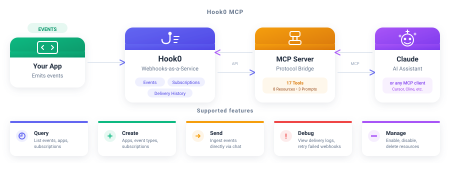

<div align="center">

# Hook0 MCP Server

**Connect Claude to your webhook infrastructure**

<br/>



<br/>
<br/>

[](https://crates.io/crates/hook0-mcp)
[](./LICENSE)
[](https://www.rust-lang.org/)
[](https://modelcontextprotocol.io/)

</div>

---

## What is this?

A [Model Context Protocol (MCP)](https://modelcontextprotocol.io/) server that lets AI assistants like Claude interact with your [Hook0](https://www.hook0.com/) webhook infrastructure. Query events, create subscriptions, debug deliveries - all through natural conversation.

## Features

- **List & inspect** - Browse organizations, applications, event types, and delivery history
- **Send events** - Ingest webhook events directly via Claude
- **Manage subscriptions** - Create, enable, disable webhook endpoints
- **Replay events** - Send an event to its subscriptions again
- **Guided workflows** - Step-by-step prompts for common tasks
- **Read-only mode** - Safe observability access without write permissions

## Quick Start

### 1. Install via Cargo

```bash
cargo install hook0-mcp
```

### 2. Get your API token

Create a **Service Token** from the Hook0 dashboard:

1. Log in to [Hook0](https://app.hook0.com/)
2. Select your **Organization** from the dropdown
3. Click **Service Tokens** in the left sidebar
4. Click **Create Service Token**
5. Give it a name (e.g., "Claude MCP")
6. Copy the generated token - this is your `HOOK0_API_TOKEN`

> **Note**: Service tokens are organization-scoped. The MCP server will only have access to applications within the organization associated with the token.

### 3. Add to Claude Desktop

**macOS**: `~/Library/Application Support/Claude/claude_desktop_config.json`
**Windows**: `%APPDATA%\Claude\claude_desktop_config.json`

```json
{
  "mcpServers": {
    "hook0": {
      "command": "hook0-mcp",
      "env": {
        "HOOK0_API_TOKEN": "your-api-token-here"
      }
    }
  }
}
```

---

## Configuration

| Variable | Default | Description |
|----------|---------|-------------|
| `HOOK0_API_TOKEN` | *required* | Your Hook0 API token |
| `HOOK0_API_URL` | `https://app.hook0.com` | Hook0 API base URL |
| `HOOK0_READ_ONLY` | `false` | Enable read-only mode |
| `MCP_TRANSPORT` | `stdio` | Transport. Only `stdio` is supported; `sse` is reserved and not implemented |
| `MCP_SSE_PORT` | `3000` | Reserved for SSE transport, which is not implemented |

### Read-Only Mode

Set `HOOK0_READ_ONLY=true` for safe observability access. The thirteen read tools stay and the ten write tools are not listed at all, so an assistant cannot call one it cannot see.

---

## Protocol revisions

MCP is versioned by dated revisions, and a client and a server settle on one during `initialize`. This server implements:

- `2024-11-05`
- `2025-03-26`
- `2025-06-18`
- `2025-11-25`

`2025-11-25` is the one it advertises, and the one it answers with when a client asks for a revision that is not on that list, so a client pinned to something else negotiates down rather than being turned away. A request whose inline `_meta` names an unlisted revision is refused outright, with `-32022 Unsupported protocol version`.

`2026-07-28` is deliberately absent. It asks for a stateless lifecycle, `subscriptions/listen` and input-required tool handling that this server does not provide, and a server claiming a revision it has not implemented is worse for a client than one that does not claim it. If your client speaks `2026-07-28` and nothing older, this server is not usable with it yet.

That list is not prose kept up by hand. `tests/integration_test.rs` reads it out of this file, asks a running server which revisions it actually answers on, and fails if the two have come apart, so a revision the server gains or loses cannot leave this section behind.

---

## Available Tools

Twenty-three tools, one per operation the API declares under the `mcp` tag. Each is named
`<group>.<operation>`, and the group is the entity the operation belongs to.

The names below are read out of this file by `tests/integration_test.rs` and held against the tools
the server actually exposes, so a tool renamed, gained or lost fails the suite rather than leaving
this table behind. It has been left behind before.

### Read Operations
| Tool | Description |
|------|-------------|
| `applications.get` | Get an application by its ID |
| `applications.list` | List applications |
| `eventTypes.get` | Get an event type by its name |
| `eventTypes.list` | List event types |
| `events.get` | Get an event by its ID |
| `events.list` | List latest events |
| `organizations.get` | Get an organization's info by its ID |
| `organizations.list` | List organizations |
| `payload_content_types.list` | List supported event payload content types |
| `requestAttempts.get` | Get a request attempt by its ID |
| `requestAttempts.read` | List request attempts |
| `subscriptions.get` | Get a subscription by its ID |
| `subscriptions.list` | List subscriptions |

### Write Operations
| Tool | Description |
|------|-------------|
| `applications.create` | Create a new application |
| `applications.delete` | Delete an application |
| `applications.update` | Edit an application |
| `eventTypes.create` | Create a new event type |
| `eventTypes.delete` | Delete an event type |
| `events.ingest` | Ingest an event |
| `events.replay` | Replay an event |
| `subscriptions.create` | Create a new subscription |
| `subscriptions.delete` | Delete a subscription |
| `subscriptions.update` | Update a subscription |

Retrying one delivery attempt on its own is not among them. `requestAttempts.get` and
`requestAttempts.read` read attempts; sending an event to its subscriptions again is
`events.replay`, which takes the event rather than the attempt.

---

## Prompts

| Prompt | Description |
|--------|-------------|
| `create_webhook_subscription` | Step-by-step guide to create a subscription |
| `debug_event_delivery` | Troubleshoot delivery issues |
| `setup_application` | Initial application setup guide |

---

## Resources

| URI | Description |
|-----|-------------|
| `hook0://organizations` | List all organizations |
| `hook0://applications` | List all applications |
| `hook0://applications/{id}` | Application details |
| `hook0://applications/{id}/events` | Events for an app |
| `hook0://applications/{id}/subscriptions` | App subscriptions |
| `hook0://applications/{id}/event_types` | App event types |
| `hook0://events/{id}` | Event details |
| `hook0://events/{id}/attempts` | Delivery attempt history |

---

## Example Conversation

```
User: List my Hook0 applications

Claude: [Uses applications.list tool]
Here are your Hook0 applications:
1. Order Notifications (app_123...)
2. User Events (app_456...)

User: Create a webhook subscription for order events

Claude: I'll help you set up a webhook subscription. Which application
should receive the subscription?

User: Use Order Notifications, send to https://api.example.com/webhooks

Claude: [Uses subscriptions.create tool]
Created subscription successfully! It will now receive order.* events
at https://api.example.com/webhooks
```

---

## Development

```bash
# Build
cargo build

# Test
cargo test

# Lint
cargo fmt --check
cargo clippy --all-targets --all-features -- -D warnings

# Check the crate builds from the tarball published to crates.io
cargo package --locked
```

### Tool definitions

The tools this server exposes are derived from `api/openapi.snapshot.json` and committed as
`src/server/generated.rs`. Nothing generates them at build time, and the crate is published to
crates.io, where the snapshot is not around, so the definitions have to travel inside the package.
This crate depends on nothing that reads the snapshot, not even at build time. `hook0-sdkgen`
writes that file, and this crate merely compiles it.

The emission driver in `hook0-sdkgen` compares the committed file with what the snapshot describes,
and touching a handler tagged `mcp` makes it fail. Adopt the change with:

```bash
UPDATE_SDK=mcp cargo test -p hook0-sdkgen sdk_targets
```

Commit the rewritten `src/server/generated.rs` along with your change, and read the diff, because a tool
that appeared, disappeared or changed shape without you meaning it to is a defect in the handler.

## License

[MIT](./LICENSE)
