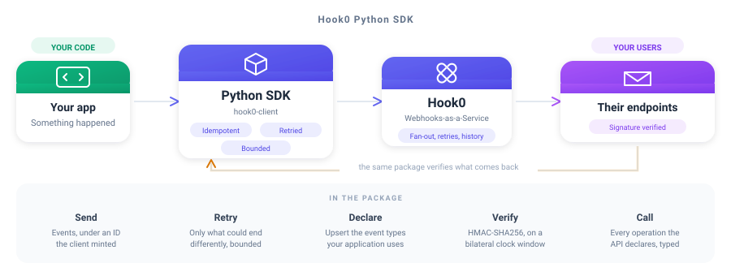

<div align="center">

# Hook0 Python SDK

**Send and verify webhooks, blocking or awaiting, on the standard library alone**

<br/>



<br/>
<br/>

[](https://pypi.org/project/hook0-client/)
[](https://pypi.org/project/hook0-client/)
[](./LICENSE)

</div>

---

## What is this?

The Python SDK for [Hook0](https://www.hook0.com/), the open source Webhooks-as-a-Service platform
for SaaS applications. It sends events, declares the event types your application uses, verifies the
signature of a webhook you receive, and calls every operation the API declares through generated,
documented types.

It reaches the network, verifies signatures and decodes what the API answers with the standard
library alone: `urllib.request` for the blocking client, `asyncio` for the awaiting one, `hmac` and
`hashlib` for signatures. Installing it never drags a transitive dependency into an application that
only wanted to send an event.

## Features

- **Send events** - under an ID the client mints, so a retry cannot duplicate one
- **Declare event types** - upsert the ones your application emits, in one call
- **Verify signatures** - HMAC-SHA256 over a bilateral clock window
- **The whole API, typed** - one class per schema, one exception per problem, one method per operation
- **Bounded everywhere** - attempts, backoff, timeouts, payload and answer, all yours to set
- **Blocking or awaiting** - the same surface, twice, with no dependency between them

---

## Quick Start

### 1. Install

```bash
pip install hook0-client
```

Python 3.11 or later. `Hook0AsyncClient` applies the same bounds, reads the same answers and retries
for the same reasons; it awaits where the other waits, and `hook0.generated.aio` carries the same
groups for an application that awaits.

### 2. Send an event

```python
from hook0 import Event, Hook0Client

client = Hook0Client(
    "https://app.hook0.com/api/v1",
    application_id,
    token,
)

event_id = client.send_event(
    Event(
        event_type="billing.invoice.paid",
        payload='{"invoice": "in_123"}',
        payload_content_type="application/json",
        labels={"environment": "production"},
    )
)
```

### 3. Verify a webhook you receive

```python
from hook0 import Hook0ClientError, verify_webhook_signature

try:
    verify_webhook_signature(
        request.headers["X-Hook0-Signature"],
        request.body,
        request.headers,
        subscription_secret,
        300,
    )
except Hook0ClientError:
    ...  # answer 400, and do not act on the delivery
```

The clock window is bilateral, so a delivery dated too far ahead is refused exactly like one dated
too far behind, because a window that only looked backwards is one a sender widens by dating its own
delivery in the future. A header the signature covers but the request did not carry is refused
before any code is computed.

---

## Configuration

Every bound one send is held to is yours to set, and every one has a default.

| Bound | Default | What it holds back |
|-|-|-|
| `max_attempts` | 4 | requests one send issues, capped at 16 whatever a policy says |
| `initial_backoff` | 100 ms | the ceiling of the wait before the first retry |
| `max_backoff` | 2 s | the ceiling no single wait between attempts crosses |
| `max_total_delay` | 5 s | the budget every wait of one send shares |
| `request_timeout` | 10 s | how long one attempt is given |
| `max_payload_bytes` | 1 MiB | the payload, refused before a socket is opened |
| `max_response_bytes` | 8 MiB | the body read off a socket |
| `max_head_bytes` | 16 KiB | the head of an answer, every line taken together |
| `max_response_headers` | 64 | header lines one answer may carry |
| `max_header_bytes` | 64 KiB | one header line |

Every default comes from [`clients/conformance/bounds.json`](https://gitlab.com/hook0/hook0/-/blob/master/clients/conformance/bounds.json),
the corpus every Hook0 SDK reads. A number changed there fails every SDK still carrying the old one,
so no two of them can bound different things.

The last three bound what the other end may cost you. A server that is broken or hostile can
otherwise stream a head, a header or a body of any length into your process.

```python
from hook0 import Hook0Client, Hook0ClientOptions, RetryPolicy

client = Hook0Client(
    "https://app.hook0.com/api/v1",
    application_id,
    token,
    Hook0ClientOptions(
        retry_policy=RetryPolicy(
            max_attempts=4,
            initial_backoff=0.1,
            max_backoff=2.0,
            max_total_delay=5.0,
        ),
        request_timeout=10.0,
        max_payload_bytes=1024 * 1024,
        max_response_bytes=8 * 1024 * 1024,
    ),
)
```

---

## Usage

### Sending is idempotent, and retried

`send_event` sends every event under an ID it knows, either the one set on the event or a UUIDv7 it
mints when the event carries none. **Passing no ID does not mean the ID comes from Hook0.** The value comes
from the client, travels with the request, and is what `send_event` returns.

That is what makes a retry safe. Hook0 keys events on their ID, so a request repeated after a network
failure or a server error ingests the event once rather than twice. Without a client-chosen ID, the
repeated request would create a second event and deliver it to every subscriber.

Retrying is limited to what could end differently. A request that got no answer, a server error and
an instance saying it is being reached faster than it accepts are all retried. A `429` naming a
spent quota is not, because a quota clears when a plan changes or a day turns, and no send can wait
for that. A
`Retry-After` the answer carries is honoured, clamped to what is left of the delay budget. A retried
request Hook0 answers with `EventAlreadyIngested` reports success, since an earlier attempt of that
same send reached the API. The same answer to a *first* attempt is a genuine conflict, and is
reported as an error.

### Declaring the event types you use

```python
created = client.upsert_event_types(
    [
        "billing.invoice.paid",
        "billing.invoice.voided",
    ]
)
```

Only the ones your application does not declare yet are created, and those are what comes back.

### Calling the rest of the API

Every operation the API declares is a method of a generated group, one group per entity.

```python
from hook0 import HttpTransport
from hook0.generated import ApplicationsApi
from hook0.generated.errors import NotFoundError

applications = ApplicationsApi(HttpTransport("https://app.hook0.com", token))

try:
    application = applications.get(application_id)
except NotFoundError:
    ...
```

---

## Development

`clients/python/src/hook0/generated/` is written by [`hook0-sdkgen`](https://gitlab.com/hook0/hook0/-/tree/master/clients/sdkgen)
from the OpenAPI snapshot the API commits, and is rewritten whole on every regeneration. A hand edit
there is reverted the next time anyone regenerates, and the drift guard says so before that. Change
the generator, then run:

```
UPDATE_SDK=python cargo test -p hook0-sdkgen sdk_targets
```

Everything else under `src/hook0/` is hand-written and never regenerated, and so is `tests/`.

What a send retries, the bounds it is held to and how a signature is verified are dictated by the
shared corpus at [`clients/conformance`](https://gitlab.com/hook0/hook0/-/tree/master/clients/conformance),
which every SDK's suite reads, so a verdict changed there fails this client until it agrees again.

Every case runs against a real Hook0 over a loopback socket. Nothing here stands in for a part of
the client.

```
ruff format --check .
ruff check .
pytest -q
```

---

## License

The Hook0 Python SDK is free and open source, released under the [MIT License](./LICENSE). Use it,
change it, ship it, in open source and in commercial work alike, as long as the copyright notice
travels with it.

Hook0 itself is open source too. Read [what Hook0 is](https://documentation.hook0.com/docs/what-is-hook0),
visit [hook0.com](https://www.hook0.com/), join the [community](https://www.hook0.com/community), or
write to [support@hook0.com](mailto:support@hook0.com).

Maintained by [David Sferruzza](mailto:david@hook0.com) and [François-Guillaume Ribreau](mailto:fg@hook0.com).
