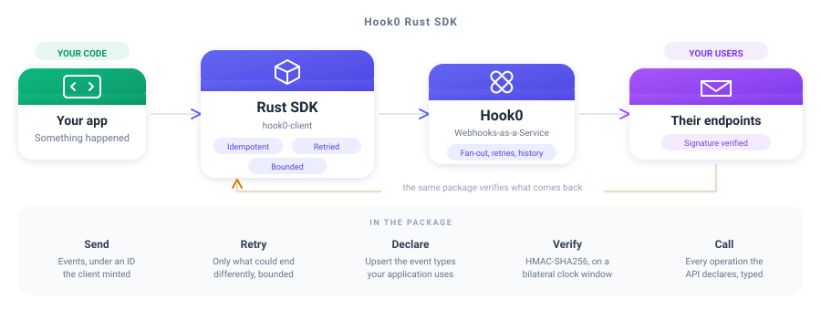

<div align="center">

# Hook0 Rust SDK

**Webhooks your users can trust, from the language that hates surprises**

<br/>



<br/>
<br/>

[](https://crates.io/crates/hook0-client)
[](https://docs.rs/hook0-client)
[](./LICENSE.md)

</div>

---

## What is this?

The Rust SDK for [Hook0](https://www.hook0.com/), the open source Webhooks-as-a-Service platform
for SaaS applications. It sends events, declares the event types your application uses, verifies the
signature of a webhook you receive, and calls every operation the API declares through generated,
documented types.

Both halves are feature-gated. `producer` sends events and declares event types, `consumer` verifies
the signature of a webhook you received, and both are on by default, so an application that only
receives can switch the other off and compile neither.

## Features

- **Send events** - under an ID the client mints, so a retry cannot duplicate one
- **Declare event types** - upsert the ones your application emits, in one call
- **Verify signatures** - HMAC-SHA256 over a bilateral clock window
- **The whole API, typed** - one struct per schema, one variant per problem, one method per operation
- **Bounded everywhere** - attempts, backoff, timeouts, payload and answer, all yours to set
- **Async throughout** - built on `reqwest` and `tokio`, cancellable by the future that holds it

---

## Quick Start

### 1. Install

```bash
cargo add hook0-client
```

Take only the half you use: `hook0-client = { version = "1", default-features = false, features =
["consumer"] }`.

### 2. Send an event

```rust
use hook0_client::{Event, Hook0Client};
use reqwest::Url;
use std::borrow::Cow;
use uuid::Uuid;

#[tokio::main]
async fn main() -> Result<(), Box<dyn std::error::Error>> {
    let client = Hook0Client::new(
        Url::parse("https://app.hook0.com/api/v1")?,
        Uuid::parse_str("0d0ea1e0-8b1f-4f4d-9c2a-1b5c9a3d7e21")?,
        &std::env::var("HOOK0_TOKEN")?,
    )?;

    let event_id = client
        .send_event(&Event {
            event_id: None,
            event_type: "billing.invoice.paid",
            payload: Cow::Borrowed(r#"{"invoice": "in_123"}"#),
            payload_content_type: "application/json",
            metadata: None,
            occurred_at: None,
            labels: vec![("environment".to_owned(), "production".to_owned())],
        })
        .await?;

    println!("ingested as {event_id}");
    Ok(())
}
```

### 3. Verify a webhook you receive

```rust
use hook0_client::verify_webhook_signature;
use std::time::Duration;

fn accept(
    signature: &str,
    body: &[u8],
    headers: &[(&str, &str)],
    subscription_secret: &str,
) -> bool {
    verify_webhook_signature(
        signature,
        body,
        headers,
        subscription_secret,
        Duration::from_secs(300),
    )
    .is_ok()
}
```

The clock window is bilateral, so a delivery dated too far ahead is refused exactly like one dated
too far behind, because a window that only looked backwards is one a sender widens by dating its own
delivery in the future. A header the signature covers but the request did not carry is refused
before any code is computed.

---

## Configuration

Every bound one send is held to is yours to set, and every one has a default.

| Bound | Default | What it holds back |
|-|-|-|
| `max_attempts` | 4 | requests one send issues, capped at 16 whatever a policy says |
| `initial_backoff` | 100 ms | the ceiling of the wait before the first retry |
| `max_backoff` | 2 s | the ceiling no single wait between attempts crosses |
| `max_total_delay` | 5 s | the budget every wait of one send shares |
| `request_timeout` | 10 s | how long one attempt is given |
| `max_payload_bytes` | 1 MiB | the payload, refused before a socket is opened |
| `max_response_bytes` | 8 MiB | the body read off a socket |
| `max_head_bytes` | 16 KiB | the head of an answer, every line taken together |
| `max_response_headers` | 64 | header lines one answer may carry |
| `max_header_bytes` | 64 KiB | one header line |

Every default comes from [`clients/conformance/bounds.json`](https://gitlab.com/hook0/hook0/-/blob/master/clients/conformance/bounds.json),
the corpus every Hook0 SDK reads. A number changed there fails every SDK still carrying the old one,
so no two of them can bound different things.

The last three bound what the other end may cost you. A server that is broken or hostile can
otherwise stream a head, a header or a body of any length into your process.

```rust
use hook0_client::{Hook0Client, RetryPolicy};
use std::time::Duration;

let client = Hook0Client::new(api_url, application_id, &token)?
    .with_retry_policy(RetryPolicy {
        max_attempts: 4,
        initial_backoff: Duration::from_millis(100),
        max_backoff: Duration::from_secs(2),
        max_total_delay: Duration::from_secs(5),
    })
    .with_request_timeout(Duration::from_secs(10))
    .with_max_payload_bytes(1024 * 1024)
    .with_max_response_bytes(8 * 1024 * 1024);
```

---

## Usage

### Sending is idempotent, and retried

`send_event` sends every event under an ID it knows, either the one set on the event or a UUIDv7 it
mints when the event carries none. **Passing no ID does not mean the ID comes from Hook0.** The value comes
from the client, travels with the request, and is what `send_event` returns.

That is what makes a retry safe. Hook0 keys events on their ID, so a request repeated after a network
failure or a server error ingests the event once rather than twice. Without a client-chosen ID, the
repeated request would create a second event and deliver it to every subscriber.

Retrying is limited to what could end differently. A request that got no answer, a server error and
an instance saying it is being reached faster than it accepts are all retried. A `429` naming a
spent quota is not, because a quota clears when a plan changes or a day turns, and no send can wait
for that. A
`Retry-After` the answer carries is honoured, clamped to what is left of the delay budget. A retried
request Hook0 answers with `EventAlreadyIngested` reports success, since an earlier attempt of that
same send reached the API. The same answer to a *first* attempt is a genuine conflict, and is
reported as an error.

### Declaring the event types you use

```rust
let created = client
    .upsert_event_types(&["billing.invoice.paid", "billing.invoice.voided"])
    .await?;
```

Only the ones your application does not declare yet are created, and those are what comes back.

### Calling the rest of the API

Every operation the API declares is a method of a generated group, one group per entity.

```rust
use hook0_client::generated::{ApplicationsApi, ProblemId, RequestError};

let applications = ApplicationsApi::new(transport);

match applications.get(application_id).await {
    Ok(application) => println!("{}", application.name),
    Err(RequestError::Api(failure)) if failure.kind == Some(ProblemId::NotFound) => {
        // the API named a problem, and this is which one
    }
    Err(other) => return Err(other.into()),
}
```

### Bringing your own transport

The generated groups are issued through a `Transport`, a trait with one method. Given a verb, a
path, a query and a body, it answers the status and the bytes. The half of this crate that reaches
the network implements it, and so can you, over whichever HTTP client your application already
carries.

---

## Development

`clients/rust/src/generated/` is written by [`hook0-sdkgen`](https://gitlab.com/hook0/hook0/-/tree/master/clients/sdkgen)
from the OpenAPI snapshot the API commits, and is rewritten whole on every regeneration. A hand edit
there is reverted the next time anyone regenerates, and the drift guard says so before that. Change
the generator, then run:

```
UPDATE_SDK=rust cargo test -p hook0-sdkgen sdk_targets
```

Everything beside it, the transport, the retry loop and the signature verification, is hand-written
and never regenerated, and so is `tests/`.

What a send retries, the bounds it is held to and how a signature is verified are dictated by the
shared corpus at [`clients/conformance`](https://gitlab.com/hook0/hook0/-/tree/master/clients/conformance),
which every SDK's suite reads, so a verdict changed there fails this client until it agrees again.

Every case runs against a real Hook0 over a loopback socket. Nothing here stands in for a part of
the client.

```
cargo fmt --all -- --check
cargo clippy --all-targets --all-features -- -D warnings
cargo test --all-features
```

---

## License

The Hook0 Rust SDK is free and open source, released under the [MIT License](./LICENSE.md). Use it,
change it, ship it, in open source and in commercial work alike, as long as the copyright notice
travels with it.

Hook0 itself is open source too. Read [what Hook0 is](https://documentation.hook0.com/docs/what-is-hook0),
visit [hook0.com](https://www.hook0.com/), join the [community](https://www.hook0.com/community), or
write to [support@hook0.com](mailto:support@hook0.com).

Maintained by [David Sferruzza](mailto:david@hook0.com) and [François-Guillaume Ribreau](mailto:fg@hook0.com).
