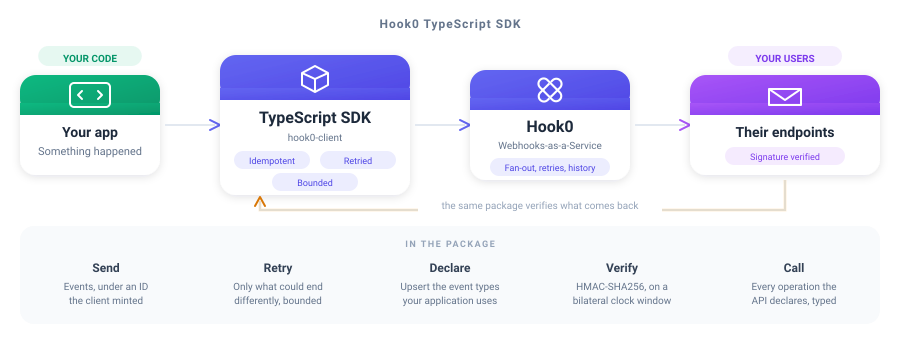

<div align="center">

# Hook0 TypeScript SDK

**Send and verify webhooks from Node, in either module system**

<br/>



<br/>
<br/>

[](https://www.npmjs.com/package/hook0-client)
[](https://documentation.hook0.com/docs/sdk-javascript-typescript)
[](./LICENSE)

</div>

---

## What is this?

The TypeScript SDK for [Hook0](https://www.hook0.com/), the open source Webhooks-as-a-Service platform
for SaaS applications. It sends events, declares the event types your application uses, verifies the
signature of a webhook you receive, and calls every operation the API declares through generated,
documented types.

`require` and `import` both reach it, and the `exports` map says so rather than leaving it to be
inferred. The ES module half re-exports the compiled CommonJS instead of being a second compilation
of it, so a dependency tree reaching the package both ways still gets one `Hook0ClientError` class
rather than two.

## Features

- **Send events** - under an ID the client mints, so a retry cannot duplicate one
- **Declare event types** - upsert the ones your application emits, in one call
- **Verify signatures** - HMAC-SHA256 over a bilateral clock window
- **The whole API, typed** - one type per schema, one class per problem, one method per operation
- **Bounded everywhere** - attempts, backoff, timeouts, payload and answer, all yours to set
- **One class, both module systems** - `instanceof` still answers what you meant

---

## Quick Start

### 1. Install

```bash
npm install hook0-client
```

TypeScript resolves the declarations for whichever half it picks, under `bundler`, `node16` and
`nodenext` alike. The compiled layout is not part of the contract, and reaching into
`hook0-client/dist/…` is refused at resolution, so import the package.

### 2. Send an event

```typescript
import { Event, Hook0Client } from 'hook0-client';
// or: const { Event, Hook0Client } = require('hook0-client');

const hook0 = new Hook0Client(
  'https://app.hook0.com/api/v1',
  '0d0ea1e0-8b1f-4f4d-9c2a-1b5c9a3d7e21',
  process.env.HOOK0_TOKEN!
);

const eventId = await hook0.sendEvent(
  new Event(
    'billing.invoice.paid',
    JSON.stringify({ invoice: 'in_123' }),
    'application/json',
    { environment: 'production' }
  )
);
```

### 3. Verify a webhook you receive

```typescript
import { verifyWebhookSignature } from 'hook0-client';

try {
  verifyWebhookSignature(signature, rawBody, headers, subscriptionSecret, 300);
} catch (refused) {
  // answer 400, and do not act on the delivery
}
```

The clock window is bilateral, so a delivery dated too far ahead is refused exactly like one dated
too far behind, because a window that only looked backwards is one a sender widens by dating its own
delivery in the future. A header the signature covers but the request did not carry is refused
before any code is computed.

---

## Configuration

Every bound one send is held to is yours to set, and every one has a default.

| Bound | Default | What it holds back |
|-|-|-|
| `maxAttempts` | 4 | requests one send issues, capped at 16 whatever a policy says |
| `initialBackoff` | 100 ms | the ceiling of the wait before the first retry |
| `maxBackoff` | 2 s | the ceiling no single wait between attempts crosses |
| `maxTotalDelay` | 5 s | the budget every wait of one send shares |
| `requestTimeout` | 10 s | how long one attempt is given |
| `maxPayloadBytes` | 1 MiB | the payload, refused before a socket is opened |
| `maxResponseBytes` | 8 MiB | the body read off a socket |
| `maxHeadBytes` | 16 KiB | the head of an answer, every line taken together |
| `maxResponseHeaders` | 64 | header lines one answer may carry |
| `maxHeaderBytes` | 64 KiB | one header line |

Every default comes from [`clients/conformance/bounds.json`](https://gitlab.com/hook0/hook0/-/blob/master/clients/conformance/bounds.json),
the corpus every Hook0 SDK reads. A number changed there fails every SDK still carrying the old one,
so no two of them can bound different things.

The last three bound what the other end may cost you. A server that is broken or hostile can
otherwise stream a head, a header or a body of any length into your process.

```typescript
import { Hook0Client, Hook0ClientOptions, RetryPolicy } from 'hook0-client';

const hook0 = new Hook0Client(apiUrl, applicationId, token, false, new Hook0ClientOptions(
  new RetryPolicy(
    4,    // attempts, the first one included
    100,  // ceiling of the delay before the first retry, in milliseconds
    2000, // ceiling no single delay ever exceeds, in milliseconds
    5000  // budget all the delays of one send share, in milliseconds
  ),
  10_000,          // longest one attempt is given, in milliseconds
  1024 * 1024,     // largest event payload the client sends, in bytes
  8 * 1024 * 1024  // largest answer it reads off the socket, in bytes
));
```

---

## Usage

### Sending is idempotent, and retried

`sendEvent` sends every event under an ID it knows, either the one set on the event or a UUIDv7 it
mints when the event carries none. **Passing no ID does not mean the ID comes from Hook0.** The value comes
from the client, travels with the request, and is what `sendEvent` resolves to.

That is what makes a retry safe. Hook0 keys events on their ID, so a request repeated after a network
failure or a server error ingests the event once rather than twice. Without a client-chosen ID, the
repeated request would create a second event and deliver it to every subscriber.

Retrying is limited to what could end differently. A request that got no answer, a server error and
an instance saying it is being reached faster than it accepts are all retried. A `429` naming a
spent quota is not, because a quota clears when a plan changes or a day turns, and no send can wait
for that. A
`Retry-After` the answer carries is honoured, clamped to what is left of the delay budget. A retried
request Hook0 answers with `EventAlreadyIngested` reports success, since an earlier attempt of that
same send reached the API. The same answer to a *first* attempt is a genuine conflict, and is
reported as an error.

### Declaring the event types you use

```typescript
import { EventType, Hook0ClientError } from 'hook0-client';

const parsed = EventType.fromString('billing.invoice.paid');

if (parsed instanceof Hook0ClientError) {
  throw parsed;
}

console.log(parsed.service, parsed.resourceType, parsed.verb);
```

Only the ones your application does not declare yet are created, and those are what comes back.

### Calling the rest of the API

Every operation the API declares is a method of a generated group, one group per entity.

```typescript
import { generated } from 'hook0-client';

const applications = new generated.ApplicationsApi(transport);

try {
  const application = await applications.get(applicationId);
  console.log(application.name);
} catch (failed) {
  if (failed instanceof generated.ProblemError && failed.kind === 'NotFound') {
    // the API named a problem, and this is which one
  }
}
```

---

## Development

`clients/typescript/src/generated/` is written by [`hook0-sdkgen`](https://gitlab.com/hook0/hook0/-/tree/master/clients/sdkgen)
from the OpenAPI snapshot the API commits, and is rewritten whole on every regeneration. A hand edit
there is reverted the next time anyone regenerates, and the drift guard says so before that. Change
the generator, then run:

```
UPDATE_SDK=typescript cargo test -p hook0-sdkgen sdk_targets
```

Everything beside it, the transport, the retry loop and the signature verification, is hand-written
and never regenerated, and so is `tests/`.

What a send retries, the bounds it is held to and how a signature is verified are dictated by the
shared corpus at [`clients/conformance`](https://gitlab.com/hook0/hook0/-/tree/master/clients/conformance),
which every SDK's suite reads, so a verdict changed there fails this client until it agrees again.

Every case runs against a real Hook0 over a loopback socket. Nothing here stands in for a part of
the client.

```
npm install
npm run check-full
```

---

## License

The Hook0 TypeScript SDK is free and open source, released under the [MIT License](./LICENSE). Use it,
change it, ship it, in open source and in commercial work alike, as long as the copyright notice
travels with it.

Hook0 itself is open source too. Read [what Hook0 is](https://documentation.hook0.com/docs/what-is-hook0),
visit [hook0.com](https://www.hook0.com/), join the [community](https://www.hook0.com/community), or
write to [support@hook0.com](mailto:support@hook0.com).

Maintained by [David Sferruzza](mailto:david@hook0.com) and [François-Guillaume Ribreau](mailto:fg@hook0.com).
