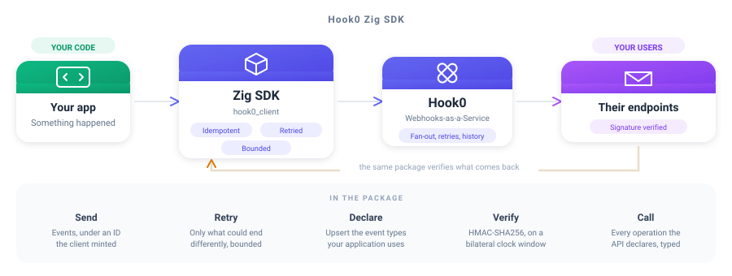

<div align="center">

# Hook0 Zig SDK

**Send and verify webhooks with an allocator you handed over and an Io you own**

<br/>



<br/>
<br/>

[](https://ziglang.org/)
[](./LICENSE)

</div>

---

## What is this?

The Zig SDK for [Hook0](https://www.hook0.com/), the open source Webhooks-as-a-Service platform
for SaaS applications. It sends events, declares the event types your application uses, verifies the
signature of a webhook you receive, and calls every operation the API declares through generated,
documented types.

`build.zig.zon` declares `.dependencies = .{}`, and the suite fails if that ever stops being true.
The HTTP/1.1 the transport speaks is written out in [`src/transport.zig`](src/transport.zig) rather
than taken from `std.http`, because what this client needs is the four ceilings applied on the line
that crosses each, and a client of `std.http.Client` applies them after the fact.

## Features

- **Send events** - under an ID the client mints, so a retry cannot duplicate one
- **Declare event types** - upsert the ones your application emits, in one call
- **Verify signatures** - HMAC-SHA256 over a bilateral clock window
- **The whole API, typed** - one struct per schema, one error per problem, one method per operation
- **Everything read is owned** - one `deinit` frees the body, the document and every slice read out of it
- **Zero dependencies** - the standard library and nothing else

---

## Quick Start

### 1. Install

There is no central registry for Zig packages, so publishing is a tag and a URL. The archive is the
tag of `github.com/hook0/hook0-zig`, the read-only mirror this directory is pushed to on every SDK
release: `zig fetch` needs an archive whose root is the package, which a monorepo cannot be.

```sh
zig fetch --save=hook0 https://github.com/hook0/hook0-zig/archive/refs/tags/v2.0.1.tar.gz
```

That writes a `.hash` beside the URL, and every later build is held to it. Then, in your `build.zig`:

```zig
const hook0 = b.dependency("hook0", .{ .target = target, .optimize = optimize });
exe.root_module.addImport("hook0", hook0.module("hook0"));
```

**Zig 0.16.0, and only that one.** The package is built on `std.Io`, the interface carrying the
clock, the randomness and the sockets, which is new in this release. The same version is pinned in
CI by name and by the checksum of the tarball it names.

### 2. Send an event

```zig
const hook0 = @import("hook0");

var client: hook0.Client = .init(io, "https://app.hook0.com/api/v1", application_id, token, .{});

const sent = try client.sendEvent(allocator, .{
    .event_type = "billing.invoice.paid",
    .payload = "{\"invoice\":\"in_123\"}",
    .payload_content_type = "application/json",
    .labels = &.{.{ .key = "environment", .value = "production" }},
});
defer sent.deinit();

std.log.info("ingested as {s}", .{sent.value});
```

### 3. Verify a webhook you receive

```zig
hook0.verifyWebhookSignature(
    io,
    delivered.header("x-hook0-signature").?,
    delivered.body,
    &headers,
    subscription_secret,
    300,
) catch |refused| switch (refused) {
    error.OutsideTolerance => return .{ .status = 400 },
    else => return .{ .status = 400 },
};
```

The clock window is bilateral, so a delivery dated too far ahead is refused exactly like one dated
too far behind, because a window that only looked backwards is one a sender widens by dating its own
delivery in the future. A header the signature covers but the request did not carry is refused
before any code is computed.

---

## Configuration

Every bound one send is held to is yours to set, and every one has a default.

| Bound | Default | What it holds back |
|-|-|-|
| `max_attempts` | 4 | requests one send issues, capped at 16 whatever a policy says |
| `initial_backoff` | 100 ms | the ceiling of the wait before the first retry |
| `max_backoff` | 2 s | the ceiling no single wait between attempts crosses |
| `max_total_delay` | 5 s | the budget every wait of one send shares |
| `request_timeout` | 10 s | how long one attempt is given |
| `max_payload_bytes` | 1 MiB | the payload, refused before a socket is opened |
| `max_response_bytes` | 8 MiB | the body read off a socket |
| `max_head_bytes` | 16 KiB | the head of an answer, every line taken together |
| `max_response_headers` | 64 | header lines one answer may carry |
| `max_header_bytes` | 64 KiB | one header line |

Every default comes from [`clients/conformance/bounds.json`](https://gitlab.com/hook0/hook0/-/blob/master/clients/conformance/bounds.json),
the corpus every Hook0 SDK reads. A number changed there fails every SDK still carrying the old one,
so no two of them can bound different things.

The last three bound what the other end may cost you. A server that is broken or hostile can
otherwise stream a head, a header or a body of any length into your process.

```zig
var client: hook0.Client = .init(io, api_url, application_id, token, .{
    .retry_policy = .{
        .max_attempts = 4,
        .initial_backoff_ms = 100,
        .max_backoff_ms = 2_000,
        .max_total_delay_ms = 5_000,
    },
    .request_timeout_ms = 10_000,
    .max_payload_bytes = 1024 * 1024,
    .max_response_bytes = 8 * 1024 * 1024,
});
```

---

## Usage

### Sending is idempotent, and retried

`send_event` sends every event under an ID it knows, either the one set on the event or a UUIDv7 it
mints when the event carries none. **Passing no ID does not mean the ID comes from Hook0.** The value comes
from the client, travels with the request, and is what `send_event` answers.

That is what makes a retry safe. Hook0 keys events on their ID, so a request repeated after a network
failure or a server error ingests the event once rather than twice. Without a client-chosen ID, the
repeated request would create a second event and deliver it to every subscriber.

Retrying is limited to what could end differently. A request that got no answer, a server error and
an instance saying it is being reached faster than it accepts are all retried. A `429` naming a
spent quota is not, because a quota clears when a plan changes or a day turns, and no send can wait
for that. A
`Retry-After` the answer carries is honoured, clamped to what is left of the delay budget. A retried
request Hook0 answers with `EventAlreadyIngested` reports success, since an earlier attempt of that
same send reached the API. The same answer to a *first* attempt is a genuine conflict, and is
reported as an error.

### Declaring the event types you use

```zig
const created = try client.upsertEventTypes(allocator, &.{
    "billing.invoice.paid",
    "billing.invoice.voided",
});
defer created.deinit();
```

Only the ones your application does not declare yet are created, and those are what comes back.

### Calling the rest of the API

Every operation the API declares is a method of a generated group, one group per entity.

```zig
var group = hook0.api.ApplicationSecretsApi.init(allocator, client.transportOf());
defer group.deinit();

const secrets = try group.read(allocator, application_id);
defer secrets.deinit();
```

### The Io is the caller's

Nothing here reaches a clock, a source of randomness or a socket on its own, which is what lets the
suite move the clock rather than wait for it.

### Every failure is a value you can match

Zig errors carry no payload, so what another SDK would say in a sentence is said by the name of the
error, and every failure is a member of a declared set. `client.detail` carries what an error
cannot: the problem document the API answered, or how many attempts were spent over how long.

### One thing this client does not do yet

There is no timeout on opening the connection. `std.Io.net.ConnectOptions` declares one in 0.16 and
the POSIX backend panics with `TODO implement netConnectIpPosix with timeout` when it is set, so
setting it would trade a hang for a crash. Everything after the connection is held to
`request_timeout_ms`, and the connect is left to the operating system's own.

---

## Development

`clients/zig/src/generated/` is written by [`hook0-sdkgen`](https://gitlab.com/hook0/hook0/-/tree/master/clients/sdkgen)
from the OpenAPI snapshot the API commits, and is rewritten whole on every regeneration. A hand edit
there is reverted the next time anyone regenerates, and the drift guard says so before that. Change
the generator, then run:

```
UPDATE_SDK=zig cargo test -p hook0-sdkgen sdk_targets
```

Everything else under `src/`, the transport, the retries, the bounds and the signatures, is
hand-written and never regenerated, and so is `tests/`.

What a send retries, the bounds it is held to and how a signature is verified are dictated by the
shared corpus at [`clients/conformance`](https://gitlab.com/hook0/hook0/-/tree/master/clients/conformance),
which every SDK's suite reads, so a verdict changed there fails this client until it agrees again.

Every case runs against a real Hook0 over a loopback socket. Nothing here stands in for a part of
the client.

```
zig fmt --check .
zig build test
```

---

## License

The Hook0 Zig SDK is free and open source, released under the [MIT License](./LICENSE). Use it,
change it, ship it, in open source and in commercial work alike, as long as the copyright notice
travels with it.

Hook0 itself is open source too. Read [what Hook0 is](https://documentation.hook0.com/docs/what-is-hook0),
visit [hook0.com](https://www.hook0.com/), join the [community](https://www.hook0.com/community), or
write to [support@hook0.com](mailto:support@hook0.com).

Maintained by [David Sferruzza](mailto:david@hook0.com) and [François-Guillaume Ribreau](mailto:fg@hook0.com).
