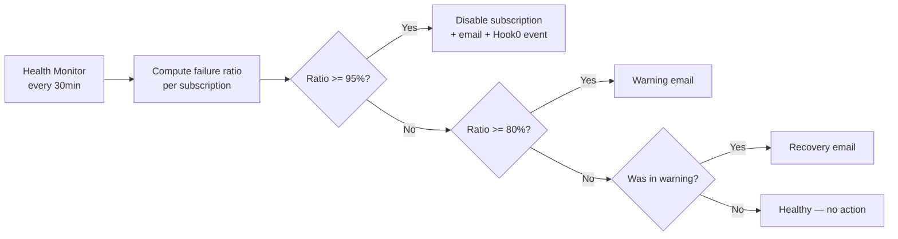
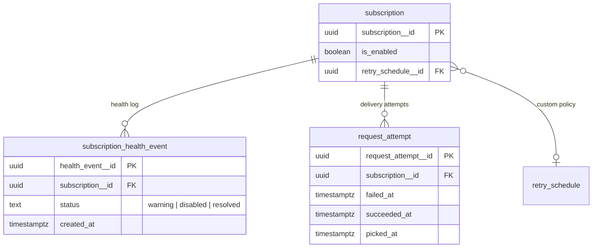
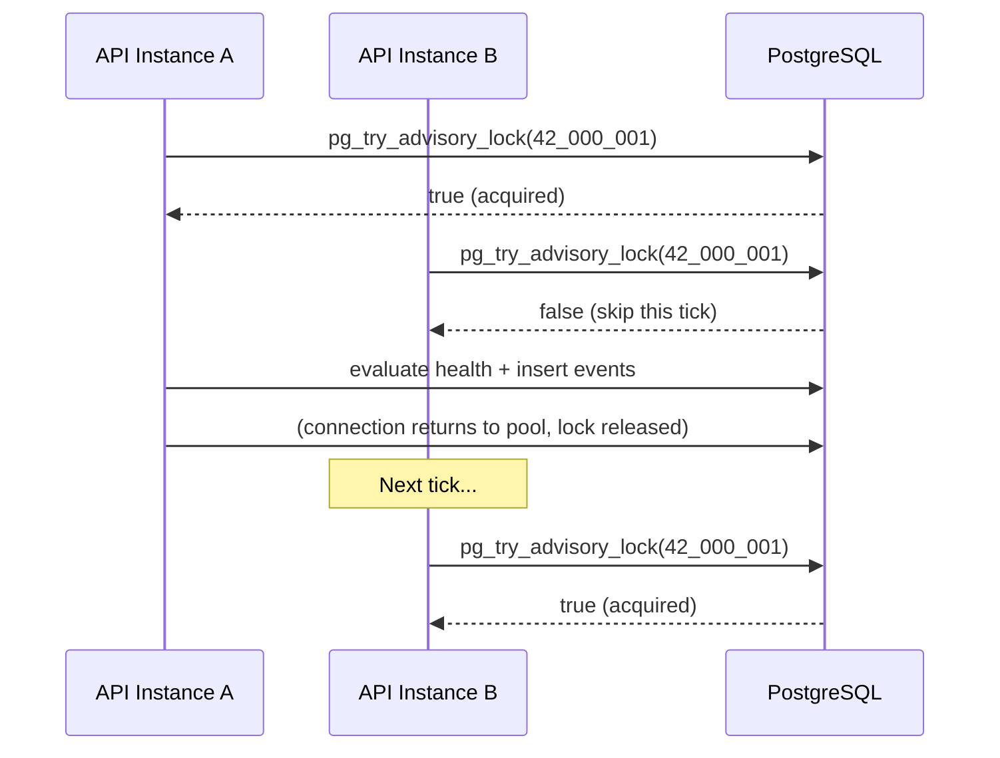
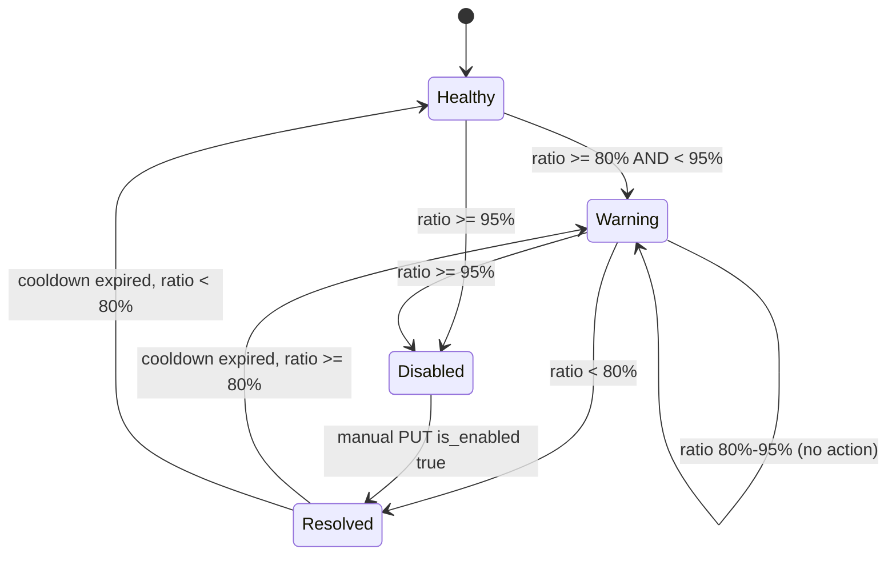
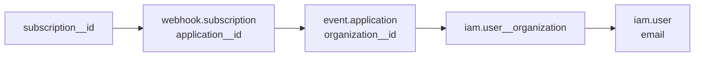

# Phase 2: Automatic Subscription Deactivation

**Ticket**: [#42 — Customizable delay algorithm strategy on retry](https://gitlab.com/hook0/hook0/-/work_items/42)
**Date**: 2026-03-26
**Status**: Draft
**Depends on**: Phase 1 (Configurable Retry Schedule) — must be merged before implementation starts.

---

## 1. Goal

Automatically disable subscriptions that are consistently failing, and notify organization members via email. This is Phase 2 of ticket #42.

Phase 1 introduced configurable retry schedules (exponential, linear, custom). Phase 2 adds a periodic health monitor that evaluates each subscription's failure ratio, disables those exceeding a threshold, and notifies organization members via email.

### High-level flow



## 2. Scope

### In scope

- Periodic health monitor (API background task) evaluating subscription failure ratio
- Adaptive failure ratio: evaluated over message count (high volume) or time window (low volume)
- `webhook.subscription_health_event` table (append-only health log, rows inserted only on status transitions)
- Warning email when failure ratio crosses warning threshold
- Deactivation email when subscription is disabled
- Recovery email when failure ratio drops below warning threshold after a warning
- Hook0 event `api.subscription.disabled`
- Health thresholds as global server config (env vars), not user-configurable
- Concurrency safety via `pg_try_advisory_lock` for multi-instance deployments

### Out of scope

- Per-subscription/per-application health threshold configuration
- Manual retry/recover/replay APIs (Phase 3)
- Frontend UI for deactivation status
- `message.attempt.exhausted` or `message.attempt.failed` events

## 3. Design

### 3.1. Failure definition

A `request_attempt` is counted as:

- **Failed**: `failed_at IS NOT NULL`
- **Succeeded**: `succeeded_at IS NOT NULL`
- **Excluded** from ratio calculation: attempts still in-flight (`succeeded_at IS NULL AND failed_at IS NULL`) and attempts not yet picked up (`picked_at IS NULL`)

The ratio is computed at the **attempt level**, not the message level. If a message fails 3 times then succeeds on retry 4, that counts as 3 failures and 1 success (4 attempts total).

### 3.2. Database

**New table `webhook.subscription_health_event`:**

```sql
CREATE TABLE webhook.subscription_health_event (
    health_event__id uuid NOT NULL DEFAULT public.gen_random_uuid(),
    subscription__id uuid NOT NULL
        REFERENCES webhook.subscription(subscription__id)
        ON DELETE CASCADE,
    status text NOT NULL
        CHECK (status IN ('warning', 'disabled', 'resolved')),
    created_at timestamptz NOT NULL DEFAULT statement_timestamp(),
    CONSTRAINT subscription_health_event_pkey PRIMARY KEY (health_event__id)
);

CREATE INDEX idx_subscription_health_event_sub_id
    ON webhook.subscription_health_event(subscription__id, created_at DESC)
    INCLUDE (status);
```

Append-only — a new row is inserted only on **status transitions** (not on every health monitor tick). This keeps the table small and sustainable.

**New index on `request_attempt` for the health evaluation query:**

```sql
CREATE INDEX idx_request_attempt_sub_health
    ON webhook.request_attempt (subscription__id, created_at DESC)
    INCLUDE (succeeded_at, failed_at);
```

This enables index-only scans for the health evaluation query, avoiding heap fetches on the large `request_attempt` table.

**Subscription health lifecycle:**



**Deactivation (health monitor, in a single transaction using CTE for idempotency):**

```sql
WITH updated AS (
    UPDATE webhook.subscription
    SET is_enabled = false
    WHERE subscription__id = $1 AND is_enabled = true
    RETURNING subscription__id
)
INSERT INTO webhook.subscription_health_event (subscription__id, status)
SELECT subscription__id, 'disabled' FROM updated;
```

If the subscription is already disabled (by user or by a concurrent tick), the UPDATE matches 0 rows and the INSERT is skipped. No orphaned health events.

**Manual re-activation (API PUT, same CTE pattern):**

```sql
WITH updated AS (
    UPDATE webhook.subscription
    SET is_enabled = true
    WHERE subscription__id = $1 AND is_enabled = false
    RETURNING subscription__id
)
INSERT INTO webhook.subscription_health_event (subscription__id, status)
SELECT subscription__id, 'resolved' FROM updated;
```

Only inserts `resolved` when `is_enabled` actually transitions from `false` to `true`. A PUT that sends `is_enabled: true` on an already-enabled subscription is a no-op.

**Data retention:** The table grows only on status transitions (not every tick). Typical lifecycle per incident: `warning → disabled → resolved` = 3 rows. A periodic cleanup job should remove rows older than 90 days where `status = 'resolved'`, keeping the latest event per subscription regardless of age:

```sql
DELETE FROM webhook.subscription_health_event
WHERE created_at < now() - interval '90 days'
  AND status = 'resolved'
  AND health_event__id NOT IN (
    SELECT DISTINCT ON (subscription__id) health_event__id
    FROM webhook.subscription_health_event
    ORDER BY subscription__id, created_at DESC
  );
```

### 3.3. Health Monitor — Background Task

A background task spawned via `actix_web::rt::spawn` with `tokio::time::sleep` between iterations (matching existing housekeeping task patterns). Runs at a configurable interval (default: 30 minutes).

**Infrastructure requirements:**

- Uses the **`housekeeping_pool`** (no statement timeout, max 3 connections), NOT the API pool. The health evaluation query is an aggregation across all subscriptions and could exceed the API pool's statement timeout.
- Participates in the **`housekeeping_semaphore`** to avoid overwhelming the housekeeping pool alongside other housekeeping tasks.
- Receives `housekeeping_pool`, `mailer`, and `hook0_client` as cloned resources before spawning (NOT via `web::Data` which is request-scoped).
- Each iteration is wrapped in a catch-all error handler: log the error and continue to the next tick. A panic or unrecoverable error must not kill the task silently.

**Multi-instance concurrency:** In Kubernetes deployments with multiple API replicas, each instance spawns its own health monitor. To prevent duplicate evaluations, emails, and health events, the health monitor acquires `pg_try_advisory_lock` at the start of each tick. The lock is session-level: if the holder crashes, PostgreSQL releases the lock automatically and another instance acquires it on the next tick.



```rust
let acquired: bool = sqlx::query_scalar("SELECT pg_try_advisory_lock(42_000_001)")
    .fetch_one(&housekeeping_pool).await?;
if !acquired {
    // Another instance is running the health check. Skip this tick.
    return Ok(());
}
// ... evaluate health ...
// Lock is automatically released at connection close or session end.
```

The lock ID `42_000_001` is a fixed constant (derived from ticket #42). Only one instance runs the evaluation per tick.

#### 3.3.1. Health evaluation query

The health monitor computes failure ratios for all enabled subscriptions in a single query:

```sql
WITH attempt_stats AS (
    SELECT
        ra.subscription__id,
        count(*) AS total,
        count(*) FILTER (WHERE ra.failed_at IS NOT NULL) AS failed,
        count(*) FILTER (WHERE ra.succeeded_at IS NOT NULL) AS succeeded
    FROM webhook.request_attempt ra
    INNER JOIN webhook.subscription s ON s.subscription__id = ra.subscription__id
    WHERE s.is_enabled = true
      AND s.deleted_at IS NULL
      AND ra.created_at > now() - $1::interval  -- HEALTH_TIME_WINDOW
      AND (ra.succeeded_at IS NOT NULL OR ra.failed_at IS NOT NULL)  -- exclude in-flight
    GROUP BY ra.subscription__id
    HAVING count(*) >= $2  -- HEALTH_MIN_SAMPLE_SIZE
),
with_ratio AS (
    SELECT
        subscription__id,
        total,
        failed,
        succeeded,
        CASE WHEN total > 0 THEN (failed::float / total::float * 100.0) ELSE 0 END AS failure_percent,
        CASE WHEN total >= $3 THEN 'high_volume' ELSE 'low_volume' END AS volume_mode
    FROM attempt_stats
),
latest_health AS (
    SELECT DISTINCT ON (subscription__id)
        subscription__id, status, created_at
    FROM webhook.subscription_health_event
    ORDER BY subscription__id, created_at DESC
)
SELECT
    r.subscription__id,
    r.failure_percent,
    r.total,
    r.volume_mode,
    lh.status AS last_health_status,
    lh.created_at AS last_health_at
FROM with_ratio r
LEFT JOIN latest_health lh USING (subscription__id)
-- $1 = HEALTH_TIME_WINDOW, $2 = HEALTH_MIN_SAMPLE_SIZE, $3 = HEALTH_MESSAGE_WINDOW
```

For high-volume subscriptions (`total >= HEALTH_MESSAGE_WINDOW`), only the last `HEALTH_MESSAGE_WINDOW` messages are considered (the query can be refined with a window function or subquery LIMIT at implementation time).

#### 3.3.2. State machine



For each subscription returned by the evaluation query, the health monitor applies the following rules. **Rules are evaluated most-specific first** (highest threshold wins):

| Last health status                 | Condition                      | Action                                                                                                              |
| ---------------------------------- | ------------------------------ | ------------------------------------------------------------------------------------------------------------------- |
| None or `resolved` (past cooldown) | failure ratio >= 95%           | Insert `warning` + `disabled` rows, send warning email + deactivation email, emit `api.subscription.disabled` event |
| None or `resolved` (past cooldown) | failure ratio >= 80% AND < 95% | Insert `warning` row, send warning email                                                                            |
| `warning`                          | failure ratio >= 95%           | Insert `disabled` row, send deactivation email, emit `api.subscription.disabled` event                              |
| `warning`                          | failure ratio >= 80% AND < 95% | No action (warning already active)                                                                                  |
| `warning`                          | failure ratio < 80%            | Insert `resolved` row, send recovery email                                                                          |
| `disabled`                         | —                              | Skip (already disabled; resolved via manual re-activation)                                                          |
| `resolved` (within cooldown)       | —                              | Skip (cooldown active — no new health events inserted, no emails sent)                                              |

**Cooldown:** After a `resolved` event, the health monitor skips the subscription entirely for `HEALTH_WARNING_COOLDOWN` (default 1h). No health events are inserted and no emails are sent during cooldown. This prevents ping-pong when the failure ratio oscillates around the 80% threshold.

#### 3.3.3. Email sending is best-effort

Email failures (SMTP unreachable, timeout) do not block deactivation or Hook0 event emission. The health monitor logs the error and proceeds. The `subscription_health_event` row is the source of truth, not the email.

This differs from the existing quota email pattern (which rolls back the DB change on email failure). Here, the DB state change is the critical path; email is advisory. A failed email will not be retried — the health event table serves as the audit trail.

#### 3.3.4. Email resolution path



The health monitor resolves email recipients via the JOIN chain: `subscription__id → webhook.subscription.application__id → event.application.organization__id → iam.user__organization → iam.user.email`. This is the same pattern used by `api/src/quotas.rs` for quota notification emails. The health monitor loops over org members and calls `send_mail` once per recipient (no batch sending — matching existing mailer API).

### 3.4. Emails

Three MJML templates, sent to every member of the organization. Language: English (consistent with existing templates).

The `webhook.subscription` table has no `name` field. Templates use `description` as the display name, falling back to `subscription_id` if description is null.

#### `SubscriptionWarning`

- **Trigger:** failure ratio crosses 80%, no active warning in current cycle
- **Subject:** `[Hook0] Subscription failing: {subscription_description}`
- **Content:** application name, subscription description/ID, target URL, failure stats (ratio, window), instructions to verify the target

#### `SubscriptionDisabled`

- **Trigger:** failure ratio crosses 95%, subscription auto-disabled
- **Subject:** `[Hook0] Subscription disabled: {subscription_description}`
- **Content:** application name, subscription description/ID, target URL, deactivation date, failure stats, instructions to re-activate (API PUT `is_enabled: true`)

#### `SubscriptionRecovered`

- **Trigger:** failure ratio drops below 80% after a warning was active
- **Subject:** `[Hook0] Subscription recovered: {subscription_description}`
- **Content:** application name, subscription description/ID, target URL, confirmation that health has improved

### 3.5. Hook0 Event

New event type: `api.subscription.disabled` — must be added to the `EVENT_TYPES` array in `api/src/hook0_client.rs`.

Payload (nested objects):

```json
{
  "subscription": {
    "subscription_id": "uuid",
    "organization_id": "uuid",
    "application_id": "uuid",
    "description": "string|null",
    "target": "url",
    "disabled_at": "timestamptz"
  },
  "retry_schedule": {
    "retry_schedule_id": "uuid",
    "name": "string",
    "strategy": "exponential|linear|custom",
    "max_retries": 25,
    "custom_intervals": "int[]|null",
    "linear_delay": "int|null"
  }
}
```

`retry_schedule` is `null` when the worker's default schedule was used (subscription has no custom schedule assigned, or the schedule was deleted via `ON DELETE SET NULL`).

Emitted by the health monitor at deactivation. No Hook0 events for warning or recovery — those are email-only.

### 3.6. API Changes

**Subscription response:** Add `auto_disabled_at: Option<DateTime<Utc>>` derived from the latest `disabled` health event via LATERAL JOIN. This allows API consumers to distinguish user-disabled from system-disabled subscriptions. Performance depends on the `idx_subscription_health_event_sub_id` index — validate with realistic data volumes before shipping.

**Subscription PUT handler:** When `is_enabled` transitions from `false` to `true`, use the CTE pattern from section 3.2 to atomically re-enable and insert a `resolved` health event. A PUT that does not change `is_enabled` must not insert health events.

No new API endpoints.

### 3.7. Configuration

**New API args (clap, all with env var equivalents, durations parsed via `humantime`):**

| Arg                                        | Env var                                  | Type     | Default | Description                                                    |
| ------------------------------------------ | ---------------------------------------- | -------- | ------- | -------------------------------------------------------------- |
| `--health-monitor-interval`                | `HEALTH_MONITOR_INTERVAL`                | duration | `30m`   | How often the health monitor runs                              |
| `--health-monitor-warning-failure-percent` | `HEALTH_MONITOR_WARNING_FAILURE_PERCENT` | u8       | `80`    | Failure % threshold for warning                                |
| `--health-monitor-disable-failure-percent` | `HEALTH_MONITOR_DISABLE_FAILURE_PERCENT` | u8       | `95`    | Failure % threshold for deactivation                           |
| `--health-monitor-time-window`             | `HEALTH_MONITOR_TIME_WINDOW`             | duration | `24h`   | Time window for low-volume evaluation                          |
| `--health-monitor-message-window`          | `HEALTH_MONITOR_MESSAGE_WINDOW`          | u32      | `100`   | Message count window for high-volume evaluation                |
| `--health-monitor-min-sample-size`         | `HEALTH_MONITOR_MIN_SAMPLE_SIZE`         | u32      | `5`     | Minimum completed attempts in window before evaluation applies |
| `--health-monitor-warning-cooldown`        | `HEALTH_MONITOR_WARNING_COOLDOWN`        | duration | `1h`    | Cooldown after resolved before new warning                     |

**Startup validation:** The API must validate at startup that `warning_failure_percent < disable_failure_percent` and both are in `[1, 100]`. Panic with a clear error message on misconfiguration.

Note: args use `--health-monitor-*` prefix to avoid collision with existing `--health-check-*` args (which configure the HTTP health check endpoint).

## 4. Security

- Auto-deactivation writes use the `housekeeping_pool` — same trust model as existing housekeeping tasks
- Email recipients resolved via SQL scoped to `organization__id` (same pattern as quota emails)
- Hook0 event emitted via authenticated hook0-client (same auth as other API events)
- `pg_try_advisory_lock` prevents concurrent evaluation across API replicas
- No new public API endpoints — no new attack surface
- Health thresholds are server-side only — users cannot manipulate them

## 5. Industry Benchmark

Findings based on open-source code review (Svix: [svix-webhooks](https://github.com/svix/svix-webhooks), `server/svix-server/src/worker.rs`, `src/cfg.rs`, `config.default.toml`) and public documentation (Stripe, Shopify).

### Stripe

- Retry schedule: **fixed** server-side (exponential backoff, ~16 attempts over 3 days). Not configurable by users.
- Auto-disable: after ~3-9 days of sustained failures (not configurable).
- Warning email sent before disabling. No recovery email. No auto re-enable.
- Per-endpoint retry config: **none**.

### Svix

- Retry schedule: **fixed** server-side (`[5s, 5min, 30min, 2h, 5h, 10h, 10h]` in `config.default.toml` line 57). Enterprise "Custom" on pricing page but no public API — the open-source `EndpointIn` struct has no retry field (`v1/endpoints/endpoint/mod.rs`). An orphaned `RetryScheduleInOut` schema exists in `openapi.json` but is not wired to any endpoint.
- Auto-disable: cache-based time window in the worker (`worker.rs` lines 132-173). `FailureCacheValue { first_failure_at }` stored on first exhausted message. Disabled when `now - first_failure_at > endpoint_failure_disable_after` (default 120h = 5 days, `cfg.rs`). Any single success clears the cache (`worker.rs` lines 109-118). Cache TTL = 2× disable duration.
- Warning: `message.attempt.failing` on the 4th failed attempt per message (hardcoded `OP_WEBHOOKS_SEND_FAILING_EVENT_AFTER = 4`, `worker.rs` line 71). Per-message, not per-endpoint.
- Recovery: `message.attempt.recovered` when a message succeeds after 4+ failures (`worker.rs` lines 476-496). No auto re-enable.
- Deduplication: structural (attempt_count is monotonically increasing per message). No table.
- All evaluation is **inline in the worker** — no cron.

### Shopify

- Retry schedule: **fixed** (8 retries over 4 hours, since Sept 2024 update). Not configurable.
- Auto-disable: **hard delete** of the webhook subscription after exhaustion.
- Warning: partial email to developer, often missed. No recovery. Must re-create subscription.

### Key insight for Hook0

None of the three allow users to configure retry schedules per-endpoint/subscription. Their fixed-schedule approach makes fixed deactivation thresholds predictable.

Hook0 is unique in offering per-subscription configurable retry schedules (Phase 1). A `custom [3, 10, 30]` schedule exhausts in ~43 seconds while `linear delay=3600, max_retries=100` exhausts in ~100 hours. A fixed `endpoint_failure_disable_after` does not work across this range. This is why we use an adaptive failure ratio rather than fixed calendar thresholds.

## 6. Design Decisions

| #   | Question                  | Decision                                                                                                                                                       | Ticket divergence                                                                                      |
| --- | ------------------------- | -------------------------------------------------------------------------------------------------------------------------------------------------------------- | ------------------------------------------------------------------------------------------------------ |
| 1   | Architecture              | Health monitor as API background task (not inline in worker)                                                                                                   | **Yes** — Svix does inline; we use background task because ratio-based health needs aggregated queries |
| 2   | Health metric             | Adaptive failure ratio — message-count-based for high volume, time-based for low volume                                                                        | **Yes** — ticket uses fixed 5-day calendar threshold                                                   |
| 3   | Health thresholds         | Global server config (env vars), not user-configurable                                                                                                         | —                                                                                                      |
| 4   | Subscription status model | Keep `is_enabled` bool. Auto-disable status derived from health event log via LATERAL JOIN                                                                     | Simplified, no denormalization                                                                         |
| 5   | Warning threshold         | 80% failure ratio                                                                                                                                              | **Yes** — ticket uses 3-day calendar threshold                                                         |
| 6   | Disable threshold         | 95% failure ratio                                                                                                                                              | **Yes** — ticket uses 5-day calendar threshold                                                         |
| 7   | Deactivation email        | Sent when subscription is auto-disabled                                                                                                                        | Aligned                                                                                                |
| 8   | Recovery email            | Sent when failure ratio drops below warning threshold after a warning                                                                                          | Aligned (ticket has optional recovery)                                                                 |
| 9   | Health event tracking     | Append-only `subscription_health_event` table; rows inserted only on status transitions                                                                        | Aligned with ticket concept, improved with audit trail                                                 |
| 10  | Ping-pong prevention      | Cooldown after `resolved` (default 1h) — entire subscription skipped during cooldown                                                                           | —                                                                                                      |
| 11  | Hook0 events              | Only `api.subscription.disabled`                                                                                                                               | Simplified                                                                                             |
| 12  | Event naming              | `api.subscription.disabled`                                                                                                                                    | Aligned with existing `api.subscription.*`                                                             |
| 13  | Event payload             | Nested `subscription` + `retry_schedule` objects                                                                                                               | —                                                                                                      |
| 14  | Email recipients          | All organization members                                                                                                                                       | Aligned with quota email pattern                                                                       |
| 15  | Subscription display name | Use `description` field (fallback to `subscription_id`)                                                                                                        | —                                                                                                      |
| 16  | Email sending failures    | Best-effort, do not block deactivation. Differs from quota pattern (which rolls back on email failure) — here DB state is the critical path, email is advisory | —                                                                                                      |
| 17  | PUT re-activation         | CTE pattern: insert `resolved` health event only when `is_enabled` actually transitions false → true                                                           | —                                                                                                      |
| 18  | Health monitor interval   | 30 minutes default, configurable via `--health-monitor-interval`                                                                                               | —                                                                                                      |
| 19  | Default schedule support  | Health monitor evaluates delivery outcomes regardless of retry schedule                                                                                        | —                                                                                                      |
| 20  | Multi-instance safety     | `pg_try_advisory_lock` ensures only one instance runs the evaluation per tick                                                                                  | —                                                                                                      |
| 21  | DB pool                   | Uses `housekeeping_pool` (no statement timeout)                                                                                                                | —                                                                                                      |
| 22  | Data retention            | Cleanup job removes resolved events older than 90 days (keeps latest per subscription)                                                                         | —                                                                                                      |
| 23  | Failure definition        | `failed_at IS NOT NULL` = failed; in-flight attempts excluded from ratio                                                                                       | —                                                                                                      |

## 7. Open Questions for Future Phases

1. **Per-subscription health thresholds**: Currently global. Could become configurable per subscription or per application.
2. **Frontend deactivation UI**: Display auto-disable status in subscription detail, show re-activation button. Health event history could power a subscription health dashboard.
3. **Manual retry (Phase 3)**: When manually retrying a failed message on a disabled subscription, should it auto-re-enable?
4. **`max_retry_window` interaction**: If enforced at runtime, could cause the health metric to see exhausted messages sooner than expected for long schedules.
5. **Observability**: The health monitor should emit structured log entries and/or metrics (subscriptions evaluated, warnings sent, deactivations performed, email failures) for operational monitoring. Details to be defined at implementation time.
