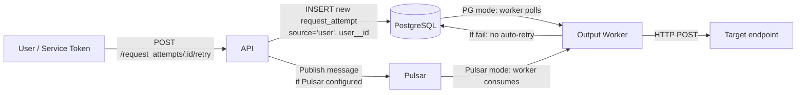

# Phase 3: Manual Retry

**Ticket**: [#42 — Customizable delay algorithm strategy on retry](https://gitlab.com/hook0/hook0/-/work_items/42)
**Date**: 2026-03-27
**Status**: Draft
**Depends on**: Phase 1 (Configurable Retry Schedule), Phase 2 (Automatic Subscription Deactivation)

---

## 1. Goal

Allow users to manually retry a specific request attempt via the API. The retry is one-shot (no automatic retries after), bypasses the `is_enabled` check on the subscription (useful for debugging disabled endpoints), and does not interfere with the health monitor's failure ratio.

This is Phase 3 of ticket #42. Recover (bulk retry of failed messages) and replay (re-send all events from a period) are out of scope.

### High-level flow



## 2. Scope

### In scope

- `POST /api/v1/request_attempts/{request_attempt_id}/retry` endpoint (Editor role)
- `source` and `user__id` columns on `webhook.request_attempt`
- Worker: skip automatic retry for `source = 'user'` attempts
- Worker: pick up manual attempts even on disabled subscriptions (`source = 'user'` bypasses `is_enabled`)
- Health monitor: exclude `source = 'user'` from failure ratio calculation
- Can retry any attempt regardless of its current status (succeeded, failed, or in-flight)
- `source` and `user_id` fields added to existing request_attempt API responses

### Out of scope

- Recover API (bulk retry of failed messages from a date)
- Replay API (re-send all events from a period)
- Hook0 event for retry (no `api.request_attempt.retried` event)
- Specific rate limiting (existing API rate limiter applies)
- Auto re-enable of disabled subscriptions on retry

## 3. Design

### 3.1. Database

**New table `webhook.principal`:**

Shared table for tracking who performed an action (system or user). Used by `subscription_health_event` (Phase 2) and `request_attempt` (Phase 3). Standard IAM term — the entity that acts.

```sql
create table webhook.principal (
    principal__id uuid not null default public.gen_random_uuid(),
    -- 'system' = automatic (health monitor, dispatch trigger, worker retry)
    -- 'user' = manual action via API (user token or service token)
    source text not null
        check (source in ('system', 'user')),
    -- NULL = system or service token action
    -- NOT NULL = action by this specific user
    -- When source = 'user' and user__id IS NULL, the action was via a service token
    user__id uuid
        references iam.user(user__id)
        on delete set null,
    constraint principal_pkey primary key (principal__id),
    -- source = 'system' must have user__id = NULL
    constraint principal_source_user_check check (
        source != 'system' or user__id is null
    )
);
```

**Migration on `webhook.request_attempt`:**

```sql
-- Add FK to principal table. Default to a system principal for existing rows.
-- 1. Insert a single system principal row for backfill
insert into webhook.principal (principal__id, source)
values ('00000000-0000-0000-0000-000000000001', 'system');

-- 2. Add column with default pointing to the system principal
alter table webhook.request_attempt
    add column principal__id uuid not null
        default '00000000-0000-0000-0000-000000000001'
        references webhook.principal(principal__id);
```

The dispatch trigger and worker retry INSERTs use the DEFAULT (system principal). The retry API handler creates a new principal row with `source = 'user'` and the authenticated `user__id`.

**Phase 2 migration refactor:** Since nothing is deployed yet, the Phase 2 migration (`20260326120000_add_subscription_health.up.sql`) will be modified in-place to:
1. Create `webhook.principal` table
2. Use `principal__id FK` on `subscription_health_event` instead of inline `source`/`user__id` columns

No ALTER needed — the original CREATE TABLE is rewritten. The Phase 2 Rust code (`health_monitor.rs`, `subscriptions.rs`) must also be updated to INSERT into `principal` first, then reference `principal__id`.

### 3.2. API Handler

**Route:** `POST /api/v1/request_attempts/{request_attempt_id}/retry`

**Auth:** New IAM action `RequestAttemptRetry` (Editor role). The handler resolves the org via `request_attempt -> subscription -> application -> organization` and authorizes against it.

**Flow:**

1. Fetch the original attempt (verify it exists, get `event__id`, `subscription__id`, `application__id`)
2. No check on `is_enabled` — bypass for debugging disabled subscriptions
3. No check on attempt status — succeeded, failed, and in-flight attempts can all be retried. Retrying an in-flight attempt creates a second concurrent delivery (idempotent endpoints expected).
4. Create a principal: INSERT into `webhook.principal(source, user__id)` with `source = 'user'` and the authenticated user's UUID (NULL for service tokens). Get back `principal__id`.
5. INSERT a new request_attempt (note: `application__id` is required, has no DEFAULT):

```sql
-- Step 1: create the principal
insert into webhook.principal (source, user__id) values ('user', $4)
returning principal__id;

-- Step 2: create the retry attempt
insert into webhook.request_attempt (event__id, subscription__id, application__id, principal__id)
values ($1, $2, $3, $5)
returning request_attempt__id, event__id, subscription__id, created_at, retry_count;
```

Both in the same transaction.

6. If Pulsar is configured: publish a message to the `request_attempts_producer` with the new attempt (same pattern as `events.rs` dispatch handler). This ensures the worker picks it up in Pulsar mode.
7. Return 201 Created with the new attempt

**Response:**

```json
{
  "request_attempt_id": "uuid",
  "event_id": "uuid",
  "subscription_id": "uuid",
  "principal": {
    "source": "user",
    "user_id": "uuid|null"
  },
  "created_at": "timestamptz",
  "retry_count": 0
}
```

**Error cases:**
- 404: original request_attempt not found, or not in an org the caller has access to
- 403: caller does not have Editor role on the org

### 3.3. Worker Changes

Two modifications to the output worker.

#### 3.3.1. Skip automatic retry for manual attempts

The `source = 'user'` check must be placed **before** calling `compute_next_retry`. When the worker processes a failed attempt:

```
if principal.source == "user":
    // Manual retry — one-shot, no automatic re-retry
    mark failed_at = now()
    return
else:
    // Existing logic: compute_next_retry(...)
```

For disabled subscriptions, the existing `is_enabled` check inside `compute_next_retry` already returns `None` (no retry). The `source = 'user'` check above handles it first, but even without it the result is correct (no retry in either case).

#### 3.3.2. Pick up manual attempts on disabled subscriptions

**PG path (`pg.rs`):** The fetch query filters on `s.is_enabled = true`. Modify to:

```sql
where (s.is_enabled = true or p.source = 'user')
  and s.deleted_at is null
  and a.deleted_at is null
  ...
```

**Pulsar path (`pulsar.rs`):** The status-check query computes `(s.is_enabled AND a.deleted_at IS NULL) AS "not_cancelled!"`. Modify the computation to:

```sql
((s.is_enabled or p.source = 'user') and a.deleted_at is null) as "not_cancelled!"
```

Both paths must add `ra.source` to the SELECT so the worker struct has access to it for the check in 3.3.1. Add `source: String` (or `Option<String>`) to the `RequestAttemptWithOptionalPayload` struct.

### 3.4. Health Monitor Update (Phase 2)

The health evaluation query in `health_monitor.rs` must exclude manual attempts from the failure ratio. Add to the `attempt_stats` CTE WHERE clause:

```sql
and p.source = 'system'
```

This ensures manual retries (which may deliberately target failing endpoints for debugging) do not contribute to auto-deactivation.

### 3.5. Request Attempt API Response

The existing request_attempt GET/LIST handlers (`api/src/handlers/request_attempts.rs`) should include `source` and `user_id` in their response struct. This is additive (new JSON fields, backward-compatible). The SELECT queries need to include `ra.source` and `ra.user__id AS user_id`.

## 4. Files to Modify

| File | Action | Responsibility |
|---|---|---|
| `api/migrations/20260326120000_add_subscription_health.up.sql` | Modify (Phase 2) | Add `webhook.principal` table, use `principal__id` FK on `subscription_health_event` instead of inline `source`/`user__id` |
| `api/migrations/2026MMDD_add_request_attempt_principal.up.sql` | Create | Add `principal__id` FK to `request_attempt` |
| `api/migrations/2026MMDD_add_request_attempt_principal.down.sql` | Create | Rollback |
| `api/src/handlers/request_attempts.rs` | Modify | Add retry endpoint + `principal` in response + Pulsar publish |
| `api/src/health_monitor.rs` | Modify | Refactor to use `principal__id` JOIN instead of `source`/`user__id` columns |
| `api/src/handlers/mod.rs` | Modify | Route registration |
| `api/src/main.rs` | Modify | Route registration |
| `api/src/iam.rs` | Modify | Add `RequestAttemptRetry` action (Editor role) |
| `output-worker/src/main.rs` | Modify | `source` check before `compute_next_retry` |
| `output-worker/src/pg.rs` | Modify | Fetch query WHERE clause + SELECT `source` |
| `output-worker/src/pulsar.rs` | Modify | `not_cancelled` computation + SELECT `source` |
| `api/src/health_monitor.rs` | Modify | Add `and p.source = 'system'` to evaluation query |

## 5. Security

- Editor role required for retry (same as subscription create/edit/delete)
- Auth scoped to organization via the attempt's subscription chain
- Manual attempts on disabled subscriptions are delivered but do not re-enable the subscription
- Existing API rate limiter applies to the retry endpoint
- Manual attempts excluded from health ratio to prevent abuse (spamming retries to manipulate health)

## 6. Design Decisions

| # | Question | Decision | Ticket divergence |
|---|---|---|---|
| 1 | Scope | Retry only (recover/replay deferred) | **Yes** — ticket includes all three |
| 2 | One-shot | No automatic retries after manual retry | Aligned with Svix `Manual` trigger type |
| 3 | Disabled subscription | Bypass `is_enabled` — retry allowed for debugging | Aligned with Svix |
| 4 | Auto re-enable | No — subscription stays disabled | — |
| 5 | Retry succeeded attempts | Allowed — useful for re-delivery | **Yes** — Svix only allows on failed |
| 6 | Retry in-flight attempts | Allowed — creates concurrent delivery (idempotent endpoints expected) | — |
| 7 | Mechanism | API inserts new request_attempt, worker picks it up | Aligned with Svix |
| 8 | Manual marker | `source` + `user__id` on request_attempt (same pattern as health_event) | — |
| 9 | Health monitor | Excludes `source = 'user'` from ratio | — |
| 10 | Route | `POST /api/v1/request_attempts/{id}/retry` | Adapted from ticket's `/messages/{id}/retry` |
| 11 | Auth | New `RequestAttemptRetry` IAM action, Editor role, org-scoped | — |
| 15 | Pulsar support | API publishes to Pulsar producer after INSERT (same pattern as event dispatch) | — |
| 12 | Hook0 event | None for retry | — |
| 13 | Rate limiting | Existing API rate limiter, no specific limit | — |
| 14 | Worker source check | Before `compute_next_retry`, not after | — |

## 7. Open Questions for Future Phases

1. **Recover API**: `POST /applications/{app_id}/recover` — bulk retry all failed messages since a date. Needs rate limiting, queueing, and progress tracking.
2. **Replay API**: `POST /applications/{app_id}/replay` — re-send all events from a period (even succeeded). Similar bulk concerns.
3. **Filtering by source**: The request_attempt list API may need a `source` query parameter to filter manual vs automatic attempts.

## 8. Cross-references — Resolves open questions from previous phases

- **Phase 1, section 7.4**: "When a user manually retries a message, should it use the subscription's custom schedule or always use the default?" — **Resolved**: one-shot, no retry schedule used at all.
- **Phase 2, section 7.3**: "When manually retrying a failed message on a disabled subscription, should it auto-re-enable?" — **Resolved**: no auto re-enable, subscription stays disabled.
