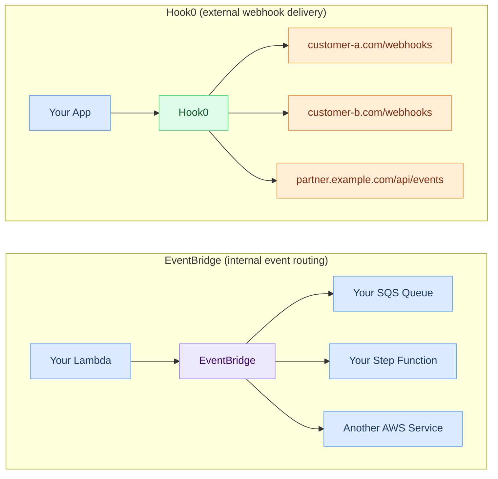
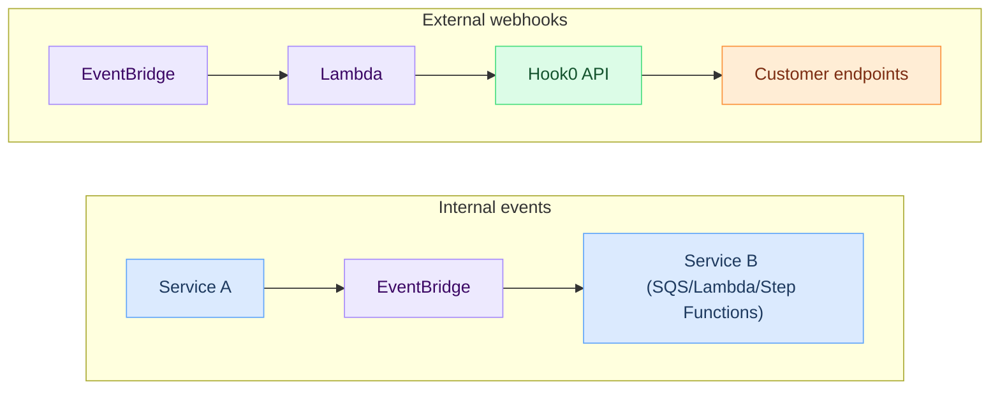

import Head from '@docusaurus/Head';

<Head>
  
</Head>

# Hook0 vs AWS EventBridge

AWS EventBridge and Hook0 both deal with events, but they solve different problems.

EventBridge is an event bus for routing events between AWS services and your own applications, mostly within your AWS account.

Hook0 is a webhook delivery server. It sends HTTP POST requests to external endpoints (your customers' servers) with retry logic, signatures, and delivery tracking.

## The actual difference

EventBridge can send events to HTTP endpoints via API Destinations, but it wasn't designed for this. Hook0 was built for delivering webhooks to external HTTP endpoints.

## Feature comparison

**Legend:** ✅ = Full support | ⚠️ = Partial support | ❌ = Not available

| Feature | AWS EventBridge | Hook0 |
|---------|----------------|-------|
| **Internal event routing** | ✅ Core focus | ❌ |
| **External webhook delivery** | ⚠️ Via API Destinations | ✅ Core focus |
| **HMAC signatures** | ❌ | ✅ |
| **Per-endpoint retry config** | ⚠️ Limited (max 185 retries) | ✅ Fixed retry schedule + jitter |
| **Dead letter queue** | ✅ (SQS-based) | ✅ Built-in with replay |
| **Delivery logs per endpoint** | ❌ | ✅ Full request/response history |
| **Manual replay** | ❌ | ✅ |
| **Multi-tenant filtering** | ⚠️ Via event patterns | ✅ Label-based |
| **Event type hierarchy** | ⚠️ Flat source/detail-type | ✅ Dot-notation hierarchy |
| **Self-hosting** | ❌ AWS only | ✅ |
| **Open-source** | ❌ | ✅ SSPL-1.0 |
| **Dashboard for webhook management** | ❌ | ✅ |
| **Subscription management API** | ❌ | ✅ |
| **Cloud provider lock-in** | ✅ AWS only | ❌ Cloud-agnostic |
| **Connection pooling to endpoints** | ⚠️ Limited (API Destinations have connection limits) | ✅ |
| **Webhook-specific SDKs** | ❌ | ✅ JS, Rust |

## What goes wrong when you use EventBridge for webhooks

If you try to use EventBridge as a webhook delivery system, you'll hit these problems:

### API Destinations limits

EventBridge API Destinations have a default rate limit of 300 invocations per second per destination. If you're sending webhooks to 1000 customer endpoints, you need 1000 API Destinations, each with its own configuration and monitoring.

### No signature verification

EventBridge doesn't sign outgoing payloads with HMAC. You'd need to add a Lambda between EventBridge and the HTTP endpoint to compute and attach signatures. That adds latency, cost, and another failure point.

### No delivery dashboard

EventBridge has CloudWatch metrics, but no per-endpoint delivery history. To see "what did we send to customer X and did they receive it?", you'd need to build a custom logging and querying layer.

### Cost structure

EventBridge pricing:
- $1.00 per million events published
- API Destination invocations: $0.20 per million
- Plus Lambda costs if you need transformation or signing
- Plus CloudWatch Logs costs for debugging
- Plus SQS costs for dead letter queues

At 10M webhooks/month, you're looking at roughly $12-20/month in EventBridge costs alone, not counting the Lambda, CloudWatch, and SQS overhead. The real cost is operational complexity.

Hook0 self-hosted: infrastructure costs only (a PostgreSQL instance and a few workers; optionally Apache Pulsar and S3-compatible storage for high-throughput setups). No per-message charges.

## Using both

EventBridge and Hook0 pair well. Use EventBridge for internal event routing within your AWS account, and Hook0 for external webhook delivery:

EventBridge handles AWS service integration for internal plumbing. Hook0 handles webhook delivery to external endpoints.

## Pick EventBridge if

- You're routing events between AWS services within your account
- Your "webhooks" are actually internal service-to-service communication
- You're already deep in the AWS ecosystem and want tight integration with Lambda, Step Functions, SQS, etc.

## Pick Hook0 if

- You're delivering events to external HTTP endpoints (your customers' servers)
- You need HMAC signatures on outgoing webhooks
- You need per-endpoint delivery logs and manual replay
- You want to avoid AWS lock-in
- You need multi-tenant webhook routing for a SaaS platform
- You want to self-host on any cloud provider (or on-premises)

## Further reading

- [All webhook service comparisons](/comparisons) -- full feature matrix across providers
- [Getting started with Hook0](/tutorials/getting-started) -- send your first webhook in 10 minutes
- [Webhook retry logic](/explanation/webhook-retry-logic) -- how Hook0 handles automatic retries and dead letter queues
- [What is Hook0?](/explanation/what-is-hook0) -- architecture and core concepts
