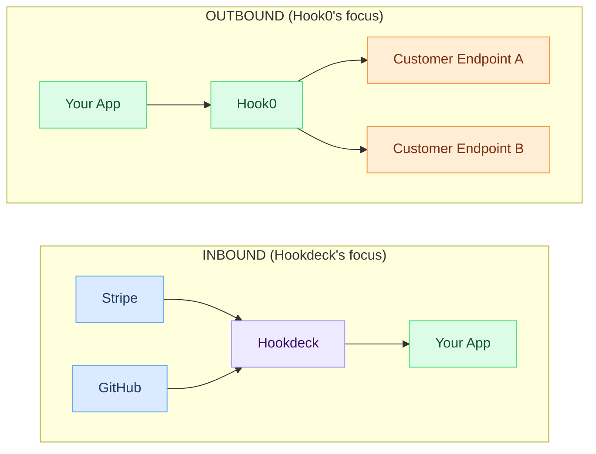
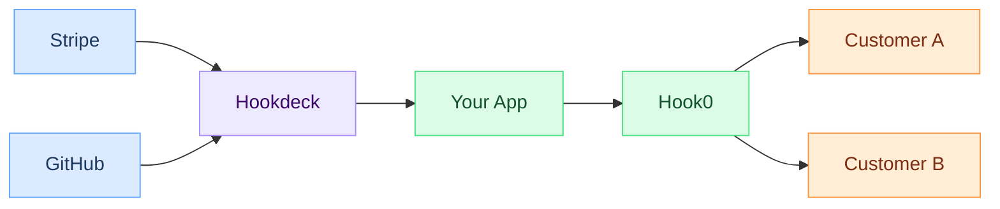

import Head from '@docusaurus/Head';

<Head>
  
</Head>

# Hookdeck vs Hook0

This is not an apples-to-apples comparison. [Hookdeck](https://hookdeck.com/) and Hook0 solve different problems.

Hookdeck is an inbound webhook proxy. It sits between third-party services (Stripe, GitHub, Shopify) and your application. It retries, deduplicates, and routes incoming webhooks.

Hook0 is an outbound webhook server. It sends webhooks from your application to your customers' endpoints, with retry logic, signatures, and delivery tracking.

Many teams use both: Hook0 for sending, Hookdeck for receiving.

## Inbound vs outbound

**Legend:** ✅ = Full support | ⚠️ = Partial support | ❌ = Not available

## Feature comparison

| Feature | Hookdeck | Hook0 |
|---------|----------|-------|
| **SaaS** | ✅ | ✅ |
| **Self-hosting** | ❌ | ✅ Full feature parity |
| **Open-Source** | ❌ Proprietary | ✅ SSPL-1.0 |
| **Inbound webhook proxy** | ✅ Core focus | ❌ |
| **Outbound webhook delivery** | ⚠️ Secondary | ✅ Core focus |
| **HMAC signature verification** | ✅ Verify incoming | ✅ Sign outgoing |
| **Automatic retries** | ✅ | ✅ Fixed schedule + jitter |
| **Dead letter queue** | ✅ | ✅ |
| **Request transformation** | ✅ | ❌ |
| **Webhook deduplication** | ✅ | ✅ Via event IDs |
| **Event type hierarchy** | ❌ | ✅ Dot-notation |
| **Multi-tenant filtering** | ❌ | ✅ Label-based |
| **Custom retry schedules** | ✅ | ✅ |
| **Delivery logs & replay** | ✅ | ✅ |
| **REST API** | ✅ | ✅ |
| **Local development tunnel** | ✅ CLI tool | ❌ |
| **Self-funded** | ❌ $5.5M raised | ✅ Fully self-funded |

*Funding data last verified: January 2025*

## Pick Hookdeck if

- You're receiving webhooks from third-party services (Stripe, GitHub, Twilio, etc.)
- You need to transform incoming webhook payloads before they hit your application
- You want a local development tunnel for testing webhooks locally
- You need to fan out a single incoming webhook to multiple internal services

## Pick Hook0 if

- You're sending webhooks to your customers (you're the SaaS platform)
- You need multi-tenant webhook routing (different customers get different events)
- You want to self-host your webhook infrastructure
- You need event type hierarchies and label-based filtering
- You want open-source with no vendor lock-in

## Use both

If you're a SaaS platform that both receives webhooks from providers (payment events from Stripe, code events from GitHub) and sends webhooks to your own customers, use Hookdeck for inbound and Hook0 for outbound:

## Pricing

Hookdeck charges per request. At high volume, costs scale linearly with webhook traffic.

Hook0 offers both cloud pricing (per event) and self-hosting (free, you pay for infrastructure). If you process millions of events monthly, self-hosting Hook0 eliminates per-message costs entirely.

## Further reading

- [All webhook service comparisons](/comparisons) -- full feature matrix across providers
- [Getting started with Hook0](/tutorials/getting-started) -- send your first webhook in 10 minutes
- [Webhook best practices](/how-to-guides/webhook-best-practices) -- patterns for sending and receiving webhooks
