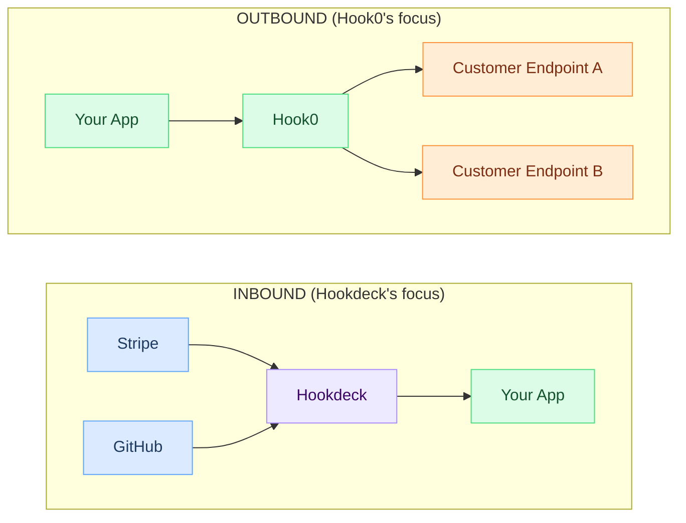
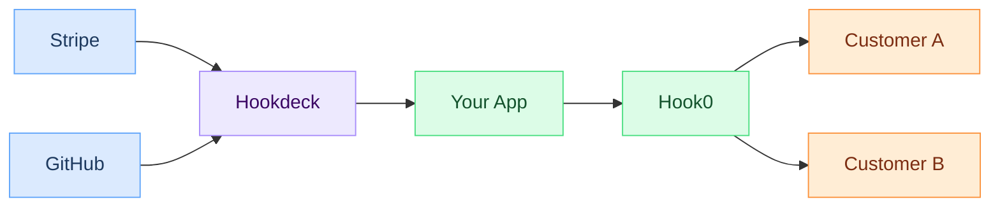

import Head from '@docusaurus/Head';

<Head>
  <link rel="canonical" href="https://www.hook0.com/hook0-vs-hookdeck" />
  
</Head>

# Hookdeck vs Hook0

This is not an apples-to-apples comparison. [Hookdeck](https://hookdeck.com/) and Hook0 solve different problems.

Hookdeck sells two products. The **Event Gateway** is an inbound webhook proxy: it sits between third-party services (Stripe, GitHub, Shopify) and your application, and it retries, deduplicates, and routes incoming webhooks. **Outpost** is a separate outbound product, written in Go and licensed Apache-2.0, that sends your events to your customers' webhook endpoints or to queues and buses such as SQS, Kafka or Pub/Sub.

Hook0 is an outbound webhook server. It sends webhooks from your application to your customers' endpoints, with retry logic, signatures, and delivery tracking. On the sending side, the product to compare Hook0 with is Outpost.

Many teams use both: Hook0 for sending, Hookdeck's Event Gateway for receiving.

## Inbound vs outbound

```mermaid
flowchart LR
    subgraph Inbound["INBOUND (Hookdeck's focus)"]
        direction LR
        S[Stripe]:::external --> HD1[Hookdeck]:::processing
        GH[GitHub]:::external --> HD1
        HD1 --> APP1[Your App]:::hook0
    end

    subgraph Outbound["OUTBOUND (Hook0's focus)"]
        direction LR
        APP2[Your App]:::hook0 --> H0[Hook0]:::hook0
        H0 --> CEA[Customer Endpoint A]:::customer
        H0 --> CEB[Customer Endpoint B]:::customer
    end

    classDef external fill:#dbeafe,stroke:#60a5fa,color:#1e3a5f
    classDef hook0 fill:#dcfce7,stroke:#4ade80,color:#14532d
    classDef customer fill:#ffedd5,stroke:#fb923c,color:#7c2d12
    classDef processing fill:#ede9fe,stroke:#a78bfa,color:#3b0764

    click H0 "/explanation/what-is-hook0" "What is Hook0?"
    click CEA "/concepts/subscriptions" "Subscriptions"
    click CEB "/concepts/subscriptions" "Subscriptions"
```

**Legend:** ✅ = Full support | ⚠️ = Partial support | ❌ = Not available

## Feature comparison

| Feature | Hookdeck | Hook0 |
|---------|----------|-------|
| **SaaS** | ✅ | ✅ |
| **Self-hosting** | ⚠️ Outpost only (Redis, PostgreSQL, a message queue) | ✅ Full feature parity (PostgreSQL) |
| **Open-Source** | ⚠️ Outpost Apache-2.0, Event Gateway proprietary | ✅ SSPL-1.0 |
| **Inbound webhook proxy** | ✅ Event Gateway | ❌ |
| **Outbound webhook delivery** | ✅ Outpost (separate product) | ✅ Core focus |
| **Non-HTTP destinations** | ✅ Outpost: SQS, EventBridge, Kinesis, S3, Pub/Sub, Service Bus, RabbitMQ, Kafka, Cloudflare Queues | ❌ HTTPS only |
| **HMAC signatures** | ✅ Verify incoming (Event Gateway), sign outgoing (Outpost) | ✅ Sign outgoing |
| **Automatic retries** | ✅ | ✅ Fixed escalating backoff, capped by max retries + window |
| **Dead letter queue** | ✅ | ✅ |
| **Request transformation** | ✅ | ❌ |
| **Webhook deduplication** | ✅ | ✅ Via event IDs |
| **Event type hierarchy** | ⚠️ Outpost topics | ✅ Dot-notation |
| **Multi-tenant filtering** | ✅ Outpost tenants | ✅ Label-based |
| **Custom retry schedules** | ✅ | ⚠️ Global limits only (self-hosted), not per subscription |
| **Delivery logs & replay** | ✅ | ✅ |
| **REST API** | ✅ | ✅ |
| **Local development tunnel** | ✅ CLI tool | ✅ [`hook0 listen`](/reference/cli) |
| **Self-funded** | ❌ $5.5M raised | ✅ Fully self-funded |

*Funding data last verified: January 2025*

## Pick Hookdeck if

- You're receiving webhooks from third-party services (Stripe, GitHub, Twilio, etc.)
- You need to transform incoming webhook payloads before they hit your application
- You want a local development tunnel for testing webhooks locally
- You need to fan out a single incoming webhook to multiple internal services
- You send events to customers who want them in SQS, Kafka or Pub/Sub rather than on an HTTPS endpoint (Outpost)

## Pick Hook0 if

- You're sending webhooks to your customers (you're the SaaS platform)
- You need multi-tenant webhook routing (different customers get different events)
- You want to self-host your webhook infrastructure
- You need event type hierarchies and label-based filtering
- You want open-source with no vendor lock-in

## Use both

If you're a SaaS platform that both receives webhooks from providers (payment events from Stripe, code events from GitHub) and sends webhooks to your own customers, use Hookdeck for inbound and Hook0 for outbound:

```mermaid
flowchart LR
    S[Stripe]:::external --> HD[Hookdeck]:::processing
    GH[GitHub]:::external --> HD
    HD --> APP[Your App]:::hook0
    APP --> H0[Hook0]:::hook0
    H0 --> CA[Customer A]:::customer
    H0 --> CB[Customer B]:::customer

    classDef external fill:#dbeafe,stroke:#60a5fa,color:#1e3a5f
    classDef hook0 fill:#dcfce7,stroke:#4ade80,color:#14532d
    classDef customer fill:#ffedd5,stroke:#fb923c,color:#7c2d12
    classDef processing fill:#ede9fe,stroke:#a78bfa,color:#3b0764

    click H0 "/explanation/what-is-hook0" "What is Hook0?"
    click CA "/concepts/subscriptions" "Subscriptions"
    click CB "/concepts/subscriptions" "Subscriptions"
```

## Pricing

As published on 8 October 2026, Hookdeck's Event Gateway is free up to 10,000 events a month, then starts at $39/month (Team) or $499/month (Growth). Outpost is free to self-host, or $10 per million events managed, with a $499/month minimum on its Growth plan.

Hook0 Cloud is free up to 100 events a day, then €59/month (Startup) or €190/month (Pro) excluding VAT, with overage billed per event instead of blocked. Self-hosting Hook0 is free: you pay for the infrastructure, not per message. The [Hook0 vs Hookdeck page](https://www.hook0.com/hook0-vs-hookdeck) lists every plan side by side.

## Try Hook0

Hook0's free tier gives you 100 events/day, no credit card. [Take it for a ride](https://www.hook0.com/hook0-vs-hookdeck).

## Further reading

- [All webhook service comparisons](/comparisons) -- full feature matrix across providers
- [Getting started with Hook0](/tutorials/getting-started) -- send your first webhook in 10 minutes
- [Webhook best practices](/how-to-guides/webhook-best-practices) -- patterns for sending and receiving webhooks
