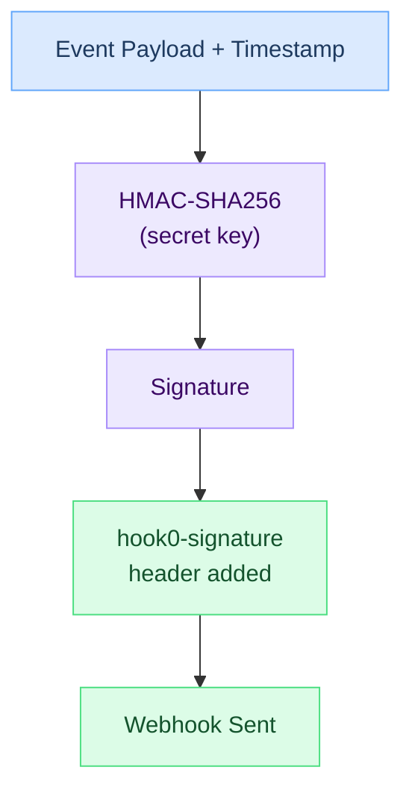

# Application secrets

An application secret is a cryptographic token used to sign webhook payloads. When Hook0 delivers a webhook, it uses the secret to generate an HMAC signature so recipients can verify the payload is authentic and unmodified.

## Key points

- Each [application](applications.md) can have multiple secrets for key rotation
- Secrets sign webhook payloads with HMAC-SHA256
- Consumers verify signatures to confirm payload integrity
- Revoking a secret immediately invalidates all webhooks signed with it

## Why signatures matter

Without signature verification, webhook endpoints are open to:

- Spoofing (attackers sending fake webhooks)
- Tampering (payload modification in transit)
- Replay attacks (resending captured webhooks)

Signature verification confirms:

1. The webhook came from Hook0
2. The payload hasn't been modified
3. The webhook is fresh (timestamp validation)

## How signing works

The signature header contains:
- Timestamp: when the signature was generated
- Signature: HMAC-SHA256 hash of timestamp + payload

## Secret rotation

To rotate secrets without downtime:

1. Create a new secret
2. Update consumers to accept both secrets
3. Wait for in-flight webhooks to complete
4. Revoke the old secret

## Security considerations

- Treat secrets like passwords
- Don't log or display secrets
- Rotate periodically
- Immediately revoke leaked secrets

:::warning Save the Token
The secret is displayed only once at creation time. Store it securely before leaving the page.
:::

## What's next?

- [Secure Webhook Endpoints](/how-to-guides/secure-webhook-endpoints) - Complete verification guide
- [Applications](applications.md) - Managing your applications
- [Subscriptions](subscriptions.md) - Configuring webhook delivery
