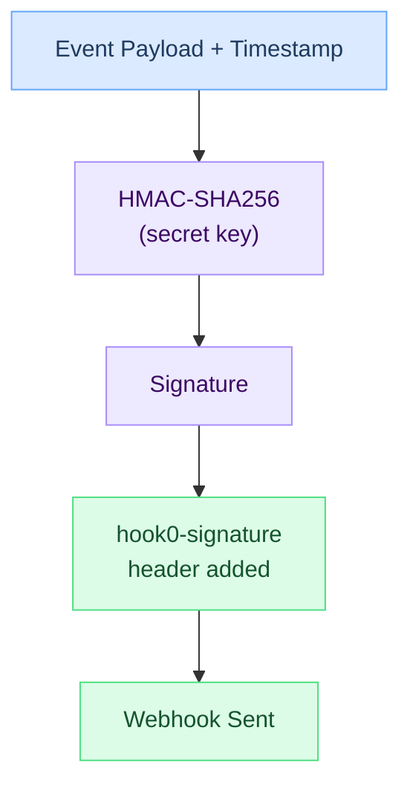

# Application secrets

An application secret is the API token of one [application](applications.md). You send it as `Authorization: Bearer <secret>` to call the Hook0 API on that application's behalf — starting with sending events.

## What an application secret can do

An application secret is not limited to sending events. It carries the full set of permissions on the application it belongs to:

- Send events, and read events and delivery attempts
- Create and delete event types
- Create, update and delete subscriptions (including reading their signing secrets)
- List, create and revoke that application's secrets — including itself
- Rename or delete the application

It cannot reach anything outside that application: another application, even in the same organization, is refused, and so is everything at the organization level (members, billing, service tokens).

Treat it as you would a password: whoever holds it controls the application.

**Every application is created with one secret already provisioned, named `Default`**, so a new application can send its first event with no extra step. It is an ordinary secret: rename it, revoke it, or replace it with one of your own at any time. Applications created before this behaviour shipped do not have one — create a key from the **API keys** page of the application.

An application secret cannot be narrowed down: its permissions are fixed. When you need a credential that may send events but must not administer the application — a CI job, an AI assistant, a third party — create a [service token](/how-to-guides/manage-service-tokens) and attenuate it (single application, read-only, expiration date) instead.

## Key points

- Each [application](applications.md) can have multiple secrets for key rotation
- Every new application starts with a secret named `Default`
- A secret is scoped to a single application and grants full control over it
- Revoking a secret immediately invalidates every call made with it

## Why signatures matter

:::note
Everything below is about the signature Hook0 puts on the webhooks it delivers. That signature is computed with the [subscription](subscriptions.md)'s own secret, which is a different value from the API token described above.
:::

Without signature verification, webhook endpoints are open to:

- Spoofing (attackers sending fake webhooks)
- Tampering (payload modification in transit)
- Replay attacks (resending captured webhooks)

Signature verification confirms:

1. The webhook came from Hook0
2. The payload hasn't been modified
3. The webhook is fresh (timestamp validation)

## How signing works

```mermaid
flowchart TD
    A["Event Payload + Timestamp"]:::external
    B["HMAC-SHA256<br/>(secret key)"]:::processing
    C["Signature"]:::processing
    D["hook0-signature<br/>header added"]:::hook0
    E["Webhook Sent"]:::hook0

    A --> B --> C --> D --> E

    classDef external fill:#dbeafe,stroke:#60a5fa,color:#1e3a5f
    classDef hook0 fill:#dcfce7,stroke:#4ade80,color:#14532d
    classDef processing fill:#ede9fe,stroke:#a78bfa,color:#3b0764

    click B "/tutorials/webhook-authentication" "HMAC Signature Verification"
```

The signature header contains:
- Timestamp: when the signature was generated
- Signature: HMAC-SHA256 hash of timestamp + payload

## Secret rotation

To rotate secrets without downtime:

1. Create a new secret
2. Update consumers to accept both secrets
3. Wait for in-flight webhooks to complete
4. Revoke the old secret

## Security considerations

- Treat secrets like passwords
- Don't log or display secrets
- Rotate periodically
- Immediately revoke leaked secrets

:::warning Save the Token
The secret is displayed only once at creation time. Store it securely before leaving the page.
:::

## What's next?

- [Secure Webhook Endpoints](/how-to-guides/secure-webhook-endpoints) - Complete verification guide
- [Applications](applications.md) - Managing your applications
- [Subscriptions](subscriptions.md) - Configuring webhook delivery
