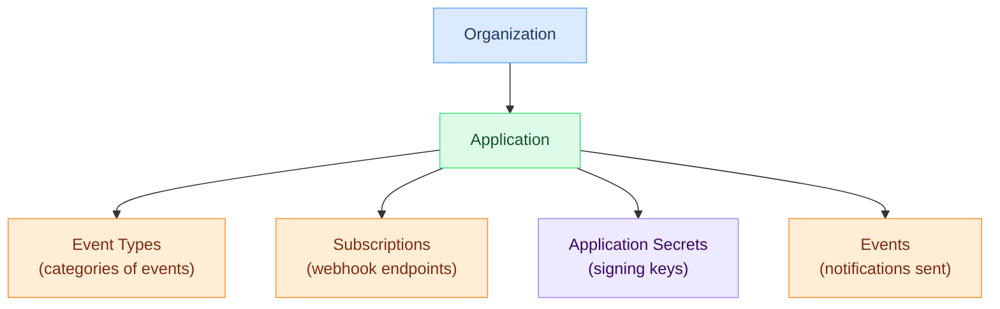

# Applications

An application is a logical container within Hook0 that groups related [event types](event-types.md), [subscriptions](subscriptions.md), and [events](events.md). Applications represent your services or products that emit webhook events.

## Key Points

- Applications belong to an [Organization](organizations.md)
- Each application has its own [event types](event-types.md), [subscriptions](subscriptions.md), and [secrets](application-secrets.md)
- Applications provide usage quotas and consumption tracking
- Deleting an application cancels all pending webhook deliveries

## Relationship to Other Concepts

Applications act as the boundary between your services. A typical setup might have:

- **Order Service Application** - Emits `order.created`, `order.shipped` [events](events.md)
- **User Service Application** - Emits `user.registered`, `user.updated` [events](events.md)
- **Billing Service Application** - Emits `invoice.paid`, `subscription.renewed` [events](events.md)

## Quotas and Limits

Each application operates within quotas defined by your [organization's](organizations.md) plan:

- **[Events](events.md) per day** - Maximum events that can be sent daily
- **Event retention** - How long [events](events.md) are stored for replay

When quotas are exceeded, new [events](events.md) are rejected until the next billing period.

## Onboarding Progress

Hook0 tracks application setup through onboarding steps:

1. **[Event Type](event-types.md)** - Define at least one event type
2. **[Subscription](subscriptions.md)** - Configure at least one webhook endpoint
3. **[Event](events.md)** - Send your first event

## Lifecycle

When an application is deleted:

- The application is soft-deleted (can be audited)
- All pending webhook deliveries are cancelled
- No new [events](events.md) can be sent
- Existing [subscriptions](subscriptions.md) stop receiving webhooks

:::danger Irreversible Action
Deleting an application cannot be undone. All pending webhook deliveries will be cancelled immediately.
:::

## What's Next?

- [Organizations](organizations.md) - Managing the parent container
- [Event Types](event-types.md) - Categorizing your events
- [Application Secrets](application-secrets.md) - Securing webhook signatures
- [Events](events.md) - Sending notifications
- [Getting Started](/tutorials/getting-started) - Create your first application
