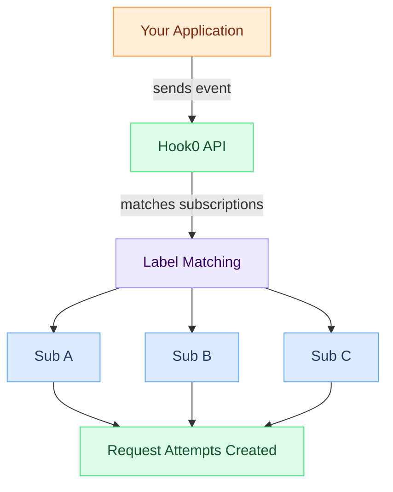

# Events

An event is a notification sent from your [applications](applications.md) to Hook0 when something happens. Events carry data from producers to consumers through the webhook system.

## Key points

- Events belong to an [Application](applications.md)
- Each event has an [Event Type](event-types.md) that categorizes it
- Events carry a payload in JSON, plain text, or base64 format
- [Labels](labels.md) on events control routing to matching [Subscriptions](subscriptions.md)
- Events are immutable once created

## Event lifecycle

## Payload formats

Hook0 supports three payload content types:

- `application/json`: structured data for API integrations
- `text/plain`: simple string data
- `application/octet-stream`: binary data encoded as base64

The payload is delivered exactly as received, with no transformation.

:::warning Payload as String
When sending JSON payloads via the API, the payload must be a JSON-encoded string, not a raw object. This ensures Hook0 forwards it exactly as provided.
:::

## Routing with labels

Every event must include at least one [label](labels.md). Labels are key-value pairs that Hook0 uses to match events with [subscriptions](subscriptions.md):

1. Event is created with [labels](labels.md) (e.g., `tenant_id: "acme"`)
2. Hook0 finds [subscriptions](subscriptions.md) with matching label filters
3. [Request attempts](request-attempts.md) are created for each match

## Idempotency

Each event has a unique `event_id` (UUID). If you send an event with the same ID twice, Hook0 rejects the duplicate.

## What's next?

- [Event Types](event-types.md) - Categorize your events
- [Labels](labels.md) - Route events to subscriptions
- [Applications](applications.md) - Container for your events
- [Request Attempts](request-attempts.md) - Track delivery status
- [Send your first event](/tutorials/getting-started) - Quick start guide
