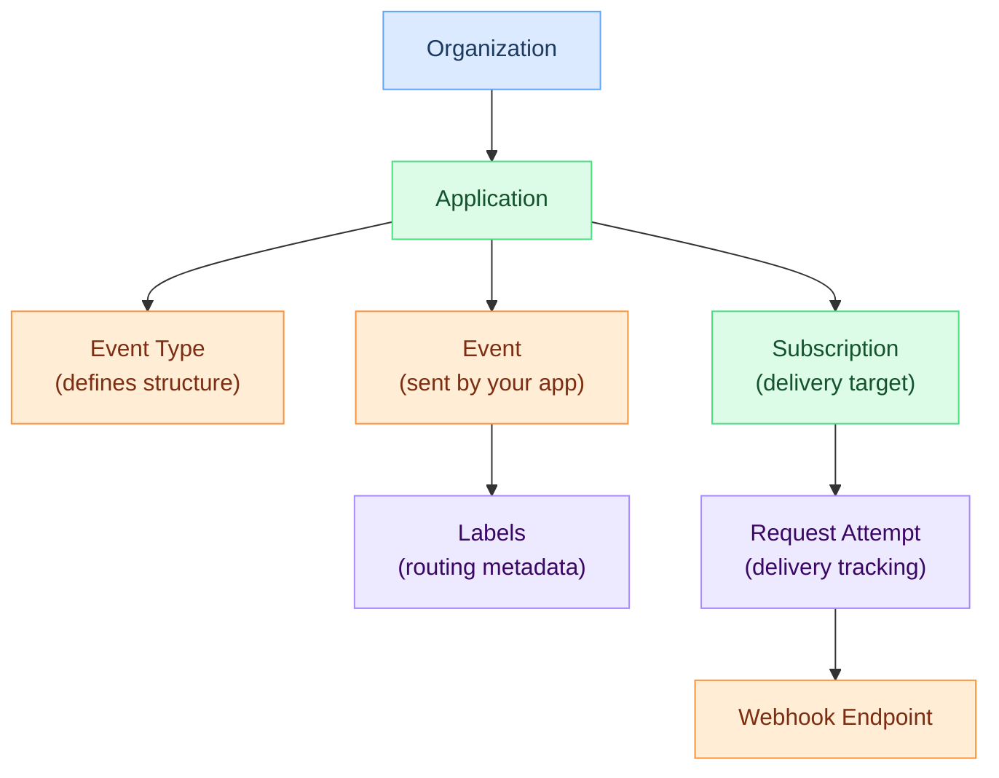

# Concepts

Understand the fundamental building blocks of Hook0.

## Architecture Overview

Hook0 connects your applications to external systems through a hierarchical structure:

1. **Organizations** group your team and applications
2. **Applications** represent your services that emit events
3. **Events** are notifications sent when actions occur
4. **Event Types** categorize and validate your events
5. **Labels** route events to the correct subscriptions
6. **Subscriptions** define where to deliver webhooks
7. **Request Attempts** track each delivery attempt

## Core Concepts

### Structure & Organization

- **[Organizations](organizations.md)** - Multi-tenant containers for teams and applications
- **[Applications](applications.md)** - Logical containers grouping events and subscriptions

### Events & Routing

- **[Events](events.md)** - Notifications sent from your applications to Hook0
- **[Event Types](event-types.md)** - Categorize and structure your events
- **[Labels](labels.md)** - Filter and route events to subscriptions
- **[Metadata](metadata.md)** - Attach arbitrary key-value data to objects

### Delivery & Security

- **[Subscriptions](subscriptions.md)** - Configure where and how to receive notifications
- **[Request Attempts](request-attempts.md)** - Track webhook delivery status and retries
- **[Application Secrets](application-secrets.md)** - Sign webhooks for verification
- **[Service Tokens](service-tokens.md)** - API authentication for automated systems
