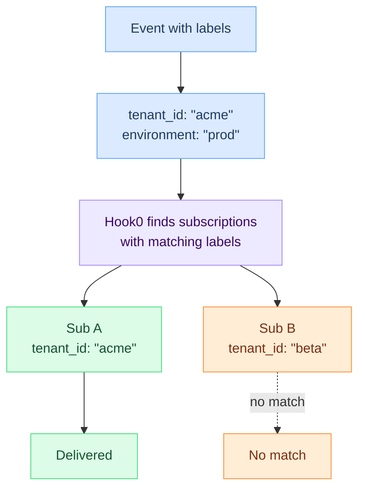

# Labels

Labels are key-value pairs attached to [events](events.md). Hook0 uses them to route events to the right [subscriptions](subscriptions.md). You can use labels for multi-tenancy, environment separation, or any filtering logic you need.

## Key points

- Every [event](events.md) must include at least one label
- [Subscriptions](subscriptions.md) filter [events](events.md) by matching label values
- Labels are how you implement multi-tenant routing
- Matching is case-sensitive and exact

:::warning Minimum Requirement
Every [event](events.md) must include **at least one label**. The API rejects [events](events.md) with empty labels.
:::

## How labels work

## Matching rules

- A [subscription](subscriptions.md) receives an [event](events.md) only if all its label filters match the event's labels
- If an [event](events.md) lacks a label that the [subscription](subscriptions.md) filters on, the event is not delivered
- [Subscriptions](subscriptions.md) can have fewer labels than [events](events.md) (partial matching)
- Label values are case-sensitive and must match exactly

## Common patterns

| Pattern | Example label | Purpose |
|---------|---------------|---------|
| Multi-tenancy | `tenant_id: "acme_corp"` | Isolate [events](events.md) per customer |
| Environment | `environment: "production"` | Separate prod/staging/dev |
| Priority | `priority: "critical"` | Route urgent [events](events.md) differently |
| Geographic | `region: "eu-west-1"` | Route by location |
| Source | `source: "mobile_app"` | Identify [event](events.md) origin |

## Naming conventions

- Use `snake_case` for keys: `tenant_id`, `event_source`
- Be descriptive: `payment_provider` not `pp`
- Avoid sensitive data: never use `password`, `ssn`, `credit_card`
- Use consistent naming across all [events](events.md)

## What's next?

- [Events](events.md) - Attach labels to events
- [Subscriptions](subscriptions.md) - Filter events with labels
- [Event Types](event-types.md) - Categorize your events
- [Applications](applications.md) - Manage labels per application
