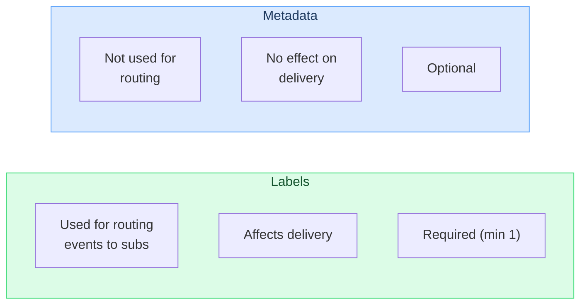

# Metadata

Metadata lets you attach arbitrary key-value data to [events](events.md) and [subscriptions](subscriptions.md). Hook0 stores it but does not act on it -- it's for your own use.

## Key points

- Metadata can be attached to [events](events.md) and [subscriptions](subscriptions.md)
- Hook0 stores it but does not process it
- Searchable via the Search API
- Not visible to webhook consumers unless you explicitly include it

## Metadata vs labels

A common question: when should you use metadata instead of [labels](labels.md)?

Use [labels](labels.md) when you need to route [events](events.md) to specific [subscriptions](subscriptions.md).
Use metadata when you need to store extra context for your own systems.

## Common use cases

- Correlation IDs to link [events](events.md) to external systems
- User context (the user ID who triggered the [event](events.md))
- Debug info like request IDs or trace identifiers
- Domain-specific identifiers

## Description field

A separate `description` field exists for human-readable annotations. For example: "Customer onboarding webhook for Acme Corp".

:::warning Security
Don't store sensitive information (bank accounts, card details, passwords) in metadata or the description field.
:::

## What's next?

- [Events](events.md) - Attach metadata to events
- [Subscriptions](subscriptions.md) - Attach metadata to subscriptions
- [Labels](labels.md) - Use labels for event routing
