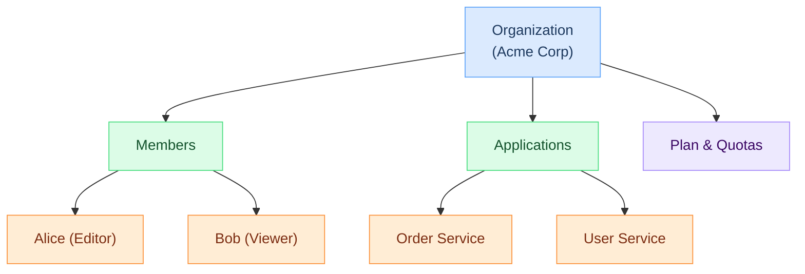

# Organizations

An organization is the top-level container in Hook0 that groups [applications](applications.md), manages team members, and controls billing. Organizations enable multi-tenant architectures where different teams or customers have isolated webhook infrastructures.

## Key Points

- Organizations contain [Applications](applications.md) and team members
- Each organization has its own quotas, plan, and billing
- Members can have different roles (Editor, Viewer)
- Organizations provide complete isolation between tenants

## Relationship to Other Concepts

## Multi-Tenancy

Organizations are the foundation of Hook0's multi-tenant architecture:

- **SaaS providers** can create one organization per customer
- **Enterprises** can create one organization per department or team
- **Agencies** can create one organization per client project

Each organization operates independently with its own:
- [Applications](applications.md) and [event types](event-types.md)
- [Subscriptions](subscriptions.md) and [secrets](application-secrets.md)
- Usage quotas and billing
- Team members and permissions

## Member Roles

Organizations support role-based access control:

- **Editor** - Full access: create, edit, delete [applications](applications.md), manage members
- **Viewer** - Read-only access to [applications](applications.md) and [events](events.md)

## Quotas

Organizations have quotas that limit resource usage based on the billing plan:

- **Members per organization** - Maximum team members
- **Applications per organization** - Maximum [applications](applications.md)
- **[Events](events.md) per day** - Maximum events across all applications
- **Event retention** - How long [events](events.md) are stored

## Onboarding Progress

Hook0 tracks organization setup through steps:

1. **[Application](applications.md)** - Create at least one application
2. **[Event Type](event-types.md)** - Define at least one event type
3. **[Subscription](subscriptions.md)** - Configure at least one webhook endpoint
4. **[Event](events.md)** - Send your first event

## Lifecycle

Before deleting an organization:

- All [applications](applications.md) must be deleted first
- This is enforced to prevent accidental data loss

:::danger Irreversible Action
Organization deletion cannot be undone. Ensure all [applications](applications.md) are removed and data is backed up before proceeding.
:::

## What's Next?

- [Applications](applications.md) - Creating applications within your organization
- [Service Tokens](service-tokens.md) - API access for automated systems
- [Events](events.md) - Sending your first webhook event
- [Getting Started](/tutorials/getting-started) - Set up your first organization
