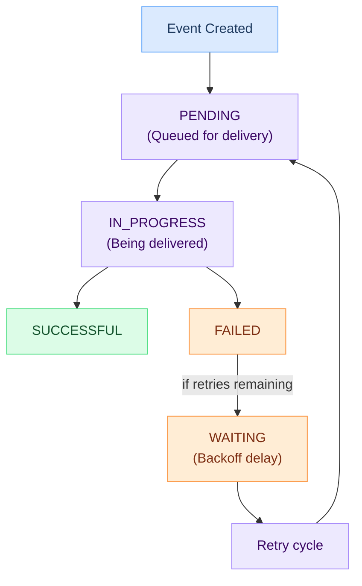

# Request attempts

A request attempt is a single delivery try for a webhook. When an [event](events.md) matches a [subscription](subscriptions.md), Hook0 creates a request attempt and tracks it until delivery succeeds or all retries are exhausted.

## Key points

- Each [event](events.md)/[subscription](subscriptions.md) pair generates one or more request attempts
- Hook0 retries failed deliveries automatically with increasing backoff
- Request attempts move through distinct statuses
- Full delivery history is kept for debugging

## Delivery lifecycle

## Status states

Request attempts go through these states:

- Pending: queued, waiting to be picked up for delivery
- In progress: currently being delivered to the endpoint
- Waiting: delivery failed, waiting for retry (backoff delay)
- Successful: webhook delivered and endpoint returned 2xx
- Failed: all retry attempts exhausted or permanently failed

## Retry behavior

When a delivery fails, Hook0 schedules retries with increasing backoff delays:

| Retry | Delay |
|-------|-------|
| 1 | 3 seconds |
| 2 | 10 seconds |
| 3 | 3 minutes |
| 4 | 30 minutes |
| 5 | 1 hour |
| 6 | 3 hours |
| 7 | 5 hours |
| 8+ | 10 hours |

Retries are bounded by both `MAX_RETRIES` and `MAX_RETRY_WINDOW` (whichever limit is reached first) at the Output Worker level. After all retries are exhausted, the attempt is marked as permanently failed.

Transient failures won't cause data loss, and struggling endpoints won't get hammered.

## Failure scenarios

Request attempts fail when:

- Endpoint returns 4xx or 5xx status codes
- Connection times out
- DNS resolution fails
- SSL/TLS handshake fails
- [Application](applications.md) is deleted (all pending attempts cancelled)

## Debugging failed webhooks

When webhooks fail, request attempts give you:

- Timestamps for when each phase occurred
- Retry count (how many attempts were made)
- Response reference (link to the endpoint's response)

This helps you figure out whether the problem is endpoint availability, authentication, or payload processing.

## What's next?

- [Debug Failed Webhooks](/how-to-guides/debug-failed-webhooks) - Troubleshooting guide
- [Monitor Webhook Performance](/how-to-guides/monitor-webhook-performance) - Tracking metrics
- [Subscriptions](subscriptions.md) - Configuring webhook endpoints
- [Events](events.md) - Understanding event structure
