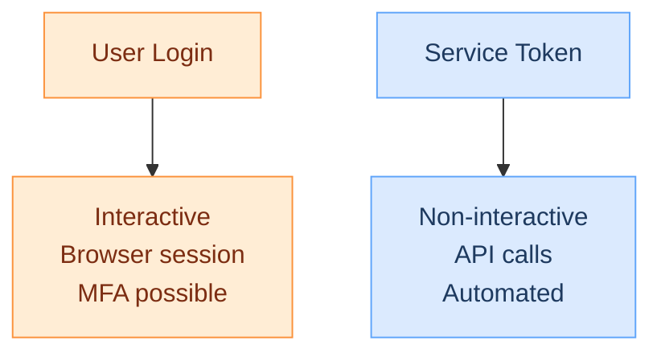
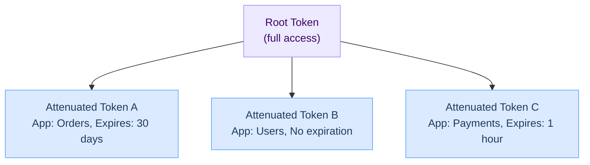

# Service tokens

A service token authenticates API requests to Hook0 on behalf of your [organization](organizations.md). Unlike user credentials (which require interactive login), service tokens are for automated systems and scripts.

## Key points

- Service tokens authenticate non-interactive API requests
- Tokens are scoped to an [organization](organizations.md) by default
- You can attenuate (restrict) tokens without contacting Hook0
- Revoking a root token invalidates all derived tokens

## Service tokens vs user credentials

Service tokens are the right choice for:

- CI/CD pipelines
- Backend services
- Scripts and automation
- AI assistants and MCP servers

## Biscuit token format

Hook0 uses [Biscuit tokens](https://www.biscuitsec.org/), a cryptographic token format with these properties:

- Offline attenuation: create restricted tokens without contacting Hook0
- Cryptographic verification: tokens are tamper-proof
- Cascading revocation: revoking a parent invalidates all children

## Attenuation

You can create restricted versions of a token without calling the Hook0 API:

Common restrictions:

- [Application](applications.md) scope: limit to specific [applications](applications.md)
- Expiration: automatic token expiry
- Operation limits: restrict to read-only operations

This is useful when sharing tokens with third-party services or temporary workers.

## Security practices

- Treat service tokens like passwords
- Always restrict tokens before giving them to third-party tools
- Rotate periodically: create new tokens and revoke old ones
- Monitor API calls made with each token

## What's next?

- [Managing Service Tokens](/how-to-guides/manage-service-tokens) - Create, attenuate, and revoke tokens
- [Organizations](organizations.md) - Understanding token scope
- [Applications](applications.md) - Restricting tokens to specific apps
