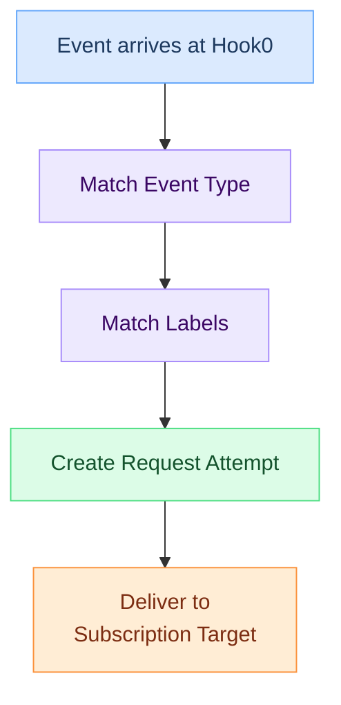

# Subscriptions

A subscription tells Hook0 where to deliver [events](events.md) and which events to deliver. It pairs a webhook endpoint URL with filtering criteria so only relevant events get sent.

## Key points

- Subscriptions belong to an [Application](applications.md)
- Each subscription specifies a target URL and filtering criteria
- Filtering uses [Event Types](event-types.md) and [Labels](labels.md)
- Subscriptions can be enabled or disabled without deletion
- Each subscription has a [secret](application-secrets.md) for signature verification

## How subscriptions work

## Filtering

Subscriptions filter [events](events.md) in two ways:

### Event type filtering

Subscribe to specific [event types](event-types.md) (e.g., `order.created`, `user.updated`). Only [events](events.md) with matching types trigger deliveries.

### Label filtering

Narrow down further using [labels](labels.md). A subscription with label `tenant_id: "acme"` only receives [events](events.md) that have that exact label.

Both filters must match for an [event](events.md) to be delivered.

## Target types

Subscriptions support HTTP targets where webhooks are delivered via POST (or other methods) to your endpoint. The target configuration includes:

- URL where the webhook is sent
- HTTP method (typically POST)
- Custom headers

## Subscription secrets

Each subscription has an associated [secret](application-secrets.md) used to sign webhook payloads. Recipients use this [secret](application-secrets.md) to verify:

- The webhook came from Hook0
- The payload wasn't modified in transit
- The webhook is fresh (timestamp validation)

## What's next?

- [Events](events.md) - Understanding event structure
- [Labels](labels.md) - Filtering events with labels
- [Request Attempts](request-attempts.md) - Track delivery status and retries
- [Application Secrets](application-secrets.md) - Understanding webhook signatures
- [Secure Webhook Endpoints](/how-to-guides/secure-webhook-endpoints) - Complete security guide
