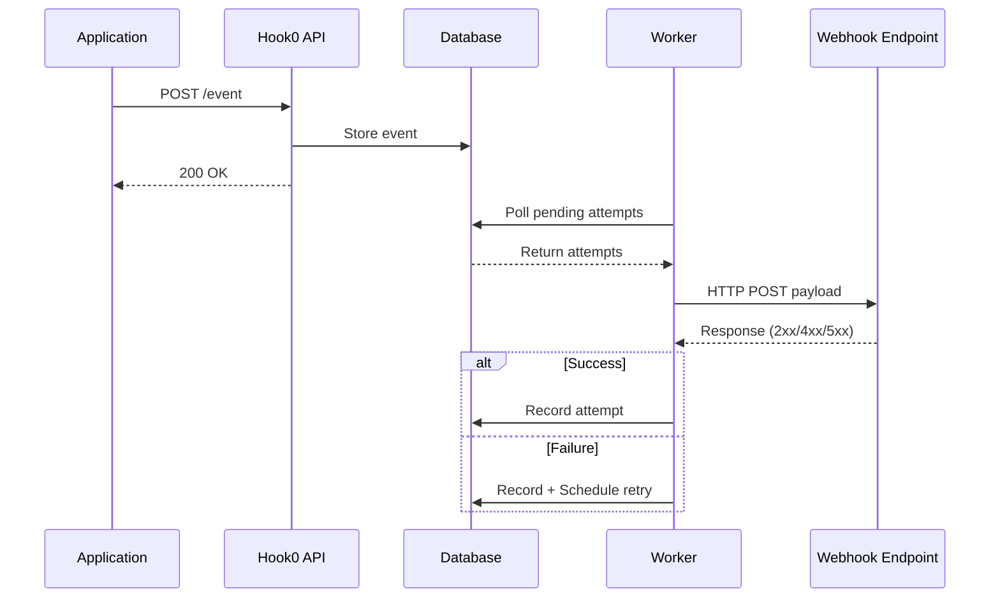

# Event processing model

This document explains how events flow through Hook0, from ingestion to delivery.

## Event processing flow



Steps:
1. Application sends event to Hook0 API via `POST /event`
2. API validates and stores event in database, returns `200 OK`
3. Worker polls database for pending delivery attempts
4. Worker sends HTTP POST to webhook endpoint
5. Endpoint responds with status code
6. Worker records attempt result; schedules retry on failure (increasing backoff)

## Event lifecycle

### 1. Event creation

Your application sends an event to Hook0:

:::info Prerequisites
Before sending events, you need:
1. An application created in Hook0
2. An API token for authentication (see [Getting Started](/tutorials/getting-started#step-3-get-your-api-token))
3. An event type registered for your application
:::

```bash
curl -X POST "$HOOK0_API/event" \
  -H "Authorization: Bearer $HOOK0_TOKEN" \
  -H "Content-Type: application/json" \
  -d '{
    "application_id": "'"$APP_ID"'",
    "event_id": "'"$(uuidgen)"'",
    "event_type": "order.order.completed",
    "payload": "{\"order_id\": \"ord_123\", \"customer_id\": \"cust_456\", \"amount\": 99.99, \"currency\": \"USD\"}",
    "payload_content_type": "application/json",
    "occurred_at": "'"$(date -u +%Y-%m-%dT%H:%M:%SZ)"'",
    "labels": {
      "environment": "production",
      "region": "us-east-1"
    }
  }'
```

#### Validation steps
1. Authentication: verify API token and permissions
2. Event type: check the event type exists for the application
3. Payload: validate against schema if defined
4. Quotas: check organization limits
5. Rate limits: enforce ingestion rate limits

#### Storage
After validation passes, events are stored with:
- Unique UUID identifier
- Timestamp (UTC)
- Application and organization context
- Original payload and metadata
- Source IP address

### 2. Subscription matching

When an event is stored, Hook0 finds matching subscriptions. Subscriptions can match:
- **Exact types**: `user.account.created`
- **Multiple types**: `["user.account.created", "user.account.updated"]`

### 3. Delivery task creation

For each matching subscription, Hook0 creates a delivery task.

#### Initial scheduling
- First delivery attempt: immediate
- Subsequent retries: increasing backoff
- Maximum retry limit: configurable at the Output Worker level

### 4. Webhook delivery

For each delivery task, the worker sends the HTTP request.

### 5. Response handling

Hook0 categorizes HTTP responses to decide what happens next:

#### Success responses (2xx)
- Mark delivery as successful
- Record response details
- No further action needed

#### Non-success responses (4xx, 5xx) and network issues
- Schedule retry according to the fixed retry schedule (see [Webhook retry logic](./webhook-retry-logic.md) for details on predefined retry delays and jitter)
- Increment attempt counter
- See [HTTP Status Code Categories](../how-to-guides/debug-failed-webhooks.md#http-status-code-categories) for retry behavior details
- Eventually move to dead letter queue after max retries exhausted


### 6. Request attempt tracking

Every delivery attempt is recorded.

```rust
struct RequestAttempt {
    id: Uuid,
    event_id: Uuid,
    subscription_id: Uuid,
    attempt_number: u32,
    status_code: Option<u16>,
    response_body: Option<String>,
    error_message: Option<String>,
    duration_ms: u32,
    created_at: DateTime<Utc>,
}
```

#### Status categories
- **Pending**: Not yet attempted
- **Success**: 2xx response received
- **Failed**: Non-2xx response or network error
- **Timeout**: Request exceeded timeout limit
- **Cancelled**: Delivery cancelled by user


## Next steps

- [Security Model](./security-model.md)
- [Debugging Failed Webhooks](../how-to-guides/debug-failed-webhooks.md)
- [Webhook retry logic](./webhook-retry-logic.md) - Fixed retry schedule, jitter, circuit breakers, and dead letter queues
- [Webhook best practices](../how-to-guides/webhook-best-practices.md) - Production patterns for producers and consumers
