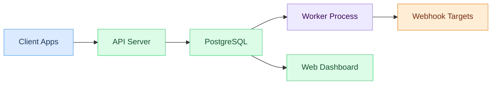
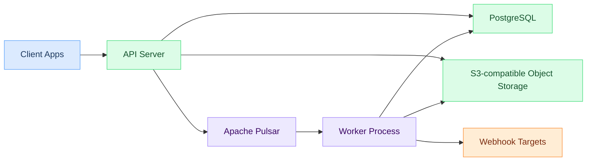
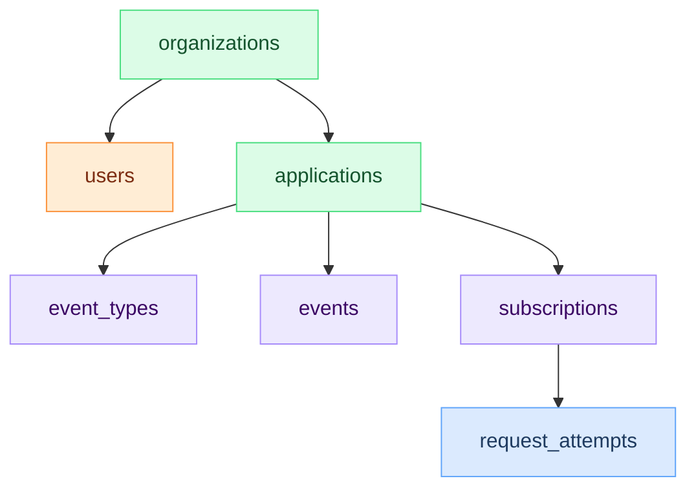

# Hook0 Architecture

This document covers Hook0's architecture, the design decisions behind it, and how the components fit together.

## System architecture

### Default setup (PostgreSQL-only)

PostgreSQL handles everything: event storage, queue, and delivery state. Workers poll for pending deliveries using `FOR UPDATE SKIP LOCKED` for concurrent processing. One database to operate.

### High-throughput setup (Pulsar + S3)

For high-throughput deployments, Hook0 can use Apache Pulsar for queuing and S3-compatible object storage for large payloads. The API server stores event payloads in S3 and publishes delivery tasks to Pulsar. Workers consume from Pulsar, retrieve event payloads from S3, deliver webhooks, and store response bodies back to S3. Workers also read metadata from PostgreSQL and record delivery results there. PostgreSQL remains the source of truth for metadata, subscriptions, and event types. The switch between backends is a per-worker database setting (`queue_type` column in `infrastructure.worker`), not a code change.

## Component responsibilities

### API server
- Receives [events](/concepts/events) via REST API
- Validates [Biscuit tokens](/concepts/service-tokens) (user sessions) and [service tokens](/how-to-guides/manage-service-tokens) (programmatic access)
- Validates event payloads against [event type](/concepts/event-types) schemas
- Enforces rate limits and usage quotas
- CRUD for [organizations](/concepts/organizations), [applications](/concepts/applications), [subscriptions](/concepts/subscriptions)

### Worker process
- Retrieves pending delivery tasks from the queue (PostgreSQL or Pulsar)
- Sends HTTP requests to [subscription](/concepts/subscriptions) endpoints
- Retries failed deliveries using a [fixed schedule](/explanation/webhook-retry-logic) (3s, 10s, 3min, 30min, 1h, 3h, 5h, 10h)
- Records [delivery attempts](/concepts/request-attempts) and response data in PostgreSQL

### Web dashboard
- Vue.js-based management UI
- Live updates on event processing
- Configuration for [subscriptions](/concepts/subscriptions) and [event types](/concepts/event-types)
- Delivery metrics and health dashboards

## Event flow

For details on the event lifecycle, retry logic, and delivery handling, see the [Event Processing Model](./event-processing.md).

## Data model

### Core entities

### Event storage
Events are stored with:
- Unique ID
- [Event type](/concepts/event-types) reference
- JSON payload
- [Metadata](/concepts/metadata) ([labels](/concepts/labels), source IP, etc.)
- Timestamp

### Subscription matching
Subscriptions define:
- [Event types](/concepts/event-types) to listen to (exact match list)
- Target HTTP endpoint (URL, method, headers)
- [Labels](/concepts/labels) for [multi-tenant routing](/how-to-guides/multi-tenant-architecture)
- [Metadata](/concepts/metadata) (key-value pairs for custom context)
- An auto-generated [secret](/concepts/application-secrets) for [HMAC signature verification](/tutorials/webhook-authentication)

## Design decisions

### Why Rust?
- Memory safety without garbage collection
- Good performance
- Strong type system catches bugs at compile time

### Why PostgreSQL as the default?
- ACID guarantees
- Good JSON support
- Doubles as a job queue via `FOR UPDATE SKIP LOCKED`, so most deployments don't need a separate queuing system

### Why Pulsar + S3 for high throughput?
- Pulsar handles message ordering, fan-out, and backpressure at scale
- S3-compatible storage offloads large payloads and response bodies from the database
- Better fit for deployments processing millions of events per day
- PostgreSQL stays the source of truth for metadata; Pulsar handles the delivery queue

### Why Biscuit tokens?
Hook0 uses [Biscuit tokens](https://www.biscuitsec.org/) for both user sessions and service tokens:
- More flexible than JWT
- Built-in authorization
- Supports token attenuation (restrict permissions without calling the server)

## Next steps

- [Event Processing Model](./event-processing.md)
- [Security Model](./security-model.md)
- [API Reference](../openapi/intro)
