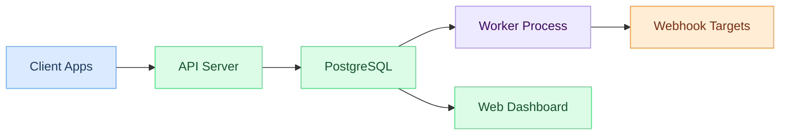
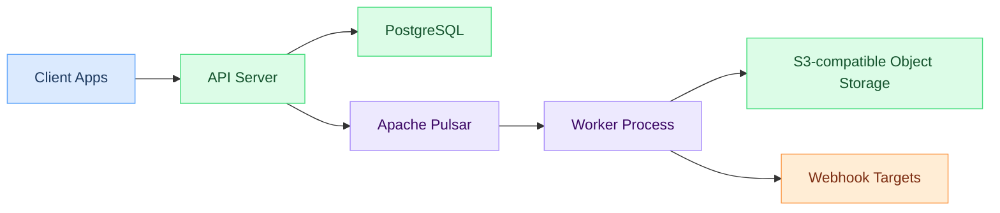
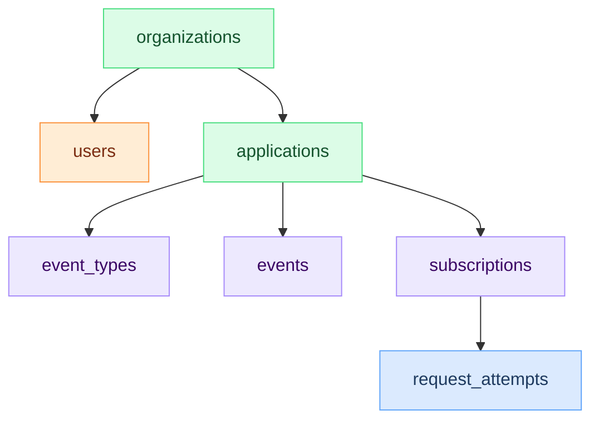

# Hook0 Architecture

This document covers Hook0's architecture, the design decisions behind it, and how the components fit together.

## System architecture

### Default setup (PostgreSQL-only)

PostgreSQL handles everything: event storage, queue, and delivery state. Workers poll for pending deliveries using `FOR UPDATE SKIP LOCKED` for concurrent processing. One database to operate.

### High-throughput setup (Pulsar + S3)

For high-throughput deployments, Hook0 can use Apache Pulsar for queuing and S3-compatible object storage for event payloads and response bodies. PostgreSQL remains the source of truth for metadata, subscriptions, and event types. The switch between backends is a configuration change (`QUEUE_TYPE`), not a code change.

## Component responsibilities

### API server
- Receives events via REST API
- Validates Biscuit tokens (user sessions) and service tokens (programmatic access)
- Validates event payloads against schemas
- Enforces rate limits and usage quotas
- CRUD for organizations, applications, subscriptions

### Worker process
- Retrieves pending events from the database
- Sends HTTP requests to configured endpoints
- Retries failed deliveries with increasing backoff
- Manages permanently failed events (dead letter)
- Records delivery attempts and response data

### Web dashboard
- Vue.js-based management UI
- Live updates on event processing
- Configuration for subscriptions and event types
- Delivery metrics and health dashboards

## Event flow

For details on the event lifecycle, retry logic, and delivery handling, see the [Event Processing Model](./event-processing.md).

## Data model

### Core entities

### Event storage
Events are stored with:
- Unique ID
- Event type reference
- JSON payload
- Metadata (labels, source IP, etc.)
- Timestamp

### Subscription matching
Subscriptions define:
- Event type filters (exact match or patterns)
- Target HTTP endpoint
- Authentication headers
- Custom metadata
- Retry configuration

## Design decisions

### Why Rust?
- Memory safety without garbage collection
- Good performance
- Strong type system catches bugs at compile time

### Why PostgreSQL as the default?
- ACID guarantees
- Good JSON support
- Doubles as a job queue via `FOR UPDATE SKIP LOCKED`, so most deployments don't need a separate queuing system

### Why Pulsar + S3 for high throughput?
- Pulsar handles message ordering, fan-out, and backpressure at scale
- S3-compatible storage offloads large payloads and response bodies from the database
- Better fit for deployments processing millions of events per day
- PostgreSQL stays the source of truth for metadata; Pulsar handles the delivery queue

### Why Biscuit tokens?
Hook0 uses [Biscuit tokens](https://www.biscuitsec.org/) for both user sessions and service tokens:
- More flexible than JWT
- Built-in authorization
- Supports token attenuation (restrict permissions without calling the server)

## Next steps

- [Event Processing Model](./event-processing.md)
- [Security Model](./security-model.md)
- [API Reference](../openapi/intro)
