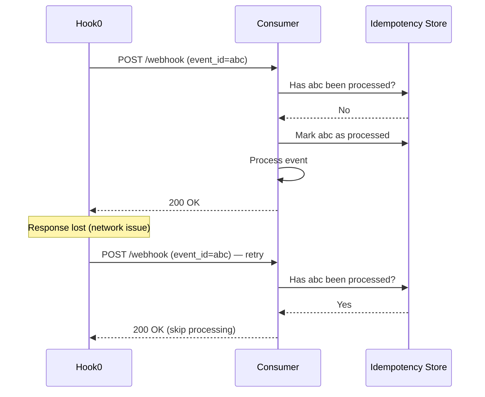

# Webhook delivery guarantees

Every webhook system sits somewhere on a spectrum between losing events and delivering duplicates. The three delivery guarantees below describe where you land on that spectrum, and what your consumer code needs to handle.

## The three guarantees

### At-most-once

Fire and forget. The producer sends the webhook once and never retries. If the delivery fails, the event is lost.

Simple to implement. Also unusable for any workflow where a missed event causes data inconsistency -- payments, user provisioning, inventory updates.

### At-least-once

The producer retries with increasing delays until the consumer acknowledges with a 2xx response. The event will arrive, but it may arrive more than once.

Hook0 uses at-least-once. So do Stripe, GitHub, and most webhook providers. See [webhook retry logic](/explanation/webhook-retry-logic) for how Hook0 schedules retries.

### Exactly-once

Not possible in distributed systems. The producer cannot know whether the consumer processed the event before the connection dropped. This is the Two Generals Problem.

What you can do instead is **effectively-once processing**: deliver at-least-once, then deduplicate on the consumer side with an idempotency key.

## Why at-least-once wins

It comes down to which failure mode you can tolerate:

| Guarantee | Failure mode | Recovery |
|-----------|-------------|----------|
| At-most-once | Lost events | Manual investigation, data reconciliation |
| At-least-once | Duplicate events | Idempotent handler (automated) |

Lost events are silent. You won't know what you missed until a customer reports a broken state. Duplicates, on the other hand, are visible -- your code can detect and skip them.

## The idempotency pattern

Every [event](/concepts/events) in Hook0 carries a unique `event_id` (UUID). You can use it as an idempotency key: store processed IDs and skip events you have already seen.

The Python example below shows the basic shape. The `event_id` comes from the `X-Hook0-EventId` header:

### Python

```python
def handle_webhook(request):
    event_id = request.headers["X-Hook0-EventId"]

    if db.event_already_processed(event_id):
        return Response(status=200)  # Acknowledge but skip

    db.mark_processed(event_id)
    process_event(request.json())
    return Response(status=200)
```

Same idea in Node.js, using `.then()` chains:

### Node.js

```javascript
app.post("/webhook", (req, res) => {
  const eventId = req.headers["x-hook0-eventid"];

  db.checkProcessed(eventId)
    .then((alreadyProcessed) => {
      if (alreadyProcessed) {
        return res.sendStatus(200);
      }
      return db.markProcessed(eventId)
        .then(() => processEvent(req.body))
        .then(() => res.sendStatus(200));
    })
    .catch((err) => res.sendStatus(500));
});
```

In Rust, you can use PostgreSQL's `ON CONFLICT DO NOTHING` to atomically check and mark in one query:

### Rust

```rust
async fn handle_webhook(
    pool: &PgPool,
    event_id: &str,
    payload: &[u8],
) -> Result<(), AppError> {
    let inserted = sqlx::query!(
        "INSERT INTO processed_webhooks (event_id) VALUES ($1) ON CONFLICT DO NOTHING RETURNING event_id",
        event_id
    )
    .fetch_optional(pool)
    .await?;

    if inserted.is_none() {
        return Ok(()); // Already processed
    }

    process_event(payload).await
}
```

## How it looks end to end



## What Hook0 gives you

Hook0 handles the sending side of effectively-once processing. Failed deliveries are retried with a [configurable two-phase schedule](/explanation/webhook-retry-logic). Each event gets a unique `event_id` (server-generated UUIDv7 if you don't provide one; duplicate rejection if you do -- see [events](/concepts/events)).

Every [request attempt](/concepts/request-attempts) is logged with timestamps, status codes, and error details. And HMAC signatures let consumers [verify that events come from Hook0](/tutorials/webhook-authentication), not an attacker replaying old payloads.

## Common mistakes

### Using payload hash instead of event_id

Payload hashes collide when two distinct events carry the same data (two identical orders placed one second apart, for example). The `event_id` is guaranteed unique. Use it.

### Processing before acknowledging

If your handler processes the event and then crashes before returning 200, Hook0 retries and the event gets processed twice. Fix: store the `event_id` first, acknowledge, then process. If you crash after storing the ID but before processing, you recover from the idempotency store.

### Stateless handlers with no idempotency store

Without a persistent store of processed event IDs, every retry looks like a new event. A serverless function with no database is non-idempotent by default. Add a store -- even a Redis SET with a TTL is enough.

## Further reading

- [Events](/concepts/events) -- event structure and the `event_id` field
- [Request attempts](/concepts/request-attempts) -- how Hook0 tracks each delivery attempt
- [Webhook retry logic](/explanation/webhook-retry-logic) -- retry schedule and configuration
- [Webhook authentication](/tutorials/webhook-authentication) -- verify webhook signatures
