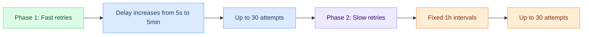
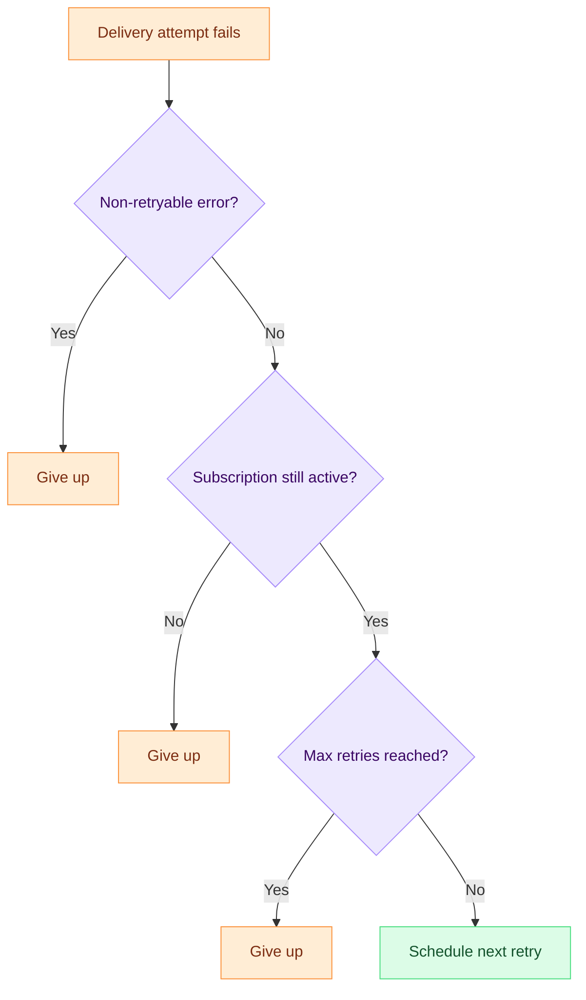
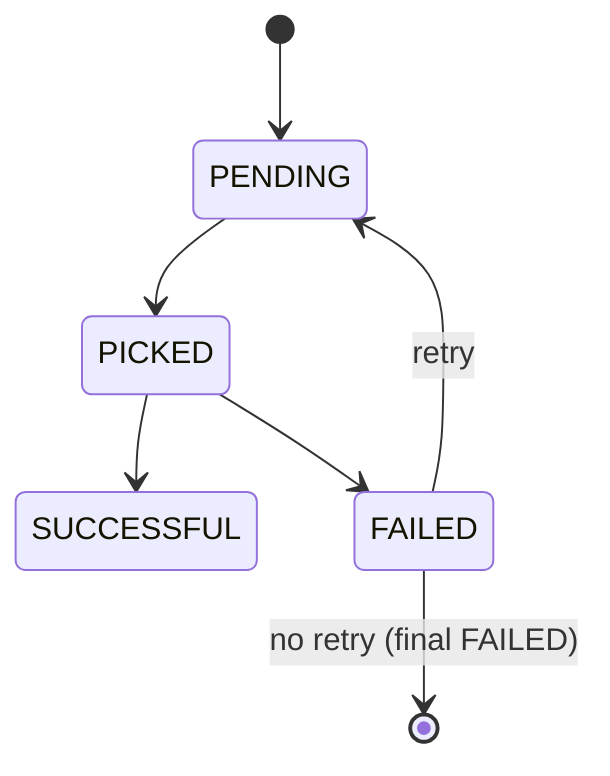

# Webhook retry logic

When a webhook delivery fails (network timeout, 5xx response, DNS error, connection refused), Hook0 retries with increasing delays. Each failed attempt creates a new [request attempt](/concepts/request-attempts) scheduled for later, until the retry limit is reached.

## Why retries matter

Most webhook delivery failures are transient. The receiving server was restarting, a load balancer was draining connections, or a brief network partition occurred. A retry a few seconds later usually succeeds.

Without retries, every transient failure becomes a lost event. With naive retries (fixed interval, no limit), you risk overwhelming a recovering server. Hook0 uses a two-phase retry schedule that balances fast recovery with patience.

## Two-phase retry schedule

Hook0 uses a configurable two-phase approach instead of a single fixed schedule:

1. **Fast retries** -- frequent attempts with increasing delays, to recover from brief outages quickly
2. **Slow retries** -- spaced-out attempts at fixed intervals, to handle longer outages without overwhelming the endpoint



### Default retry configuration

Every [application](/concepts/applications) gets these defaults. Most users never need to change them:

| Parameter | Default | Range | Description |
|-----------|---------|-------|-------------|
| `max_fast_retries` | 30 | 0-100 | Number of fast-phase retry attempts |
| `max_slow_retries` | 30 | 0-100 | Number of slow-phase retry attempts |
| `fast_retry_delay_seconds` | 5s | 1-3600s | Initial delay between fast retries |
| `max_fast_retry_delay_seconds` | 300s (5min) | 1-86400s | Maximum delay between fast retries |
| `slow_retry_delay_seconds` | 3600s (1h) | 60-604800s | Fixed delay between slow retries |

### Per-subscription overrides

Each [subscription](/concepts/subscriptions) can override any of these parameters. When a subscription does not specify a retry configuration, it inherits the application-level defaults. This means you can:

- Set sane defaults for the whole application
- Customize retry behavior for specific subscriptions that need it (e.g., a critical integration that needs more aggressive retries, or a low-priority endpoint that can tolerate longer delays)

## What happens on failure

When a delivery attempt fails, Hook0 follows this decision process:



### Non-retryable errors

Some errors are never retried because retrying would produce the same result:

- Invalid header: the webhook signature could not be constructed (e.g., event type contains characters that are invalid in HTTP headers).

### Subscription and application checks

Before scheduling a retry, Hook0 checks that the subscription is still enabled, has not been soft-deleted, and that the parent application still exists. If any of these fail, the retry is skipped.

## Delivery status flow

Each webhook delivery attempt goes through these states:



More precisely, Hook0 tracks five statuses:

| Status | Meaning |
|--------|---------|
| Waiting | Scheduled for future delivery (`delay_until` has not elapsed yet) |
| Pending | Ready to be picked up by a worker |
| In Progress | Currently being delivered (picked by a worker) |
| Successful | Delivery succeeded (2xx HTTP response) |
| Failed | Delivery failed |

The `request_attempt` table stores every attempt with timestamps (`created_at`, `picked_at`, `succeeded_at`, `failed_at`, `delay_until`), so you can calculate:
- Time to first delivery: `picked_at - created_at`
- Delivery latency: `succeeded_at - picked_at`
- Total time to success: `succeeded_at - created_at` (including retries)

Each retry creates a new row in the `request_attempt` table with an incremented `retry_count` and a `delay_until` set to the scheduled retry time.

## When all retries are exhausted

When the maximum number of retries is reached (or the retry window expires), Hook0 does not create another attempt. The last attempt stays in `failed` status.

Failed deliveries are not lost. You can:

1. Inspect all delivery attempts and their responses via the API or dashboard
2. Replay the event via the API to re-trigger delivery to all matching subscriptions

Replaying an event resets its `dispatched_at` field. The dispatch trigger then creates new request attempts for all active subscriptions that match the event's type and labels.

## Idempotency

Every [event](/concepts/events) in Hook0 has a unique `event_id`. Consumers should use this as an idempotency key to handle duplicate deliveries.

Duplicates happen when:
- The consumer processed the event but returned a non-2xx response (e.g., crashed after processing but before responding)
- Network issues caused the response to be lost
- Manual replay of an event

### Example implementation

```sql
-- PostgreSQL example
CREATE TABLE processed_webhooks (
    event_id UUID PRIMARY KEY,
    processed_at TIMESTAMPTZ NOT NULL DEFAULT NOW()
);

-- Before processing:
INSERT INTO processed_webhooks (event_id)
VALUES ($1)
ON CONFLICT (event_id) DO NOTHING
RETURNING event_id;

-- If no row returned, event was already processed -- skip it.
```

## Configuration

The output worker's retry and delivery behavior is configured via environment variables:

| Parameter | Default | Description |
|-----------|---------|-------------|
| `MAX_RETRIES` | 25 | Maximum delivery attempts before giving up |
| `MAX_RETRY_WINDOW` | 8 days | Maximum time window for retries |
| `CONNECT_TIMEOUT` | 5 seconds | Timeout for establishing a TCP connection |
| `TIMEOUT` | 15 seconds | Total HTTP request timeout (including connect) |
| `CONCURRENT` | 1 | Number of request attempts handled concurrently |

## Error types

When a delivery fails, Hook0 records one of these error codes:

| Error code | Meaning |
|------------|---------|
| `E_TIMEOUT` | The HTTP request timed out |
| `E_CONNECTION` | Could not establish a connection to the target |
| `E_HTTP` | The server responded with a non-2xx status code |
| `E_INVALID_TARGET` | The target URL is invalid or resolves to a forbidden IP |
| `E_INVALID_HEADER` | A required header value could not be constructed (non-retryable) |
| `E_UNKNOWN` | An unexpected error occurred |

## SSRF protection

Hook0 blocks webhook deliveries to private/internal IP addresses by default (loopback, RFC 1918, link-local, etc.). This prevents Server-Side Request Forgery attacks. This check can be disabled with the `DISABLE_TARGET_IP_CHECK` flag for development environments.

## Further reading

- [Webhook delivery guarantees](/explanation/webhook-delivery-guarantees) -- at-least-once delivery and the idempotency pattern
- [Webhook retry strategies compared](/explanation/webhook-retry-strategies) -- fixed interval vs exponential backoff vs two-phase, with trade-offs
- [Webhook vs Polling](/explanation/webhook-vs-polling) -- when to use webhooks, when to poll, and the hybrid pattern
- [Monitor webhook performance](/how-to-guides/monitor-webhook-performance) -- track delivery rates and latency
- [Debug failed webhooks](/how-to-guides/debug-failed-webhooks) -- investigate specific delivery failures
- [Webhook best practices](/how-to-guides/webhook-best-practices) -- patterns for producers and consumers
