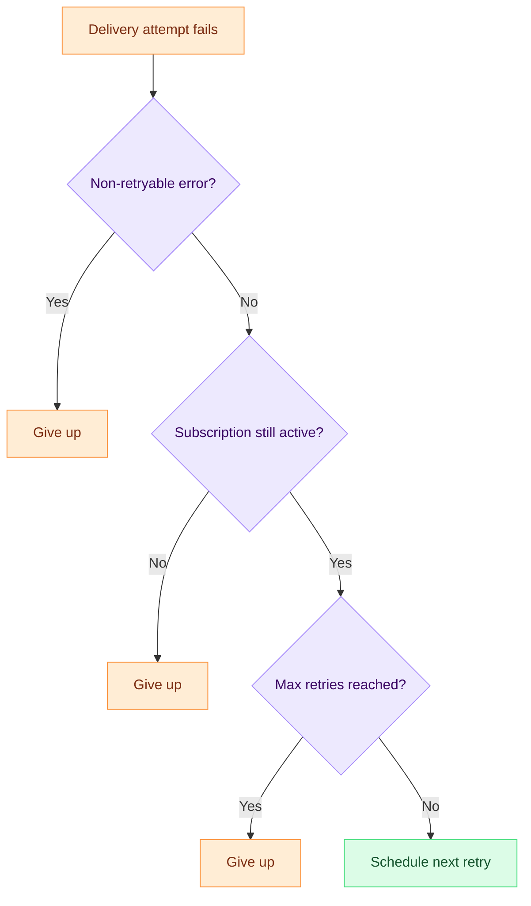
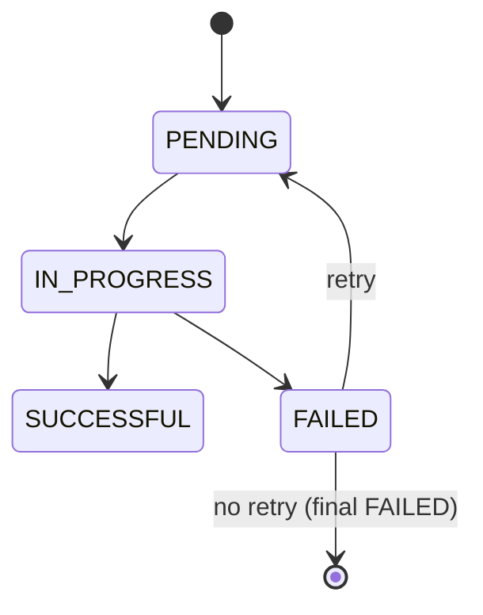

# Webhook retry logic

When a webhook delivery fails (network timeout, 5xx response, DNS error, connection refused), Hook0 retries with increasing delays. Each failed attempt creates a new [request attempt](/concepts/request-attempts) scheduled for later, until the retry limit is reached.

## Why retries matter

Most webhook delivery failures are transient. The receiving server was restarting, a load balancer was draining connections, or a brief network partition occurred. A retry a few seconds later usually succeeds.

Without retries, every transient failure becomes a lost event. With naive retries (fixed interval, no limit), you risk overwhelming a recovering server. Hook0 uses a fixed escalating schedule. Short delays come first, to recover from brief outages quickly; longer delays follow, so a struggling endpoint is not hammered.

## The retry schedule

Hook0 retries on a fixed schedule of increasing delays. The delay before each attempt depends on how many times the delivery has already failed, plus a small random amount ([see below](#why-delays-are-not-exact)):

| Failed attempts so far | Base delay before next attempt |
|---|---|
| 1 | 3 seconds |
| 2 | 10 seconds |
| 3 | 3 minutes |
| 4 | 30 minutes |
| 5 | 1 hour |
| 6 | 3 hours |
| 7 | 5 hours |
| 8 and beyond | 10 hours |

The first attempts are seconds apart to recover from brief outages quickly. Later attempts stretch to hours so a long outage does not turn into a retry storm against an endpoint that is just coming back. From the eighth retry on, the delay holds steady at 10 hours.


```mermaid
flowchart LR
    F["Delivery fails"]:::customer --> R1["3s"]:::hook0
    R1 --> R2["10s"]:::hook0
    R2 --> R3["3min"]:::processing
    R3 --> R4["30min"]:::processing
    R4 --> R5["1h"]:::external
    R5 --> R6["3h"]:::external
    R6 --> R7["5h"]:::external
    R7 --> R8["10h (repeats)"]:::external

    classDef external fill:#dbeafe,stroke:#60a5fa,color:#1e3a5f
    classDef hook0 fill:#dcfce7,stroke:#4ade80,color:#14532d
    classDef customer fill:#ffedd5,stroke:#fb923c,color:#7c2d12
    classDef processing fill:#ede9fe,stroke:#a78bfa,color:#3b0764
```

This schedule is the same for every [application](/concepts/applications) and [subscription](/concepts/subscriptions). It is not tuned per subscription; the two limits that bound it are set on the output worker (see [Configuration](#configuration)).

## Why delays are not exact

Hook0 adds a small random amount on top of each delay. It is only ever added, never subtracted, so a retry never fires earlier than the base delay in the table above.

This matters because failures arrive in groups. When one endpoint goes down, every subscription pointing at it fails at almost the same instant. Without randomness they would all retry at exactly the same instant too, and keep doing so at every step of the schedule -- a wave that stresses the queue and keeps the same deliveries locked together for as long as the outage lasts. Spreading them out breaks that lockstep and keeps one struggling endpoint from delaying deliveries for everyone else.

By default the random amount is up to 10% of the base delay, with a minimum of 2 seconds and a maximum of 15 minutes. A first retry therefore fires between 3 and 5 seconds after the failure, and a 10-hour retry between 10h00 and 10h15. Self-hosted deployments can tune this with `RETRY_JITTER_RATIO` and `RETRY_JITTER_MAX_SPREAD` (see [Configuration](/reference/configuration)); setting either to `0` restores strictly deterministic delays.

The 2-second minimum is not configurable on its own: lowering `RETRY_JITTER_RATIO` never takes the random amount below it.

## How far retries go

Two limits decide when Hook0 stops retrying, whichever is reached first:

- `MAX_RETRIES` (default 24): the maximum number of retry attempts.
- `MAX_RETRY_WINDOW` (default 8 days): the maximum total time spent retrying. Hook0 schedules the next attempt only if it still fits inside this window.

With the defaults, a failing delivery is retried up to 24 times over roughly 8 days before Hook0 gives up.

## What happens on failure

When a delivery attempt fails, Hook0 follows this decision process:


```mermaid
flowchart TD
    FAIL[Delivery attempt fails]:::customer --> NR{Non-retryable error?}:::processing
    NR -->|Yes| GU1[Give up]:::customer
    NR -->|No| ACTIVE{Subscription still active?}:::processing
    ACTIVE -->|No| GU2[Give up]:::customer
    ACTIVE -->|Yes| MAX{Max retries reached?}:::processing
    MAX -->|Yes| GU3[Give up]:::customer
    MAX -->|No| SCHED[Schedule next retry]:::hook0

    classDef hook0 fill:#dcfce7,stroke:#4ade80,color:#14532d
    classDef customer fill:#ffedd5,stroke:#fb923c,color:#7c2d12
    classDef processing fill:#ede9fe,stroke:#a78bfa,color:#3b0764

    click FAIL "/concepts/request-attempts" "Request Attempts"
    click ACTIVE "/concepts/subscriptions" "Subscriptions"
```

### Non-retryable errors

Some errors are never retried because retrying would produce the same result:

- Invalid header: the webhook signature could not be constructed (e.g., event type contains characters that are invalid in HTTP headers).

### Subscription and application checks

Before scheduling a retry, Hook0 checks that the subscription is still enabled, has not been soft-deleted, and that the parent application still exists. If any of these fail, the retry is skipped.

## Delivery status flow

Each webhook delivery attempt goes through these states:


```mermaid
stateDiagram-v2
    [*] --> PENDING
    PENDING --> IN_PROGRESS
    IN_PROGRESS --> SUCCESSFUL
    IN_PROGRESS --> FAILED
    FAILED --> PENDING : retry
    FAILED --> [*] : no retry (final FAILED)
```

More precisely, Hook0 tracks five statuses:

| Status | Meaning |
|--------|---------|
| Waiting | Scheduled for future delivery (`delay_until` has not elapsed yet) |
| Pending | Ready to be picked up by a worker |
| In Progress | Currently being delivered (picked by a worker) |
| Successful | Delivery succeeded (2xx HTTP response) |
| Failed | Delivery failed |

The `request_attempt` table stores every attempt with timestamps (`created_at`, `picked_at`, `succeeded_at`, `failed_at`, `delay_until`), so you can calculate:
- Time to first delivery: `picked_at - created_at`
- Delivery latency: `succeeded_at - picked_at`
- Total time to success: `succeeded_at - created_at` (including retries)

Each retry creates a new row in the `request_attempt` table with an incremented `retry_count` and a `delay_until` set to the scheduled retry time.

## When all retries are exhausted

When the maximum number of retries is reached (or the retry window expires), Hook0 does not create another attempt. The last attempt stays in `failed` status.

Failed deliveries are not lost. You can:

1. Inspect all delivery attempts and their responses via the API or dashboard
2. Replay the event via the API to re-trigger delivery to all matching subscriptions

Replaying an event resets its `dispatched_at` field. The dispatch trigger then creates new request attempts for all active subscriptions that match the event's type and labels.

## Idempotency

Every [event](/concepts/events) in Hook0 has a unique `event_id`. Consumers should use this as an idempotency key to handle duplicate deliveries.

Duplicates happen when:
- The consumer processed the event but returned a non-2xx response (e.g., crashed after processing but before responding)
- Network issues caused the response to be lost
- Manual replay of an event

### Example implementation

```sql
-- PostgreSQL example
CREATE TABLE processed_webhooks (
    event_id UUID PRIMARY KEY,
    processed_at TIMESTAMPTZ NOT NULL DEFAULT NOW()
);

-- Before processing:
INSERT INTO processed_webhooks (event_id)
VALUES ($1)
ON CONFLICT (event_id) DO NOTHING
RETURNING event_id;

-- If no row returned, event was already processed -- skip it.
```

## Configuration

The output worker's retry and delivery behavior is configured via environment variables:

| Parameter | Default | Description |
|-----------|---------|-------------|
| `MAX_RETRIES` | 24 | Maximum delivery attempts before giving up |
| `MAX_RETRY_WINDOW` | 8 days | Maximum time window for retries |
| `CONNECT_TIMEOUT` | 5 seconds | Timeout for establishing a TCP connection |
| `TIMEOUT` | 15 seconds | Total HTTP request timeout (including connect) |
| `CONCURRENT` | 1 | Number of request attempts handled concurrently |

## Error types

When a delivery fails, Hook0 records one of these error codes:

| Error code | Meaning |
|------------|---------|
| `E_TIMEOUT` | The HTTP request timed out |
| `E_CONNECTION` | Could not establish a connection to the target |
| `E_DNS` | The target's hostname could not be resolved: either no name server could be reached, or one answered with an error (for example SERVFAIL or REFUSED). This does not mean the target URL is wrong |
| `E_HTTP` | The server responded with a non-2xx status code |
| `E_INVALID_TARGET` | The target URL is invalid, does not exist (NXDOMAIN), or resolves to a forbidden IP |
| `E_INVALID_HEADER` | A required header value could not be constructed (non-retryable) |
| `E_UNKNOWN` | An unexpected error occurred |

## SSRF protection

Hook0 blocks webhook deliveries to IP addresses that are not globally reachable by default (loopback, RFC 1918 private ranges, carrier-grade NAT, link-local -- which covers cloud metadata endpoints such as `169.254.169.254` -- unique-local, multicast and reserved ranges). This prevents Server-Side Request Forgery attacks.

IPv6 targets are checked too. The whole IETF-reserved block `::/8` (RFC 4291 section 4) is refused: nothing routable was ever allocated there, but every way of writing an IPv4 address inside an IPv6 one lives there -- IPv4-mapped (`::ffff:0:0/96`), IPv4-compatible (`::/96`), IPv4-translated (`::ffff:0:0:0/96`, RFC 2765 SIIT) and ISATAP (`::5efe:0:0/96`, RFC 5214). 6to4 (`2002::/16`, together with its IPv4 relay anycast prefix `192.88.99.0/24`) is refused outright too, because its bits 16 to 47 are an arbitrary IPv4 address and that is where the traffic ends up. The one carve-out inside `::/8` is the NAT64 well-known prefix (`64:ff9b::/96`), which is refused only when the IPv4 address it carries is itself forbidden -- so Hook0 keeps working behind NAT64/DNS64 without the prefix becoming a way to spell `127.0.0.1` in IPv6.

The check applies to hostnames *and* to URLs written with an IP literal, and the addresses it vetted are pinned into the connection, so a second DNS answer cannot redirect the request afterwards (DNS rebinding).

This check can be disabled with the `DISABLE_TARGET_IP_CHECK` flag for development environments.

## Further reading

- [Webhook delivery guarantees](/explanation/webhook-delivery-guarantees) -- at-least-once delivery and the idempotency pattern
- [Webhook retry strategies compared](/explanation/webhook-retry-strategies) -- fixed interval vs exponential backoff vs two-phase, with trade-offs
- [Webhook vs Polling](/explanation/webhook-vs-polling) -- when to use webhooks, when to poll, and the hybrid pattern
- [Monitor webhook performance](/how-to-guides/monitor-webhook-performance) -- track delivery rates and latency
- [Debug failed webhooks](/how-to-guides/debug-failed-webhooks) -- investigate specific delivery failures
- [Webhook best practices](/how-to-guides/webhook-best-practices) -- patterns for producers and consumers
