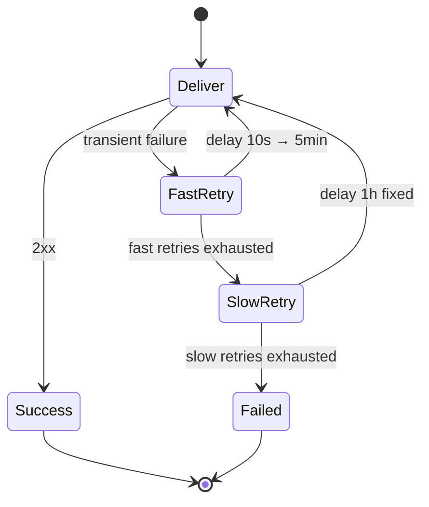

# Webhook retry strategies compared

3-5% of webhook deliveries fail on the first attempt. Network blips, rolling deploys, load balancer drains, brief DNS hiccups. These are transient failures — the endpoint is fine a few seconds later.

Without retries, those events are gone. With naive retries, you risk making things worse. Your strategy determines whether you recover quietly or trigger a cascading outage.

## Strategy comparison

| Strategy | Recovery rate | Thundering herd risk | Complexity | When to use |
|----------|:---:|:---:|:---:|-------------|
| Fixed interval | ~85% | **High** | Low | Dev/test environments only |
| Exponential backoff | ~92% | Medium | Low | Single-consumer systems |
| Exponential + jitter | ~95% | **Low** | Medium | Multi-consumer systems |
| Two-phase (fast then slow) | Very high | **Low** | Medium | Production webhook infrastructure |
| Circuit breaker | Varies | **None** | High | When you control both sides |

## Fixed interval: why it breaks at scale

Say you have a 10-second fixed retry and 1,000 subscribers hitting a recovering endpoint:

- **t=0s**: 1,000 deliveries fail (endpoint down)
- **t=10s**: 1,000 retries hit at the same time
- **t=20s**: 1,000 retries again -- the endpoint just came back but gets 1,000 concurrent requests

The endpoint either recovers and immediately gets hammered, or stays down because the retry storm prevents recovery. A transient failure becomes a sustained outage.

## Exponential backoff: better but not enough

Exponential backoff (1s, 2s, 4s, 8s, 16s...) spreads load over time. But when subscribers are synchronized, every retry wave still lands at the same instant, just less often.

The fix is **jitter**: add randomness to each delay. Instead of `delay = base * 2^attempt`, use `delay = random(0, base * 2^attempt)`. This breaks the synchronization across subscribers.

Without jitter, 1,000 subscribers still slam the endpoint at each backoff step. With jitter, those 1,000 retries spread across the full interval.

## Two-phase retry: the production pattern

Pure exponential backoff has a problem: delays grow too fast. After 10 attempts at base 2s, you are waiting 17 minutes between retries. After 15 attempts, 9 hours. You either cap the delay (reinventing two-phase) or accept huge gaps.

Two-phase retry splits the schedule into two stages. The **fast phase** uses short, increasing delays to catch transient failures within seconds. The **slow phase** switches to fixed-interval retries over hours or days for longer outages.

This maps to how failures actually play out: most resolve in seconds (a restart, a deploy rollout), while some take hours (provider outage, DNS propagation).



## Hook0's default two-phase configuration

By default, Hook0 uses two-phase retry with these parameters:

| Phase | Attempts | Delay range | Total window |
|-------|:---:|-------------|:---:|
| Fast | 5 | 10s → 5min (increasing) | ~15min |
| Slow | 10 | 1h (fixed) | ~10h |

The fast phase covers the ~95% of transient failures that resolve within minutes: container restarts, deploy rollouts, brief network partitions.

The slow phase picks up the rest -- provider outages, DNS propagation, certificate renewals. Spacing retries at 1-hour intervals avoids overwhelming the endpoint while still recovering when it comes back.

In practice, this handles nearly all transient failures without anyone intervening.

## Configuring retries

You can override retry parameters per [application](/concepts/applications) or per [subscription](/concepts/subscriptions). Here is the default configuration as JSON:

```json
{
  "max_fast_retries": 5,
  "fast_retry_delay_seconds": 10,
  "max_fast_retry_delay_seconds": 300,
  "max_slow_retries": 10,
  "slow_retry_delay_seconds": 3600
}
```

For critical integrations where you want faster recovery and a longer retry window, something like this works:

```json
{
  "max_fast_retries": 10,
  "fast_retry_delay_seconds": 5,
  "max_fast_retry_delay_seconds": 120,
  "max_slow_retries": 20,
  "slow_retry_delay_seconds": 1800
}
```

The full configuration reference and per-subscription overrides are documented in [Webhook retry logic](/explanation/webhook-retry-logic).

## Further reading

- [Webhook retry logic](/explanation/webhook-retry-logic) -- full two-phase retry configuration reference
- [Request attempts](/concepts/request-attempts) -- how each delivery attempt is tracked
- [Monitor webhook performance](/how-to-guides/monitor-webhook-performance) -- delivery rates and retry patterns
