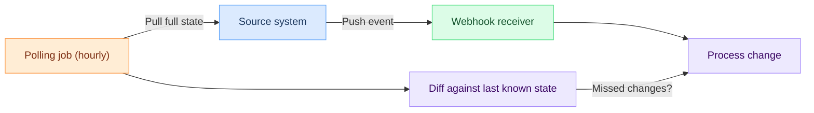

# Webhook vs Polling: A Decision Framework

## Short version

**Polling** means your code asks "anything new?" on a timer. Works fine, but wastes calls at scale.

**Webhooks** mean the source sends you an HTTP request when something changes. Faster and cheaper, though you need an endpoint to receive them.

If your source supports webhooks, use webhooks. If it does not, poll. If reliability matters, do both (see [hybrid pattern](#the-hybrid-pattern) below).

## Latency comparison

| Scenario | Polling (60s interval) | Polling (5s interval) | Webhook |
|----------|:---:|:---:|:---:|
| Average notification delay | **30s** | **2.5s** | **< 1s** |
| Worst-case delay | 60s | 5s | Network RTT |
| Delay scales with | Poll interval | Poll interval | Nothing |

Polling latency = `interval / 2` on average. Shrinking the interval improves latency but multiplies API calls linearly.

## Cost comparison

Consider 10,000 resources you need to monitor for changes, where ~1% change per hour:

| Metric | Polling (60s) | Polling (5s) | Webhook |
|--------|:---:|:---:|:---:|
| API calls / day | **14.4M** | **172.8M** | **~2,400** |
| Calls that found a change | ~2,400 | ~2,400 | ~2,400 |
| Wasted calls / day | 14,397,600 | 172,797,600 | 0 |
| Wasted call ratio | 99.98% | 99.999% | 0% |

With webhooks, every HTTP request carries a real change. With polling, you pay for every empty response in API quota, bandwidth, server CPU, and rate-limit headroom.

## When polling wins

Webhooks are not always the right call.

If the source API only supports pull, you poll. No other option there. Same if the webhook sender has no retry logic and silently drops deliveries -- polling becomes your safety net.

For simple scripts, a cron job polling once per minute is 10 lines of code. Standing up an HTTPS endpoint with signature verification takes more work. And when you need full-state consistency, polling gives you a snapshot each time, which makes it easier to detect deletions or reconcile state.

## When webhooks win

When users expect instant feedback (payment received, order shipped, CI build done), webhooks deliver it. The cost gap matters too: 14.4M vs 2,400 API calls per day adds up across resources and environments.

Both sides benefit from lower load. The source stops serving millions of empty responses, and your system stops parsing them. On top of that, a single [event](/concepts/events) can fan out to multiple [subscriptions](/concepts/subscriptions) at once. Polling would need separate logic per consumer.

## The hybrid pattern

The most reliable setup is webhook-first with a polling fallback:

The webhook path delivers changes in real-time. Then a low-frequency polling job runs (say, hourly) to catch anything the webhook missed -- network blip, sender outage, misconfiguration. Both paths feed the same processor, which uses an idempotency key to skip duplicates.

Hook0's [retry logic](/explanation/webhook-retry-logic) does something similar on the sending side: if a delivery fails, it retries with increasing delays, so you may not need the polling fallback at all.

## How Hook0 handles this

Hook0 wraps the "webhook-first" pattern into something you can run in production without building retry queues, signature verification, or delivery monitoring from scratch.

It accepts [events](/concepts/events) from your application via API, routes them to subscriber endpoints based on [subscriptions](/concepts/subscriptions), and retries failed deliveries with a configurable [two-phase schedule](/explanation/webhook-retry-logic#two-phase-retry-schedule). You also get delivery logs, latency metrics, and replay.

The [getting started tutorial](/tutorials/getting-started) walks through setup.

## Further reading

- [Event concepts](/concepts/events) -- what events are and how they flow through Hook0
- [Subscriptions](/concepts/subscriptions) -- routing rules that connect events to endpoints
- [Webhook retry logic](/explanation/webhook-retry-logic) -- how Hook0 handles failed deliveries
- [Event processing](/explanation/event-processing) -- the full event lifecycle
