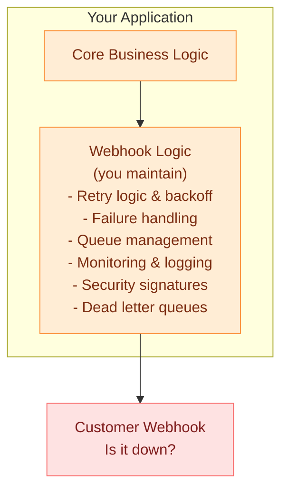
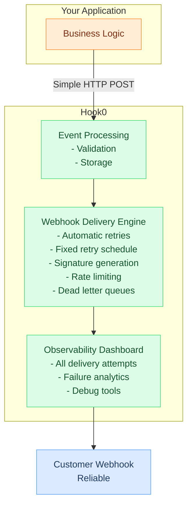

# What is Hook0?

Hook0 is an open-source webhook server (Webhooks as a Service). It receives events from your applications and delivers them to configured webhook endpoints, handling retries, signatures, and monitoring for you.

## The problem

When your application needs to send webhooks, you end up building:

- Retry logic for when the receiving system is down
- Queue management for thousands of deliveries
- Monitoring to track and debug failures
- Signature generation for authenticity

Hook0 handles all of that so you don't have to.

## Before and after Hook0

### Without Hook0

Problems:
- Webhook code scattered across your application
- No centralized visibility on delivery status
- Retry and failure logic you have to maintain yourself
- Hard to debug failed deliveries

### With Hook0

What changes:
- One API call to send events
- One dashboard for all deliveries
- Retry logic works out of the box
- Full visibility and debugging tools

## How Hook0 works

1. Your application sends events to Hook0 via REST API
2. Hook0 validates and stores events
3. Hook0 delivers events to configured webhook endpoints
4. Failed deliveries are retried on a fixed schedule (3s, 10s, 3min, 30min, 1h, 3h, 5h, 10h)
5. All attempts are logged and viewable in the dashboard

## Core concepts

### Organizations
The top-level entity. Organizations group users and applications together, providing isolation and access control.

### Applications
Applications represent your services or products within an organization. Each application can define event types and have multiple subscriptions.

### Event types
Event types define what events your application can emit. Examples:
- `user.account.created`
- `payment.transaction.completed`
- `order.shipment.shipped`

### Events
An event is a specific occurrence of an event type, containing:
- Event type identifier
- Payload data
- Metadata
- Timestamp

### Subscriptions
A subscription defines where and how webhook notifications get delivered:
- Target webhook URL
- Which event types to receive
- Authentication headers
- Retry configuration

### Request attempts
Hook0 tracks every delivery attempt:
- Response status codes
- Response bodies
- Timestamps
- Retry attempts

## Why Hook0?

- Open source (SSPL v1), self-hostable, or use the [cloud version](https://www.hook0.com/)
- Written in Rust, scales horizontally
- RESTful API with SDKs (Rust, TypeScript)
- Automatic retries, dead letter queues, rate limiting
- Full delivery visibility in the dashboard

## Use cases

- SaaS integration: let customers receive webhook notifications from your platform
- Microservices: decouple services with async webhook delivery
- Audit and compliance: track all events and their delivery status
- Third-party integrations: connect to Slack, Discord, or any HTTP endpoint

## Next steps

- [Getting Started Tutorial](../tutorials/getting-started.md)
- [System Architecture](./hook0-architecture.md) - Detailed technical architecture
- [API Reference](../openapi/intro)
- [Webhook best practices](../how-to-guides/webhook-best-practices.md) - Production patterns for sending and receiving webhooks
- [How Hook0 compares](../comparisons/) - Side-by-side comparison with Svix, Hookdeck, and other providers
