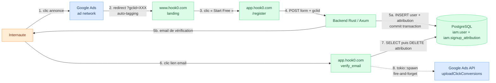

# Balance test — intérêt légitime (art. 6.1.f RGPD)

| | |
|---|---|
| **Traitement** | Transmission du gclid à Google Ads pour mesure de conversion publicitaire (server-side) |
| **Numéro au registre art. 30** | Traitement n°8 (cf. `record-of-processing-activities.md`) |
| **Responsable de traitement** | FGRibreau SARL, 3 rue de l'Aubépine, 85110 Chantonnay, France (RCS La Roche-sur-Yon 850 824 350) |
| **Co-responsable** | Google LLC, dans le cadre des Customer Data Processing Terms — module 2 (contrôleur → contrôleur), art. 26 RGPD |
| **DPO** | Non désigné. FGRibreau SARL n'est pas soumise à l'obligation de l'art. 37.1 RGPD : ni autorité publique, ni traitement à grande échelle de données sensibles, ni suivi systématique de personnes à grande échelle. Point de contact RGPD : `legal@hook0.com`. |
| **Référence légale principale** | Règlement (UE) 2016/679 (RGPD), art. 6.1.f |
| **Référentiels appliqués** | WP29/EDPB Guidelines 06/2014 sur la notion d'intérêt légitime ; CJUE C-582/14 *Breyer* du 19 octobre 2016 ; Délibération CNIL 2020-091 du 17 septembre 2020 |
| **Périmètre** | Campagnes Google Ads opérées par FGRibreau SARL pour le SaaS Hook0 (`www.hook0.com`, `app.hook0.com`). Les déploiements self-hosted de Hook0 (open-source) n'utilisent pas ce traitement par défaut. |

### Historique des révisions

| Version | Date | Auteur | Modification |
|---------|------|--------|--------------|
| 1.0 | 4 mai 2026 | Direction FGRibreau SARL | Création |
| 1.1 | 10 mai 2026 | Direction FGRibreau SARL | Correction de la référence CCT (Décision d'exécution UE 2021/914), ajout de la table de transit `iam.signup_attribution`, précision sur le statut DPO, clarification de l'effet de l'opposition art. 21.2 sur les données déjà transmises à Google, ajout du numéro de registre |

---

## 1. Description du traitement

Le `gclid` (Google Click Identifier) est un identifiant opaque généré par Google au moment du clic d'un internaute sur une annonce Google Ads. Il est injecté dans l'URL de destination par le mécanisme d'auto-tagging de Google Ads (paramètre `?gclid=XXX`). Cet identifiant n'est interprétable que par Google. FGRibreau SARL ne peut, à elle seule, ni en déduire l'identité de l'utilisateur, ni le rattacher à un profil publicitaire.

### Trajet fonctionnel

L'internaute clique sur une annonce et atterrit sur `www.hook0.com/?gclid=XXX`. Il clique ensuite sur le bouton « Start Free » qui le redirige vers `app.hook0.com/register?gclid=XXX` (le gclid est propagé via le query string, et accessoirement via un cookie de domaine parent `.hook0.com` posé après recueil du consentement sur le site marketing pour relayer un signup différé). Le frontend Vue lit le gclid depuis l'URL ou le cookie et l'inclut dans le payload du formulaire. Le backend Rust valide le formulaire, crée l'utilisateur en base PostgreSQL et commite la transaction.

Une fois la transaction d'inscription réussie, le backend insère une ligne dans la table de transit `iam.signup_attribution (user__id, gclid, created_at)`. Lorsque l'utilisateur valide ensuite son adresse email (handler `verify_email`), la ligne d'attribution est lue, supprimée, et un appel `tokio::spawn` fire-and-forget déclenche un upload vers l'API Google Ads `uploadClickConversions`. La réponse de Google n'est ni attendue ni bloquante : la vérification d'email réussit indépendamment de l'issue de l'upload.

### Données transmises à Google

Trois éléments sont transmis : le `gclid`, l'identifiant de la `conversionAction` (resource ID statique configuré côté Hook0) et le `conversionDateTime` au format ISO 8601.

### Données qui ne sont pas transmises

L'adresse email (en clair ou hashée), l'adresse IP du client, le User-Agent du navigateur, l'état civil (prénom, nom), les identifiants Hook0 internes (`user_id`, `organization_id`) et toute donnée d'usage du SaaS (events, webhooks, métriques) restent strictement dans le périmètre Hook0 et ne quittent pas l'infrastructure FGRibreau SARL.

### Persistance côté Hook0

La seule trace persistée du gclid est la ligne dans `iam.signup_attribution`, créée à l'inscription et supprimée à la vérification de l'email. Pour les inscriptions sans vérification d'email, une purge automatique élimine les lignes après 30 jours. Cette durée est calibrée sur la fenêtre de conversion Google Ads (configurable jusqu'à 90 jours), tout en restant proportionnée à la finalité pour un funnel B2B (la vérification d'email survient en pratique sous 24 à 72 heures). Le gclid n'est référencé dans aucune autre table SQL. Les logs applicatifs peuvent en contenir trace (cf. section 4 sur la rétention).

---

## 2. Qualification juridique du gclid

Le gclid n'identifie pas directement un individu pour FGRibreau SARL : il s'agit d'une chaîne pseudo-aléatoire opaque dont la table de correspondance vers un cookie publicitaire `_gads` est détenue exclusivement par Google.

La jurisprudence **CJUE Breyer (C-582/14, 19 octobre 2016)** et le **considérant 26 du RGPD** retiennent toutefois qu'une donnée doit être qualifiée de personnelle dès lors qu'un tiers raisonnablement accessible peut, par des moyens raisonnablement disponibles, la rattacher à une personne physique. Google détient les moyens techniques et juridiques de ré-identifier l'utilisateur derrière un gclid, via son cookie publicitaire et son écosystème ad tech. Le gclid constitue donc **une donnée à caractère personnel au sens de l'art. 4§1 RGPD** dans le chef de FGRibreau SARL, même si celle-ci ne peut pas opérer la ré-identification elle-même.

Cette qualification déclenche l'application du RGPD au traitement décrit. Une base légale est requise au titre de l'art. 6 RGPD. FGRibreau SARL retient l'**intérêt légitime (art. 6.1.f)**, dont la validité est étayée par le test tripartite ci-dessous.

---

## 3. Test tripartite WP29/EDPB (Guidelines 06/2014)

### 3.1 Existence d'un intérêt légitime

L'intérêt poursuivi est la mesure de l'efficacité des campagnes publicitaires Google Ads, afin d'optimiser l'allocation du budget marketing (calcul du CPA et du ROI par campagne et par mot-clé).

Le marketing direct, dans sa dimension d'analyse d'efficacité publicitaire, est expressément reconnu comme un intérêt légitime par les Guidelines 06/2014 du WP29 (exemple 6, p. 25) et par le considérant 47 du RGPD. FGRibreau SARL opère effectivement des campagnes Google Ads avec un budget mensuel de l'ordre de 500 EUR. L'intérêt n'est donc ni hypothétique ni spéculatif : il découle directement d'une activité économique mesurable.

La finalité poursuivie se limite à la mesure agrégée de la performance publicitaire (combien de signups proviennent de chaque campagne, annonce ou mot-clé). Elle ne couvre ni le profilage individuel, ni le retargeting, ni l'enrichissement de profil utilisateur.

### 3.2 Nécessité du traitement

L'écosystème Google Ads ne propose aucun mécanisme alternatif permettant d'attribuer une conversion à un clic publicitaire en l'absence de remontée du gclid. Sans gclid, Google Ads ne peut pas relier une inscription Hook0 à la campagne qui l'a générée, ce qui rend impossible l'optimisation budgétaire.

Comparaison avec les alternatives techniquement disponibles, du plus intrusif au moins intrusif :

| Alternative | Données transmises à Google | Niveau d'intrusion | Décision |
|-------------|----------------------------|--------------------|----------|
| `gtag.js` client-side classique | gclid, IP, User-Agent, cookies Google, referrer | Élevé | Rejetée |
| Enhanced Conversions for Leads (hash email) | gclid, SHA-256(email) | Moyen — ré-identifiable chez Google | Rejetée |
| Mode A — gclid only server-side | gclid, conversionAction, timestamp | Minimal | **Retenue** |

La solution retenue (Mode A server-side, gclid only) constitue le minimum techniquement viable pour atteindre la finalité. Elle satisfait au principe de minimisation des données (art. 5.1.c RGPD) et au critère de nécessité du test tripartite.

### 3.3 Balance des intérêts vs droits et libertés des personnes

| En faveur du traitement (FGRibreau SARL) | En faveur de la personne concernée |
|------------------------------------------|------------------------------------|
| La mesure du CPA conditionne l'allocation du budget marketing : sans données fiables, gaspillage budgétaire et campagnes à l'aveugle. | Aucune donnée directement identifiante (email, IP, UA) n'est transmise. Le risque d'identification est limité au gclid seul. |
| L'optimisation des campagnes contribue à la compétitivité d'une PME française face à des concurrents internationaux disposant de ressources marketing supérieures. | L'utilisateur ne s'attend pas nécessairement à ce que le clic publicitaire qui l'a amené sur le site soit retracé jusqu'à son inscription. Cette attente raisonnable joue contre le traitement et appelle une information transparente au moment de la collecte (art. 13). |
| Pratique standard et largement documentée du marketing digital B2B (équivalent à un comptage anonymisé des conversions). | Risque de ré-identification chez Google, qui dispose déjà de données sur l'internaute via son propre écosystème publicitaire. |
| Aucun impact négatif sur l'expérience utilisateur (pas de profilage, pas de modification du parcours, pas de différenciation tarifaire). | L'utilisateur effectue un acte volontaire de souscription à un service B2B SaaS. Le contexte est explicitement commercial, ce qui modère partiellement l'effet de surprise. |

### Mitigations en faveur de la personne concernée

Sept mesures concrètes ont été mises en œuvre.

La politique de confidentialité (sections 2 et 9b de `privacy-policy.md`) décrit le traitement, sa finalité, sa base légale, le co-responsable et les droits afférents. Une mention courte sous le bouton « S'inscrire » sur `app.hook0.com/register` rappelle ces éléments au moment de la collecte (art. 13.1 et 13.2 RGPD), avec lien vers la politique. Cette mention identifie expressément Google LLC comme co-responsable et précise les coordonnées permettant d'exercer les droits vis-à-vis des deux co-responsables (art. 26.2).

Le droit d'opposition (art. 21.2 RGPD) est effectif via l'adresse `legal@hook0.com`. Comme l'opposition fondée sur un traitement marketing au titre de l'art. 21.2 confère un droit absolu, FGRibreau SARL n'oppose aucun motif impérieux : la cessation est immédiate. Concrètement, la procédure interne :

- positionne le champ `marketing_opt_out_at` sur `iam.user`, ce qui empêche tout upload futur (le code de fire-and-forget vérifie `WHERE marketing_opt_out_at IS NULL`) ;
- adresse à Google une demande de suppression des données déjà transmises pour cet utilisateur, via l'API `removeClickConversions` lorsque le gclid de l'utilisateur peut être identifié, ou à défaut via les voies contractuelles ouvertes par les CDPT.

Aucun marketing direct n'est par ailleurs opéré par Hook0 sur le compte créé, à l'exception des newsletters strictement opt-in. Les données transmises se limitent au gclid (minimisation art. 5.1.c). Le gclid est purgé de l'environnement Hook0 dès que l'upload Google Ads est terminé, ou au plus tard 30 jours après l'inscription si la vérification d'email n'a pas eu lieu. La co-responsabilité est formalisée par les Customer Data Processing Terms acceptés dans la console Google Ads (art. 26 RGPD).

### Conclusion de la balance

L'intérêt légitime de FGRibreau SARL à mesurer l'efficacité de ses campagnes publicitaires prévaut sur les droits et libertés des personnes concernées, sous réserve que les mitigations énumérées soient maintenues opérationnelles.

---

## 4. Mise en œuvre technique des mitigations

| Mesure | Statut | Référence |
|--------|--------|-----------|
| Politique de confidentialité (sections 2 et 9b) | Réalisée | `documentation/hook0-cloud/privacy-policy.md`, version du 4 mai 2026 |
| Mention contextuelle au signup, identifiant Google LLC comme co-responsable et coordonnées d'exercice des droits | Réalisée | Composant Vue `RegisterForm.vue`, lien vers la section 2 de la politique de confidentialité |
| Endpoint `legal@hook0.com` pour l'exercice du droit d'opposition art. 21.2 | Réalisé | Documenté dans la politique de confidentialité, section « Vos droits » |
| Procédure interne sur réception d'une demande d'opposition art. 21.2 | Réalisée | Champ `marketing_opt_out_at: timestamptz` sur `iam.user` ; le code d'upload vérifie ce filtre avant fire-and-forget. Demande de suppression adressée à Google pour les données déjà transmises (cf. section 3.3). |
| Co-responsabilité Google Ads art. 26 RGPD | Réalisée | Customer Data Processing Terms acceptés dans la console Google Ads, module 2 (contrôleur → contrôleur). |
| Transfert hors UE encadré | Réalisé | Clauses Contractuelles Types issues de la Décision d'exécution (UE) 2021/914 de la Commission du 4 juin 2021 (JOUE L 199 du 7 juin 2021), incluses dans les CDPT acceptés. |
| Inscription au registre des traitements art. 30 RGPD | Réalisée | `record-of-processing-activities.md`, traitement n°8 |

**Logging.** Le gclid peut apparaître dans les logs applicatifs : niveau `info` pour un préfixe de 8 caractères tronqué, niveau `debug` pour la valeur complète. La rétention des logs est plafonnée à 30 jours et leur accès est restreint à l'équipe technique de FGRibreau SARL. Aucun partage de logs avec un tiers n'est opéré.

---

## 5. Risques résiduels acceptés

| Risque | Niveau | Mitigation |
|--------|:------:|------------|
| Contestation de la base légale art. 6.1.f par la CNIL en cas de contrôle | Faible | Présent document, CDPT signés, droit d'opposition fonctionnel |
| Bug dans le mécanisme d'opt-out art. 21.2 entraînant un upload malgré une opposition exprimée | Faible | Test unitaire backend à ajouter (vérification du filtre `marketing_opt_out_at IS NULL` avant fire-and-forget) |
| Fuite du gclid via les logs applicatifs | Très faible | Rétention plafonnée à 30 jours, pas de transfert tiers, accès restreint |
| Évolution jurisprudentielle sur le statut du gclid (CJUE, CNIL) ou modification unilatérale des CDPT par Google | Moyen | Veille juridique CNIL/CJUE annuelle, ré-examen formel du présent document tous les 12 mois |

Ces risques sont jugés acceptables au regard de l'intérêt légitime poursuivi et de la robustesse des mitigations.

---

## 6. Procédure de réexamen

Le réexamen est annuel, ou immédiat à chaque évolution majeure : changement de finalité, modification des CDPT Google, jurisprudence CJUE ou CNIL pertinente, modification du périmètre des données transmises.

Prochain réexamen planifié : **4 mai 2027**. Responsable : Direction FGRibreau SARL, avec appui externe d'un conseil juridique le cas échéant.

Critères déclenchant un réexamen anticipé :

- évolution des Guidelines EDPB sur l'intérêt légitime ou sur le marketing digital ;
- décision CNIL ou CJUE remettant en cause la qualification ou le régime du gclid ;
- modification unilatérale par Google des CDPT, des conditions générales Google Ads ou de l'API `uploadClickConversions` ;
- changement de finalité ou élargissement des données transmises (l'ajout d'un hash email, par exemple, déclencherait obligatoirement une nouvelle balance).

---

## 7. Annexes

### Annexe 1 — Références légales et doctrinales

- Règlement (UE) 2016/679 du 27 avril 2016 (RGPD), art. 4§1, 5, 5.1.c, 5.1.e, 6.1.f, 13.1, 13.2, 21.2, 26, 30, 30.4, 37.1, 44 et s. ; considérants 26, 47.
- Loi Informatique et Libertés modifiée (loi n° 78-17 du 6 janvier 1978).
- WP29/EDPB, *Guidelines 06/2014 on the notion of legitimate interests of the data controller under Article 7 of Directive 95/46/EC* (transposable au RGPD), WP217.
- CJUE, 19 octobre 2016, *Patrick Breyer c. Bundesrepublik Deutschland*, C-582/14 (qualification de donnée personnelle d'un identifiant ré-identifiable par un tiers).
- CJUE, 16 juillet 2020, *Schrems II*, C-311/18 (encadrement des transferts hors UE).
- Décision d'exécution (UE) 2021/914 de la Commission du 4 juin 2021 (JOUE L 199 du 7 juin 2021) relative aux clauses contractuelles types pour le transfert de données à caractère personnel vers des pays tiers.
- CNIL, Délibération n° 2020-091 du 17 septembre 2020 portant adoption de lignes directrices relatives aux cookies et autres traceurs.
- CNIL, *Guide pratique de la conformité RGPD pour les TPE/PME*.

### Annexe 2 — Flux de données

Les pointillés signalent un appel asynchrone non bloquant : la réponse Google Ads ne conditionne ni la réussite de la vérification d'email, ni la latence perçue par l'utilisateur.

### Annexe 3 — Référence aux CDPT Google Ads

- Customer Data Processing Terms (Google Ads) : <https://business.safety.google/adscontrollerterms/>
- Acceptation : effectuée dans la console Google Ads par l'administrateur du compte FGRibreau SARL le 25 mars 2026 (acceptation des conditions générales Google Ads, qui intègrent les CDPT depuis leur mise à jour 2024).
- Module CCT applicable : module 2 (contrôleur → contrôleur), cohérent avec la qualification de co-responsabilité art. 26 retenue dans le présent document.
- Capture d'écran horodatée à archiver dans le dossier juridique de FGRibreau SARL.

---

*Document interne. Non destiné à publication. Conservé dans le registre RGPD de FGRibreau SARL et présenté sur demande de l'autorité de contrôle (CNIL), conformément à l'art. 30.4 RGPD.*
