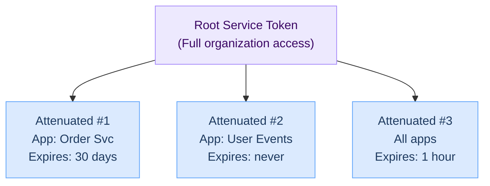

# Managing service tokens

This guide covers creating and managing Hook0 service tokens for API access, including token attenuation for least-privilege access.

## Quick Start (2 minutes)

1. Log in to [Hook0](https://app.hook0.com/)
2. Select your **Organization**
3. Click **Service Tokens** in the sidebar
4. Click **Create Service Token**
5. Name your token and copy it

For production environments, see [Token Attenuation](#token-attenuation) below.

## What is a service token?

A [service token](/concepts/service-tokens) authenticates API requests to Hook0 on behalf of your [organization](/concepts/organizations). Unlike user credentials, service tokens:

- Don't require interactive login
- Can be used in automated systems (CI/CD, scripts, AI assistants)
- Have organization-wide scope by default
- Can be restricted through attenuation

## Creating a service token

### Step 1: Access the service tokens page

1. Log in to the Hook0 dashboard
2. Select your organization from the dropdown
3. Navigate to **Service Tokens** in the left sidebar

### Step 2: Create the token

1. Click **Create Service Token**
2. Enter a descriptive name (e.g., "Production API", "Claude MCP", "CI Pipeline")
3. Click **Create**

:::warning Save your token
The full token is only shown once. Copy it immediately and store it securely. If you lose it, you'll need to create a new one.
:::

### Step 3: Configure your environment

Set the token as an environment variable:

```bash
export HOOK0_API_TOKEN="your-service-token-here"
```

Or use it in your application configuration.

---

## Token attenuation

### What is token attenuation?

Token attenuation lets you create restricted versions of your service token. Like giving someone a house key that only opens the front door.



### Why this matters

Without attenuation, a service token gives full access to your entire organization: all applications, all subscriptions, all events, forever.

The risks:

- If the token leaks, attackers have full access to your webhook infrastructure
- AI assistants see more data than they need
- No way to limit access per use case or team member
- Forgotten tokens stay valid indefinitely

### How it works

Hook0 uses [Biscuit tokens](https://www.biscuitsec.org/), a cryptographic token format that supports **offline attenuation**. This means:

1. **You don't need Hook0's permission** to create restricted tokens
2. **Restrictions can only be added**, never removed
3. **The original token remains unchanged**
4. **Attenuated tokens are cryptographically linked** to their parent

When you attenuate a token, you're essentially adding rules like:

- "This token can only access application X"
- "This token expires on date Y"

These rules are embedded in the token itself and verified by Hook0's API on every request.

### How to attenuate your token

1. Go to **Service Tokens** in the Hook0 dashboard
2. Click **Show** on your token
3. Under **Attenuate your token**, select:
   - **Specific application** — Limit access to one app
   - **Expiration date** — Set an automatic expiry
4. Click **Generate** to create the attenuated token
5. Use the new token in place of the original

:::warning Important
If you revoke the **root token**, all tokens derived from it are automatically invalidated. This gives you a single kill switch for all related tokens.
:::

### Attenuation use cases

| Use case | Recommended attenuation |
|----------|------------------------|
| AI Assistant (Claude, Cursor) | Single app + 30-day expiration |
| CI/CD Pipeline | Single app + no expiration |
| Development/Testing | Test app only + 7-day expiration |
| Production Monitoring | Read-only app access + no expiration |
| Contractor Access | Specific app + project duration expiration |

---

## Create a read-only service token

A read-only token can only list and retrieve resources -- it cannot create, edit, delete, or ingest anything. This is useful for monitoring dashboards, AI assistants in observation mode (see [MCP read-only mode](../reference/mcp.md#read-only-mode)), or giving third parties visibility into your webhook infrastructure without any write risk.

### Step-by-step

1. Go to **Organization** → **Service Tokens**
2. Create a new root service token (or use an existing one)
3. Click **Show** on the token, then scroll to **Attenuate your token**
4. Switch to **Advanced** configuration mode
5. *(Optional)* Restrict to a specific application
6. *(Optional)* Set an expiration date
7. In **Custom Datalog claims**, paste:

```
check if action($a), ["organization:list", "organization:get", "application:list", "application:get", "event_type:list", "event_type:get", "subscription:list", "subscription:get", "event:list", "event:get", "request_attempt:list", "response:get", "events_per_day:application", "events_per_day:organization"].contains($a)
```

8. Click **Generate Attenuated Token**
9. Copy the raw (base64-encoded) token for API calls

### How it works

The Datalog `check if` claim acts as an allowlist: it tells Hook0 "only authorize this token if the requested action is one of these". Any action not in the list -- like `event:ingest`, `subscription:create`, or `service_token:delete` -- is rejected with a 403.

This works because Hook0 service tokens are [Biscuit tokens](https://www.biscuitsec.org/), and Biscuit supports offline attenuation: you add restrictions to a token without needing Hook0's server. Restrictions can only be added, never removed.

### Things to know

- **Attenuated tokens are not stored by Hook0.** Only root tokens are persisted. If you lose the attenuated token, generate a new one from the root.
- **Revoking the root token revokes all attenuated tokens** derived from it. There is no way to revoke a single attenuated token independently.
- **Create one root token per use case.** This way you can revoke the "monitoring" root without affecting the "CI pipeline" root.
- **The claim deliberately excludes `service_token:*` and `application_secret:*` actions** to prevent a read-only token from managing authentication credentials.
- **You can customize the actions list.** Remove actions you don't need, or add write actions if you want a "read + ingest only" token, for example.

### Full list of action names

These are the action names recognized by the Hook0 API, as defined in [`api/src/iam.rs`](https://github.com/hook0/hook0/blob/master/api/src/iam.rs):

| Resource | Actions |
|----------|---------|
| Organization | `organization:list`, `organization:get`, `organization:create`, `organization:edit`, `organization:delete`, `organization:invite`, `organization:revoke`, `organization:edit_role` |
| Service Token | `service_token:list`, `service_token:get`, `service_token:create`, `service_token:edit`, `service_token:delete` |
| Application | `application:list`, `application:get`, `application:create`, `application:edit`, `application:delete` |
| Application Secret | `application_secret:list`, `application_secret:create`, `application_secret:edit`, `application_secret:delete` |
| Event Type | `event_type:list`, `event_type:get`, `event_type:create`, `event_type:delete` |
| Subscription | `subscription:list`, `subscription:get`, `subscription:create`, `subscription:edit`, `subscription:delete` |
| Event | `event:list`, `event:get`, `event:ingest`, `event:replay` |
| Request Attempt | `request_attempt:list` |
| Response | `response:get` |
| Analytics | `events_per_day:application`, `events_per_day:organization` |

---

## Best practices

### 1. Use separate tokens per environment

Create different tokens for development, staging, and production:

```bash
# Development
export HOOK0_API_TOKEN="dev-token-attenuated-to-dev-app"

# Staging
export HOOK0_API_TOKEN="staging-token-attenuated-to-staging-app"

# Production
export HOOK0_API_TOKEN="prod-token-attenuated-to-prod-app"
```

### 2. Always attenuate for third-party tools

When using tokens with AI assistants or external services:

1. Create an attenuated token limited to specific applications
2. Set an expiration date
3. Store the token securely in the tool's configuration

### 3. Use descriptive names

Name tokens clearly to identify their purpose:

- Good: "Claude MCP - Order Service - Expires 2024-06"
- Bad: "Token 1"

### 4. Rotate tokens regularly

For sensitive environments:

1. Create a new token
2. Update your applications to use the new token
3. Verify everything works
4. Revoke the old token

---

## Revoking tokens

To revoke a service token:

1. Go to **Service Tokens** in the dashboard
2. Find the token to revoke
3. Click the **Delete** button
4. Confirm the deletion

:::danger Revocation is immediate
Once revoked, the token and all its attenuated derivatives stop working immediately. Update your applications before revoking.
:::

---

## Troubleshooting

### "Authentication failed" Error

**Possible causes:**

- Token was revoked
- Token expired (if attenuated with expiration)
- Token has extra whitespace
- Using attenuated token outside its allowed scope

**Solutions:**

1. Verify the token in the dashboard
2. Check if it has an expiration date
3. Ensure no extra spaces in configuration
4. Create a new attenuated token if needed

### "Forbidden" Error (403)

**Possible causes:**

- Attenuated token doesn't have access to the requested resource
- Token was attenuated to a different application

**Solutions:**

1. Check which application the token is attenuated to
2. Create a new attenuated token with correct scope

### Token not appearing in dashboard

Service tokens belong to organizations, not users. Ensure you:

1. Selected the correct organization
2. Have admin permissions for the organization

---

## Related resources

- [API Reference](../openapi/intro) - API documentation
- [MCP Server for AI Assistants](../reference/mcp.md) - Using tokens with AI assistants
- [Configuration Reference](../reference/configuration.md) - Environment variable setup
