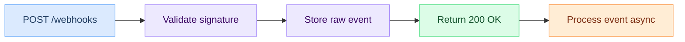

# Webhook best practices

Production patterns for both sides of a webhook integration: the producer (sender) and the consumer (receiver).

## For producers (sending webhooks)

### Sign every payload

Every outgoing webhook should include an HMAC-SHA256 signature in the headers. This lets consumers verify the payload hasn't been tampered with.

```
X-Hook0-Signature: sha256=<hex-encoded-hmac>
```

Generate the signature from the raw request body using the shared secret. Never sign a re-serialized version of the payload; byte differences will break verification.

For a step-by-step implementation with code examples, see [Webhook authentication tutorial](/tutorials/webhook-authentication). Hook0 generates HMAC signatures automatically for every delivery -- see [Application secrets](/concepts/application-secrets) for how to manage signing keys.

### Include an idempotency key

Add a unique identifier to each event so consumers can deduplicate:

```json
{
  "event_id": "evt_01H8...",
  "event_type": "invoice.paid",
  "created_at": "2025-01-15T10:30:00Z",
  "data": { }
}
```

Use UUIDs or ULIDs. The consumer stores seen event IDs and skips duplicates.

### Design payloads for stability

Keep payloads self-contained. Include the data the consumer needs rather than forcing them to make API calls back to you:

Good (self-contained):
```json
{
  "event_type": "order.shipped",
  "data": {
    "order_id": "ord_123",
    "tracking_number": "1Z999AA10123456784",
    "carrier": "ups",
    "shipped_at": "2025-01-15T14:00:00Z"
  }
}
```

Avoid (requires follow-up API call):
```json
{
  "event_type": "order.shipped",
  "data": {
    "order_id": "ord_123"
  }
}
```

### Version your webhooks

When you change payload shapes, use event type versioning:

```
order.shipped.v1
order.shipped.v2
```

Give consumers time to migrate. Support old versions for at least 6 months after announcing deprecation.

## For consumers (receiving webhooks)

### Verify signatures first

Before processing any webhook, verify the HMAC signature. Reject requests with missing or invalid signatures immediately.

```python
import hmac
import hashlib

def verify_signature(payload_body, secret, received_signature):
    expected = hmac.new(
        secret.encode('utf-8'),
        payload_body,
        hashlib.sha256
    ).hexdigest()
    return hmac.compare_digest(f"sha256={expected}", received_signature)
```

Use constant-time comparison (`hmac.compare_digest`) to prevent timing attacks. See [Secure webhook endpoints](/how-to-guides/secure-webhook-endpoints) for a more detailed walkthrough, and [Hook0's security model](/explanation/security-model) for how signatures fit into the broader security architecture.

### Respond fast, process later

Return a `200 OK` within 5 seconds. Do the actual processing asynchronously:



If your endpoint takes too long, the producer may time out and retry, leading to duplicate processing. See [Client error handling](/how-to-guides/client-error-handling) for patterns on handling these edge cases.

### Handle duplicates (idempotency)

Webhooks can be delivered more than once. Track processed event IDs:

```sql
CREATE TABLE processed_events (
  event_id TEXT PRIMARY KEY,
  processed_at TIMESTAMPTZ DEFAULT NOW()
);
```

Before processing, check if the event ID exists. If it does, skip it.

### Use HTTPS endpoints only

Always expose webhook endpoints over HTTPS. This prevents payload interception and man-in-the-middle attacks. Most webhook providers (including Hook0) refuse to deliver to plain HTTP URLs in production. See [Subscriptions](/concepts/subscriptions) for how to configure your endpoints in Hook0.

## Payload design guidelines

### Use a consistent envelope structure

Every event should follow the same top-level structure:

```json
{
  "event_id": "evt_...",
  "event_type": "resource.action",
  "api_version": "2025-01-15",
  "created_at": "2025-01-15T10:30:00Z",
  "data": { }
}
```

### Event type naming

Use `resource.action` format with dot separators:

- `user.created`
- `invoice.payment_succeeded`
- `subscription.trial_ending`

Be specific. `user.updated` is better than `user.changed`. `invoice.payment_failed` is better than `invoice.error`.

Hook0 uses a `service.resource_type.verb` convention for event types that we consider even better ! See [Event types](/concepts/event-types) for how this works, and [Event types & subscriptions tutorial](/tutorials/event-types-subscriptions) for a hands-on setup guide.

### Timestamp format

Always use ISO 8601 with timezone: `2025-01-15T10:30:00Z`. Never use Unix timestamps in the payload; they are harder to read when debugging.

## Monitoring and alerting

### Metrics to track

As a producer:
- Delivery success rate (target: >99.5%)
- P95 delivery latency
- Retry rate per endpoint
- Dead letter queue depth

As a consumer:
- Processing success rate
- Duplicate detection rate
- Average processing time
- Queue depth

### Alerting thresholds

Alert on:
- Delivery success rate drops below 99%
- Any endpoint has >5 consecutive failures
- Dead letter queue has >100 unprocessed events
- Processing latency exceeds 30 seconds

See [Monitor webhook performance](/how-to-guides/monitor-webhook-performance) for Hook0-specific monitoring setup.

## Further reading

- [Webhook authentication tutorial](/tutorials/webhook-authentication) -- HMAC implementation walkthrough
- [Webhook retry logic](/explanation/webhook-retry-logic) -- backoff algorithms and dead letter handling
- [Debug failed webhooks](/how-to-guides/debug-failed-webhooks) -- troubleshooting delivery failures
- [Secure webhook endpoints](/how-to-guides/secure-webhook-endpoints) -- endpoint security in depth
- [Event types & subscriptions](/tutorials/event-types-subscriptions) -- setting up routing and filtering
- [Getting started with Hook0](/tutorials/getting-started) -- send your first webhook
- [Hook0 Play](https://play.hook0.com) -- test webhook deliveries and inspect payloads in real-time, no signup needed
