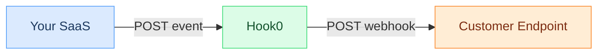

# Building your first webhook system with Hook0

This tutorial walks through integrating Hook0 into a SaaS platform so your customers can receive webhooks. It uses curl commands throughout, so you can follow along in any language.

## What you'll build

A webhook delivery system that:
- Sends events from your SaaS to Hook0
- Lets customers subscribe to specific events
- Handles delivery, retries, and monitoring automatically
- Filters events per tenant using labels

## Prerequisites

- [Hook0 cloud account](https://www.hook0.com/) or [self-hosted instance running](./getting-started.md)
- [API token](./getting-started.md#step-3-get-your-api-token)
- Application ID from Hook0
- Basic understanding of REST APIs and webhooks

### Set up environment variables

```bash
# Set your service token (from dashboard)
export HOOK0_TOKEN="YOUR_TOKEN_HERE"
export HOOK0_API="https://app.hook0.com/api/v1" # Replace by your domain (or http://localhost:8081 locally)

# Set your application ID (shown in dashboard URL or application details)
export APP_ID="YOUR_APPLICATION_ID_HERE"
```

Save these values:
```bash
# Save to .env file for later use
cat > .env <<EOF
HOOK0_TOKEN=$HOOK0_TOKEN
HOOK0_API=$HOOK0_API
APP_ID=$APP_ID
EOF
```

## Architecture overview



Your SaaS sends events to Hook0, which handles delivery, retries, signature verification, and monitoring.

## Understanding the API flow

The integration has four steps:
1. **Create event types** - define what events your SaaS emits
2. **Create subscriptions** - let customers receive webhooks
3. **Send events** - push events to Hook0 when actions occur
4. **Monitor delivery** - track webhook success and failures

## Step 1: Define your event types

Hook0 uses a three-part structure for [event types](/concepts/event-types): `service.resource_type.verb`. This gives clear semantics and makes filtering straightforward.

### Why define event types first?
Event types act as a contract between your SaaS and customer webhooks. They must be created before you can send events or create subscriptions.

### Create a "user created" event type

```bash
curl -X POST "$HOOK0_API/event_types" \
  -H "Authorization: Bearer $HOOK0_TOKEN" \
  -H "Content-Type: application/json" \
  -d '{
    "application_id": "'"$APP_ID"'",
    "service": "user",
    "resource_type": "account",
    "verb": "created"
  }'
```

**Response:**
```json
{
  "service_name": "user",
  "resource_type_name": "account",
  "verb_name": "created",
  "event_type_name": "user.account.created"
}
```

### Create an "order completed" event type

```bash
curl -X POST "$HOOK0_API/event_types" \
  -H "Authorization: Bearer $HOOK0_TOKEN" \
  -H "Content-Type: application/json" \
  -d '{
    "application_id": "'"$APP_ID"'",
    "service": "order",
    "resource_type": "purchase",
    "verb": "completed"
  }'
```

**Response:**
```json
{
  "service_name":"orders",
  "resource_type_name":"purchase",
  "verb_name":"completed",
  "event_type_name":"order.purchase.completed"
}
```


## Step 2: Send events to Hook0

Once event types are defined, your SaaS can start sending events. The `/api/v1/event` endpoint (singular) accepts individual events.

### Why this order?
You must create event types before sending events. Hook0 validates that the event type exists before accepting the event.

### Send a user created event

When a user signs up in your SaaS:

```bash
curl -X POST "$HOOK0_API/event" \
  -H "Authorization: Bearer $HOOK0_TOKEN" \
  -H "Content-Type: application/json" \
  -d '{
    "application_id": "'"$APP_ID"'",
    "event_id": "'$(uuidgen)'",
    "event_type": "user.account.created",
    "payload": "{\"user_id\": \"usr_789\", \"email\": \"john@example.com\", \"plan\": \"premium\"}",
    "payload_content_type": "application/json",
    "occurred_at": "2024-01-15T10:30:00Z",
    "labels": {
      "tenant_id": "customer_123",
      "environment": "production",
      "region": "us-east-1"
    }
  }'
```

**Response:**
```json
{
  "application_id": "{APP_ID}",
  "event_id": "{EVENT_ID}",
  "received_at": "2025-12-12T09:25:28.084734Z"
}
```

**Key points:**
- `event_id`: must be a valid UUID (e.g., `69f69ecf-0d9e-4c92-a6e0-3b2676343940`)
- `payload`: must be a JSON-encoded string, not an object (see warning below)
- `labels`: required for multi-tenant filtering, must have at least one key-value pair

:::warning Payload Format
The `payload` field must be a **JSON-encoded string**, not a JSON object:

✅ **Correct**: `"payload": "{\"user_id\": \"usr_789\"}"`

❌ **Incorrect**: `"payload": {"user_id": "usr_789"}`

This allows Hook0 to forward the exact payload to webhooks without re-serialization.
:::

The `tenant_id` label ensures events only go to the right customer.

### Send an order completed event

When an order is fulfilled:

```bash
curl -X POST "$HOOK0_API/event" \
  -H "Authorization: Bearer $HOOK0_TOKEN" \
  -H "Content-Type: application/json" \
  -d '{
    "application_id": "'"$APP_ID"'",
    "event_id": "'$(uuidgen)'",
    "event_type": "order.purchase.completed",
    "payload": "{\"order_id\": \"ord_456\", \"amount\": 299.99, \"items\": 3}",
    "payload_content_type": "application/json",
    "occurred_at": "2024-01-15T11:00:00Z",
    "labels": {
      "tenant_id": "customer_123",
      "environment": "production"
    }
  }'
```

**Response:**
```json
{
  "application_id": "{APP_ID}",
  "event_id": "{EVENT_ID}",
  "received_at": "2025-12-12T09:27:27.045191Z"
}
```

## Step 3: Create customer subscriptions

[Subscriptions](/concepts/subscriptions) define where and how webhooks get delivered. Each subscription filters events by [labels](/concepts/labels), so customers only receive their own events.

### Why labels matter for multi-tenancy
The `labels` object creates a filter. Only events with matching labels are delivered to that subscription. This is how Hook0 supports multi-tenant SaaS platforms.

### Create a subscription for a customer

```bash
curl -X POST "$HOOK0_API/subscriptions" \
  -H "Authorization: Bearer $HOOK0_TOKEN" \
  -H "Content-Type: application/json" \
  -d '{
    "application_id": "'"$APP_ID"'",
    "is_enabled": true,
    "event_types": [
      "user.account.created",
      "order.purchase.completed"
    ],
    "description": "Webhook for Customer ABC Corp",
    "labels": {
      "tenant_id": "customer_123"
    },
    "target": {
      "type": "http",
      "method": "POST",
      "url": "https://customer-abc.com/webhooks/hook0",
      "headers": {
        "X-Customer-Id": "customer_123"
      }
    },
    "metadata": {
      "customer_name": "ABC Corp",
      "created_by": "api",
      "plan": "enterprise"
    }
  }'
```

**Response:**
```json
{
  "application_id": "{APP_ID}",
  "subscription_id": "{SUBSCRIPTION_ID}",
  "is_enabled": true,
  "event_types": [
    "user.account.created",
    "order.purchase.completed"
  ],
  "description": "Webhook for Customer ABC Corp",
  "secret": "d48488f1-cddc...",
  "metadata": {
    "customer_name": "ABC Corp",
    "plan": "enterprise",
    "created_by": "api"
  },
  "labels": {
    "tenant_id": "customer_123"
  },
  "target": {
    "type": "http",
    "method": "POST",
    "url": "https://customer-abc.com/webhooks/hook0",
    "headers": {
      "x-customer-id": "customer_123"
    }
  },
  "created_at": "2025-12-12T09:30:13.822397Z",
  "dedicated_workers": []
}
```

**Important:** Save the `secret` - customers need it to verify webhook signatures.

### How multi-tenant filtering works

```
Event labels                 Subscription filter              Result
------------------------     -------------------------        ------------
tenant_id: "customer_123" -> tenant_id = "customer_123"   ->  ✅ Delivered
tenant_id: "customer_456" -> tenant_id = "customer_123"   ->  ❌ Skipped
```

## Step 4: Monitor webhook deliveries

### List recent events

See what events have been sent:

```bash
curl -X GET "$HOOK0_API/events/?application_id=$APP_ID" \
  -H "Authorization: Bearer $HOOK0_TOKEN"
```

**Response:**
```json
[
  {
    "event_id": "{EVENT_ID}",
    "event_type_name": "order.purchase.completed",
    "payload_content_type": "application/json",
    "ip": "192.168.97.1",
    "metadata": {},
    "occurred_at": "2024-01-15T11:00:00Z",
    "received_at": "2025-12-12T09:27:27.045191Z",
    "labels": {
      "environment": "production",
      "tenant_id": "customer_123"
    }
  },
  {
    "event_id": "{EVENT_ID}",
    "event_type_name": "user.account.created",
    "payload_content_type": "application/json",
    "ip": "192.168.97.1",
    "metadata": {},
    "occurred_at": "2024-01-15T10:30:00Z",
    "received_at": "2025-12-12T09:25:28.084734Z",
    "labels": {
      "environment": "production",
      "region": "us-east-1",
      "tenant_id": "customer_123"
    }
  },
  {
    "event_id": "{EVENT_ID}",
    "event_type_name": "user.account.created",
    "payload_content_type": "application/json",
    "ip": "192.168.97.1",
    "metadata": {},
    "occurred_at": "2025-12-12T08:39:19Z",
    "received_at": "2025-12-12T08:39:19.407621Z",
    "labels": {
      "environment": "tutorial"
    }
  }
]
```

### Check delivery attempts

Look at webhook delivery attempts ([request attempts](/concepts/request-attempts)) and their status:

```bash
curl -X GET "$HOOK0_API/request_attempts/?application_id=$APP_ID" \
  -H "Authorization: Bearer $HOOK0_TOKEN"
```

**Response:**
```json
[
  {
    "request_attempt_id": "{REQUEST_ATTEMPT_ID}",
    "event_id": "{EVENT_ID}",
    "subscription": {
      "subscription_id": "{SUBSCRIPTION_ID}",
      "description": "Customer webhook"
    },
    "created_at": "2024-01-15T10:30:01Z",
    "picked_at": "2024-01-15T10:30:02Z",
    "succeeded_at": "2024-01-15T10:30:03Z",
    "failed_at": null,
    "retry_count": 0,
    "response_id": "{RESPONSE_ID}",
    "status": {
      "type": "succeeded",
      "at": "2024-01-15T10:30:03Z"
    }
  }
]
```

### Replay events

You can manually replay an event when needed for business purposes (e.g., re-triggering a workflow). Note that failed deliveries are automatically retried by Hook0:

```bash
curl -X POST "$HOOK0_API/events/{EVENT_ID}/replay" \
  -H "Authorization: Bearer $HOOK0_TOKEN" \
  -H "Content-Type: application/json" \
  -d '{
    "application_id": "'"$APP_ID"'"
  }'
```

## Advanced patterns

### Bulk event processing

When you need to send multiple events (e.g., batch import), send them individually but with correlation:

```bash
# Event 1 of batch
curl -X POST "$HOOK0_API/event" \
  -H "Authorization: Bearer $HOOK0_TOKEN" \
  -H "Content-Type: application/json" \
  -d '{
    "application_id": "'"$APP_ID"'",
    "event_id": "'$(uuidgen)'",
    "event_type": "user.account.created",
    "payload": "{\"user_id\": \"usr_789\", \"email\": \"john@example.com\", \"plan\": \"premium\"}",
    "labels": {
      "tenant_id": "customer_123",
      "batch_id": "batch-001",
      "batch_size": "100"
    }
  }'

# Event 2 of batch
curl -X POST "$HOOK0_API/event" \
  -H "Authorization: Bearer $HOOK0_TOKEN" \
  -H "Content-Type: application/json" \
  -d '{
    "application_id": "'"$APP_ID"'",
    "event_id": "'$(uuidgen)'",
    "event_type": "user.account.created",
    "payload": "{\"user_id\": \"usr_7892\", \"email\": \"john2@example.com\", \"plan\": \"premium\"}",
    "labels": {
      "tenant_id": "customer_123",
      "batch_id": "batch-001",
      "batch_size": "100"
    }
  }'
```

### Environment-based filtering

Use labels to separate environments:

```bash
# Production event
curl -X POST "$HOOK0_API/event" \
  -H "Authorization: Bearer $HOOK0_TOKEN" \
  -H "Content-Type: application/json" \
  -d '{
    "application_id": "'"$APP_ID"'",
    "event_id": "'$(uuidgen)'",
    "event_type": "user.account.created",
    "payload": "{\"user_id\": \"usr_123\"}",
    "payload_content_type": "application/json",
    "occurred_at": "'$(date -u +"%Y-%m-%dT%H:%M:%SZ")'",
    "labels": {
      "tenant_id": "customer_123",
      "environment": "production"
    }
  }'
```

**Response:**
```json
{
  "application_id": "{APP_ID}",
  "event_id": "{EVENT_ID}",
  "received_at": "2025-12-12T09:41:39.757315Z"
}
```

```bash
# Staging subscription (will not receive production events)
curl -X POST "$HOOK0_API/subscriptions" \
  -H "Authorization: Bearer $HOOK0_TOKEN" \
  -H "Content-Type: application/json" \
  -d '{
    "application_id": "'"$APP_ID"'",
    "is_enabled": true,
    "event_types": ["user.account.created"],
    "description": "Staging webhook",
    "labels": {
      "environment": "staging"
    },
    "target": {
      "type": "http",
      "method": "POST",
      "url": "https://staging.example.com/webhook",
      "headers": {
        "X-Environment": "staging"
      }
    }
  }'
```

**Response:**
```json
{
  "application_id": "{APP_ID}",
  "subscription_id": "{SUBSCRIPTION_ID}",
  "is_enabled": true,
  "event_types": ["user.account.created"],
  "description": "Staging webhook",
  "secret": "{SECRET}",
  "labels": {
    "environment": "staging"
  },
  "target": {
    "type": "http",
    "method": "POST",
    "url": "https://staging.example.com/webhook",
    "headers": {"x-environment": "staging"}
  },
  "created_at": "2025-12-12T09:41:41.304925Z"
}
```

Since this subscription filters on `environment: "staging"`, it will **not** receive the production event above.

## Complete integration example

Full flow from event creation to webhook delivery:

### Step 1: Create Event Type (one-time setup)

```bash
curl -X POST "$HOOK0_API/event_types" \
  -H "Authorization: Bearer $HOOK0_TOKEN" \
  -H "Content-Type: application/json" \
  -d '{
    "application_id": "'"$APP_ID"'",
    "service": "billing",
    "resource_type": "invoice",
    "verb": "paid"
  }'
```

**Response:**
```json
{
  "service_name": "billing",
  "resource_type_name": "invoice",
  "verb_name": "paid",
  "event_type_name": "billing.invoice.paid"
}
```

### Step 2: Create Subscription (customer setup)

```bash
curl -X POST "$HOOK0_API/subscriptions" \
  -H "Authorization: Bearer $HOOK0_TOKEN" \
  -H "Content-Type: application/json" \
  -d '{
    "application_id": "'"$APP_ID"'",
    "is_enabled": true,
    "event_types": ["billing.invoice.paid"],
    "description": "Customer billing webhook",
    "labels": {
      "tenant_id": "customer_789"
    },
    "target": {
      "type": "http",
      "method": "POST",
      "url": "https://customer.example.com/webhooks",
      "headers": {
        "X-Tenant-Id": "customer_789"
      }
    }
  }'
```

**Response:**
```json
{
  "application_id": "{APP_ID}",
  "subscription_id": "{SUBSCRIPTION_ID}",
  "is_enabled": true,
  "event_types": ["billing.invoice.paid"],
  "description": "Customer billing webhook",
  "secret": "{SECRET}",
  "labels": {
    "tenant_id": "customer_789"
  },
  "target": {
    "type": "http",
    "method": "POST",
    "url": "https://customer.example.com/webhooks",
    "headers": {"x-tenant-id": "customer_789"}
  },
  "created_at": "2025-12-12T09:43:22.425687Z"
}
```

⚠️ **Save the `secret`** - customers need it to verify webhook signatures.

### Step 3: Send Event (when invoice is paid)

```bash
curl -X POST "$HOOK0_API/event" \
  -H "Authorization: Bearer $HOOK0_TOKEN" \
  -H "Content-Type: application/json" \
  -d '{
    "application_id": "'"$APP_ID"'",
    "event_id": "'$(uuidgen)'",
    "event_type": "billing.invoice.paid",
    "payload": "{\"invoice_id\": \"inv_456\", \"amount\": 1500.00}",
    "payload_content_type": "application/json",
    "occurred_at": "'$(date -u +"%Y-%m-%dT%H:%M:%SZ")'",
    "labels": {
      "tenant_id": "customer_789"
    }
  }'
```

**Response:**
```json
{
  "application_id": "{APP_ID}",
  "event_id": "{EVENT_ID}",
  "received_at": "2025-12-12T09:43:24.351417Z"
}
```

### Step 4: Automatic delivery

Hook0 delivers the webhook to `https://customer.example.com/webhooks` with:
- `X-Hook0-Signature` header for verification
- The event payload
- Automatic retries on failure

See [Implementing Webhook Authentication](./webhook-authentication.md) for signature verification code in Node.js, Python, and Go.

## Implementation in other languages

This tutorial uses curl, but here is the same thing in a few languages:

### Python
```python
import requests
import uuid
import json
from datetime import datetime, timezone

# Send event
event = {
    "application_id": "{APP_ID}",
    "event_id": str(uuid.uuid4()),
    "event_type": "user.account.created",
    "payload": json.dumps({"user_id": "usr_123"}),
    "payload_content_type": "application/json",
    "occurred_at": datetime.now(timezone.utc).isoformat(),
    "labels": {"tenant_id": "customer_123"}
}

response = requests.post(
    "https://app.hook0.com/api/v1/event",
    headers={"Authorization": "Bearer {YOUR_TOKEN}"},
    json=event
)
```

### Go
```go
import (
    "bytes"
    "encoding/json"
    "net/http"
    "time"

    "github.com/google/uuid"
)

// Send event
event := map[string]interface{}{
    "application_id":       "{APP_ID}",
    "event_id":             uuid.New().String(),
    "event_type":           "user.account.created",
    "payload":              `{"user_id": "usr_123"}`,
    "payload_content_type": "application/json",
    "occurred_at":          time.Now().UTC().Format(time.RFC3339),
    "labels": map[string]string{
        "tenant_id": "customer_123",
    },
}

jsonData, _ := json.Marshal(event)
req, _ := http.NewRequest("POST",
    "https://app.hook0.com/api/v1/event",
    bytes.NewBuffer(jsonData))
req.Header.Set("Authorization", "Bearer {YOUR_TOKEN}")
req.Header.Set("Content-Type", "application/json")

client := &http.Client{}
resp, _ := client.Do(req)
defer resp.Body.Close()
```

### Ruby
```ruby
require 'net/http'
require 'json'
require 'securerandom'
require 'time'

# Send event
event = {
  application_id: "{APP_ID}",
  event_id: SecureRandom.uuid,
  event_type: "user.account.created",
  payload: {user_id: "usr_123"}.to_json,
  payload_content_type: "application/json",
  occurred_at: Time.now.utc.iso8601,
  labels: {tenant_id: "customer_123"}
}

uri = URI('https://app.hook0.com/api/v1/event')
http = Net::HTTP.new(uri.host, uri.port)

request = Net::HTTP::Post.new(uri)
request['Authorization'] = 'Bearer {YOUR_TOKEN}'
request['Content-Type'] = 'application/json'
request.body = event.to_json

response = http.request(request)
```

## Best practices

### 1. Event design
- Use semantic naming: `service.resource.verb`
- Include enough context for consumers to act without extra API calls
- Keep the structure consistent across all events
- Plan for schema evolution from the start

### 2. Label strategy
- `tenant_id`: always include for multi-tenancy
- `environment`: separate prod/staging/dev
- `region`: geographic filtering when needed

### 3. Error handling
- Use unique `event_id` values to prevent duplicates
- Implement retry logic with backoff on your side
- Fail fast when Hook0 is unreachable (circuit breaker)
- Buffer events locally during outages

### 4. Security
- Never log tokens
- Customers should verify webhook signatures
- Do not send PII in plaintext
- Rate-limit your event sending

## Troubleshooting

### Event not delivered
```bash
# Check if event was received
curl -X GET "$HOOK0_API/events?application_id=$APP_ID" \
  -H "Authorization: Bearer $HOOK0_TOKEN"

# Check subscription filters
curl -X GET "$HOOK0_API/subscriptions?application_id=$APP_ID" \
  -H "Authorization: Bearer $HOOK0_TOKEN"
# Verify labels match your events
```

### 401 Unauthorized
```bash
# Verify token is included
curl -H "Authorization: Bearer $HOOK0_TOKEN"  # ✅ Correct
curl -H "Authorization: $HOOK0_TOKEN"         # ❌ Wrong - missing Bearer
```

### Event type not found
```bash
# List existing event types
curl -X GET "$HOOK0_API/event_types?application_id=$APP_ID" \
  -H "Authorization: Bearer $HOOK0_TOKEN"

# Create missing event type before sending events
```

## Summary

You now know how to:
1. Create event types using the three-part structure
2. Send events with labels for multi-tenancy
3. Create subscriptions with label-based filtering
4. Monitor deliveries and handle failures
5. Process events in bulk

The label system is what makes multi-tenant delivery work without extra complexity. Define types, send events, create subscriptions, check results.

## Next steps

- [Event Types and Subscriptions Deep Dive](./event-types-subscriptions.md)
- [Webhook Authentication and Security](./webhook-authentication.md)
- [Debugging Failed Webhooks](../how-to-guides/debug-failed-webhooks.md)
- [Multi-Tenant Architecture](../how-to-guides/multi-tenant-architecture.md)
